# Sprint 4: Configuració del programari de Base i Sistemes d'emmagatzematge en Ubuntu
- [RAID](#raid)
  - [Configuració](#configuracio)
  - [Comprovacions](#comprovacions)

# RAID

**- Què és RAID?**

RAID (Redundant array of independent disks) és una tecnologia que combina múltiples discos durs per millorar el rendiment i la redundància de dades.

**Per a què serveix?**
- Augmentar la velocitat de lectura/escriptura
- Proporcionar redundància (còpia de seguretat automàtica)
- Maximitzar l'espai d'emmagatzematge disponible

**Tipus més coneguts**

- **RAID 0 (Striping)**
Discos mínims: 2
Discos que poden fallar: 0
Distribució de dades **sense** redundància

- **RAID 1 (Mirroring)**
Discos mínims: 2
Discos que poden fallar: 1
Redundància: Sí
Mirroratge (còpia duplicada)

- **RAID 5 (Striping amb paritat)**:
Distribució amb paritat
Discos mínims: 3
Discos que poden fallar: 1
Redundància: Sí

- **RAID 6 (Striping amb doble paritat)**:
Discos mínims: 4
Discos que poden fallar: 2
Redundància: Sí

Similar a RAID 5 però amb doble paritat

**- Què són els volums?**

Els volums lògics (**Logical Volumes - LV**) formen part del sistema LVM (Logical Volume Manager) i són una capa per sobre dels discos fisics o RAID.

Els tipus són:
- **PV** (**Physical Volume**): discos físics o RAID (ex: /dev/sda, /dev/md0)
- **VG** (**Volume Group**): agrupació de discos (pool d’espai)
- **LV** (**Logical Volume**): els "volums" que usa el sistema (com si fossin particions)


Aquests són típics volums que podem trobar-hi.

| Volum lògic | Punt de muntatge | Descripció |
|-------------|------------------|-----------|
| lv_root     | /                | Volum principal del sistema on es troba el sistema operatiu |
| lv_home     | /home            | Emmagatzema els fitxers personals dels usuaris |
| lv_var      | /var             | Conté logs i dades variables del sistema i serveis |
| lv_swap     | swap             | Espai de memòria virtual utilitzat quan falta RAM |
| lv_srv      | /srv             | Guarda dades de serveis com webs o FTP |
| lv_tmp      | /tmp             | Fitxers temporals del sistema |

## Configuracio

Previ hem de posar dos discos (que configurarem RAID 1).

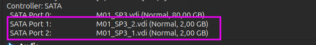

Hem d'instal·lar **mdadm** per configurar el raid.

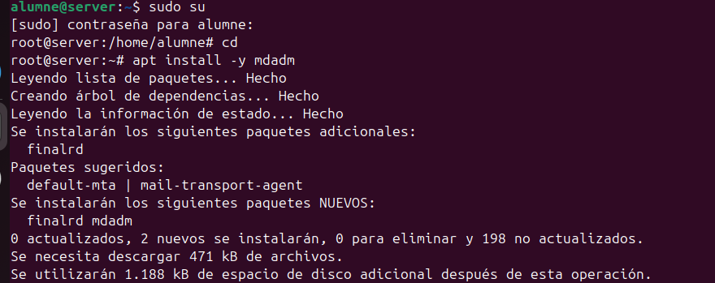

Obtenim els dos dos discos de 2 GB (fdisk -l) i els creem las particions

```bash
fdisk /dev/sdb
fdisk /dev/sdc
```
| Particions | Comprovar |
|--------------------------|--------------------------|
| 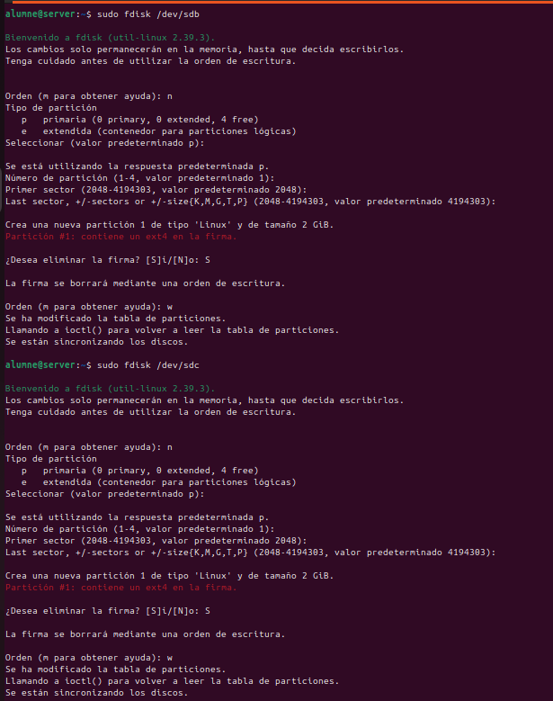 | 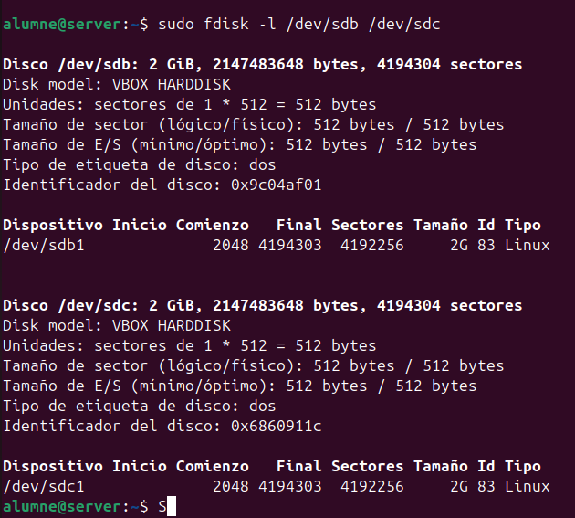 |

Creen ka caroeta raid1 amb permis total

```bash
mkdir /mnt/raid1
chmod 777 /mnt/raid1
```

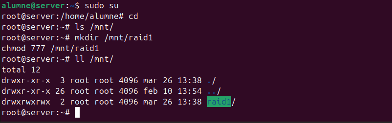

Creem el raid amb `mdadm --create /dev/md0 --level=1 --raid-devices=2 /dev/sdb1 /dev/sdc1`

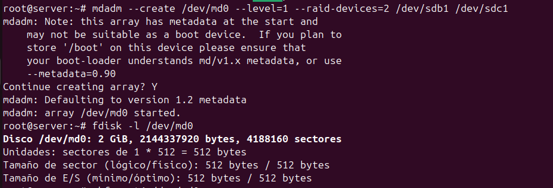

Formatem el disc creat en format ext4 (mkfs.ext4 /dev/md0)
- Comprovem els detalls del disc `mdadm --detail /dev/md0`
- Sobreescrivim la configuració mdadm --detail --scan > /etc/mdadm/mdadm.conf`

I editem l'arxiu per afegir també el disc /dev/sdb1 i /dev/sdc1

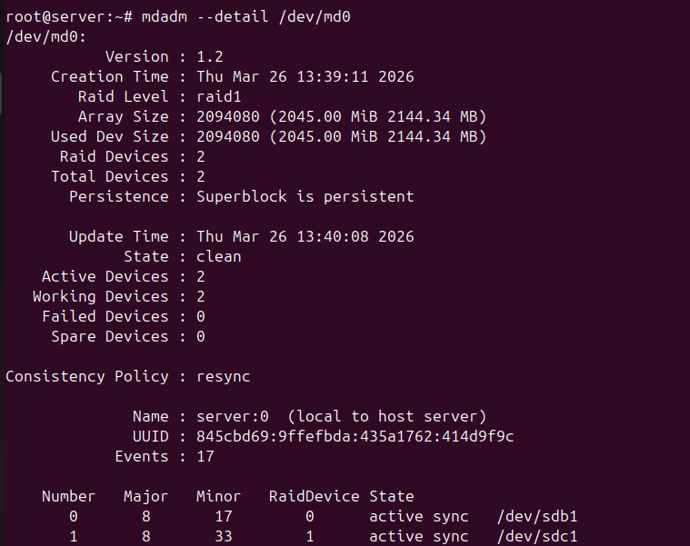
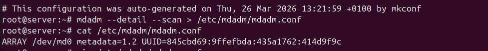
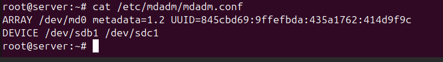

Per a que és mantengui la configuració ho posem en `/etc/fstab`.

```bash
/dev/md0 /mnt/raid1 ext4 default  0 0
```

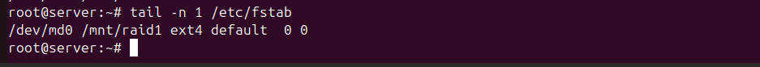

Comprovem que amb `mount -a' que és muntara correctament
El `update-initramfs -u -k all` perque el RAID ho requereix.

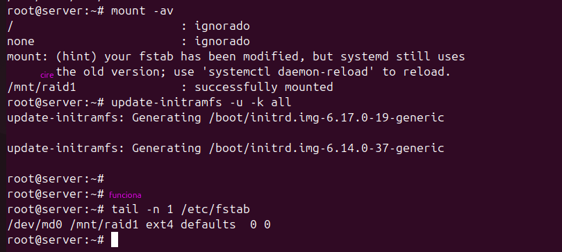

Després de reiniciar comprovem que tot funciona en el següent apartat.

## Comprovacions
Mirem el detail i veurem que están actius.

```bash
mdadm --detail /dev/md0
```

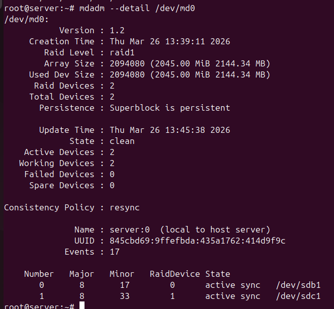

Creem una carpeta en contingut

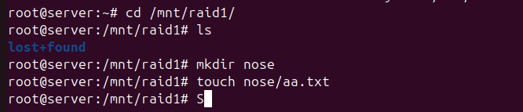

Fem que falli el disco 1 (/dev/sda1)

```bash
mdadm /dev/md0 -f /dev/sdb1
```

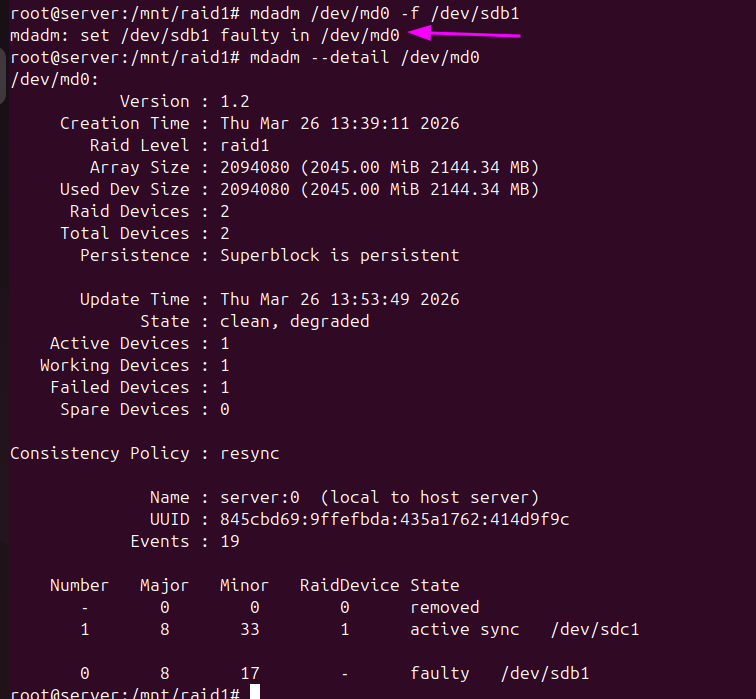

Per a sustituir-lo primer l'hem de traure

```bash
mdadm /dev/md0 -r /dev/sdb1
mdadm --detail /dev/md0
```

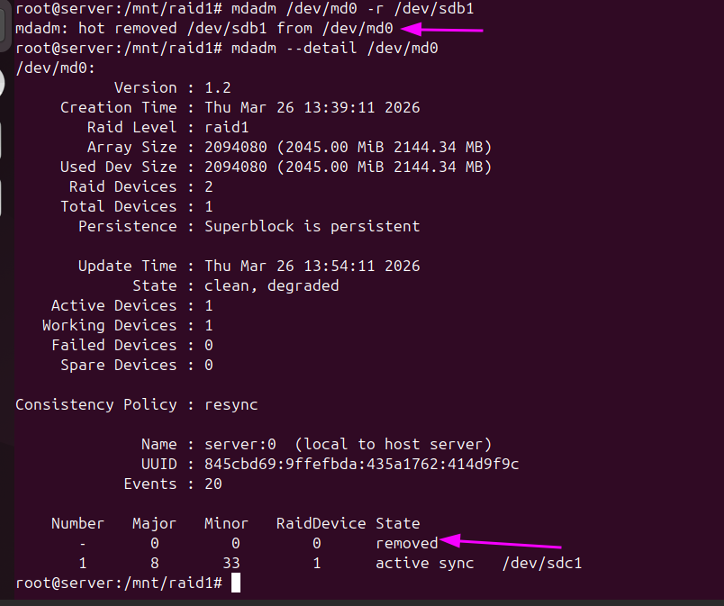

Comprovem que encara podem escriure

```bash
touch nose2
```

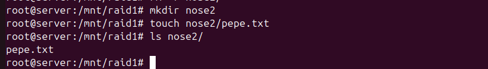

Ara imaginem que tenim el nou disco, simplement l'afegim amb:

```bash
mdadm /dev/md0 -a /dev/sdb1

### Mirem que els dos estan actius
mdadm --detail /dev/md0
```

Veure que s'esta construint

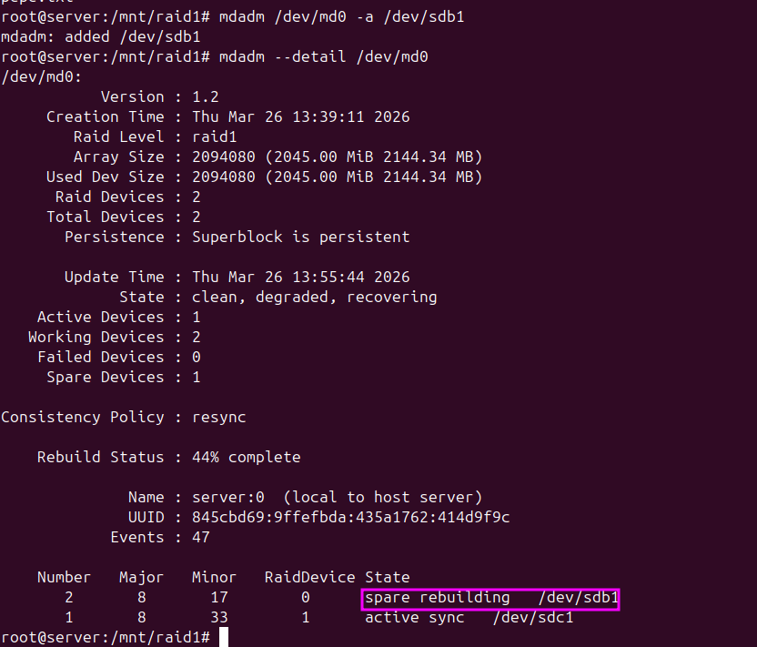

I finalment esta sincronitzat.

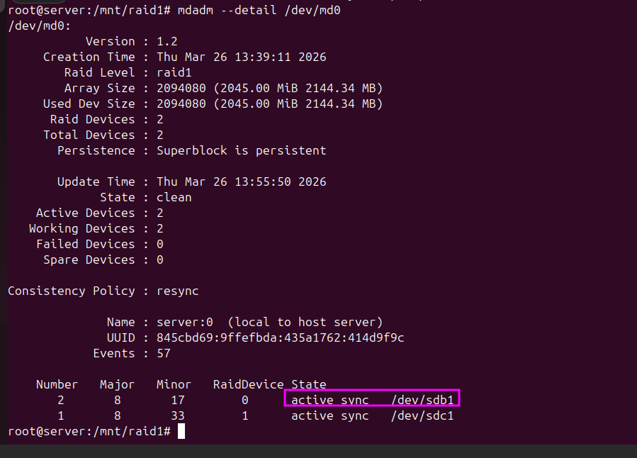