# Monitoratge, Auditories i Programari Client/Servidor


**Realitzat conjuntament amb [`razvan-ng`](https://github.com/razvan-ng/ISOPJ1)**

# Índex

- [Monitoratge de logs](#monitoratge-logs)
  - [Captures monitor](#captures-monitor)
  - [Inserir log](#inserir-log)
  - [(EXERCICI) Enviar logs entre maquines](#enviar-logs-entre-maquines)
    - [Configuració client i servidor](#configuració-client-i-servidor)
    - [Proves](#proves)
      - [Linux](#linux)
      - [Windows](#windows)
- [Servidor d'actualitzacions](#servidor-dactualitzacions)

# Monitoratge logs

Els logs son importants, ens diuen que ha passat (alguns), quan ha passat i a qui li ha passat, per així arreglar problemes o controlar per a que no n'hi hagin.

## Captures monitor

Una de les formes que podem visualitzar els processos en Ubuntu (desktop almenys) és amb el 'Monitor del sistema'

| Descripció                 | Imatge                                 |
| -------------------------- | -------------------------------------- |
| Monitor del sistema Ubuntu | 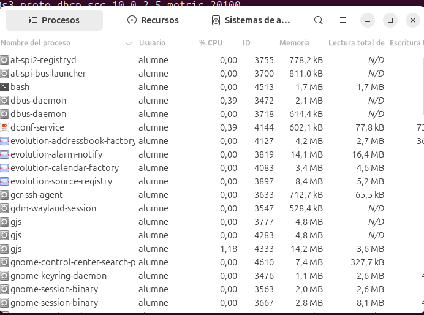   |
| Procés en execució         | 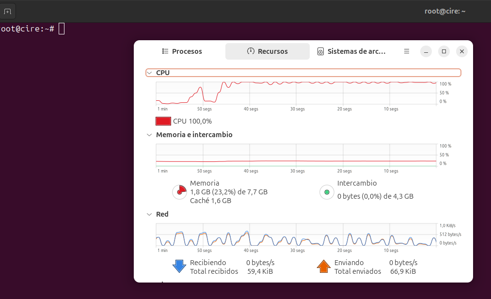 |
| Detalls del sistema        | 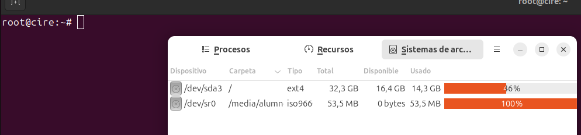 |

De directoris importants tenim el `/var/log`, dintre tenim els diversos logs dels serveis del sistema

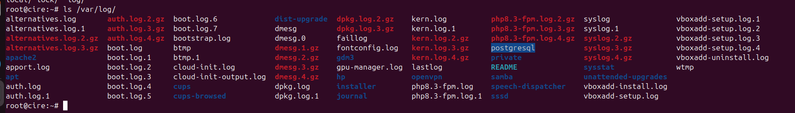

En syslog tenim tots els logs, com podem veure es molt

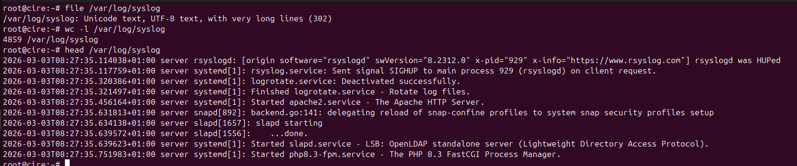

Per configurar la rotació logs dels diferents serveis, revisem el directori '/etc/logrotate.d/'

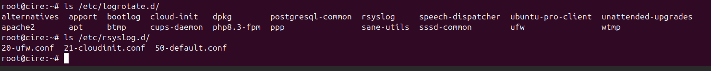

I ambos opcions tenen els seus arxius de configuracio

En el `/etc/logrotate.d/rsyslog` podem veure que es troba configurat per rotar cad 4 dies, setmanalment, amb un script post rotació.

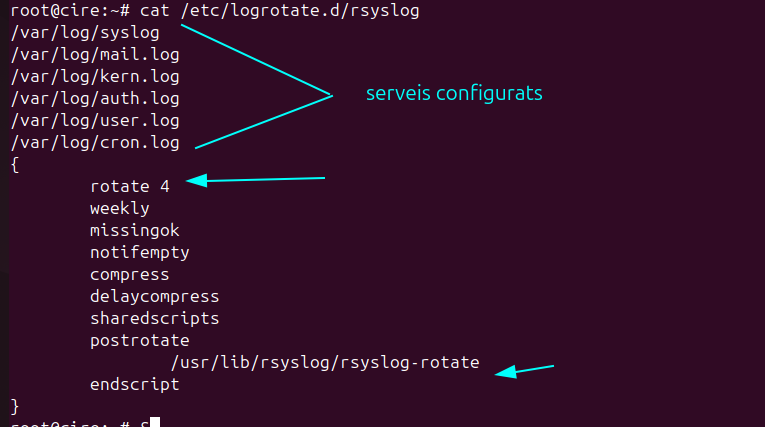

En `/etc/rsyslog.d/50-default.conf` tenim la configuració per defecte.

- En la primera columna tenim els serveis i l'estat / resultat que volem guardar, el comodí es per tenir en compte tots
- La segona columna la ruta a on guardar

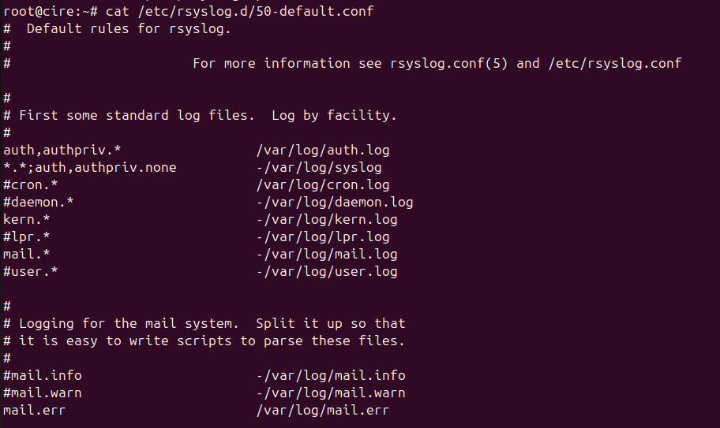

Podem utilitzar la comanda tail per mostrar els logs , amb el paràmetre -f podem veureu en temps real.

- Per exemple aqui amb `tail -f /var/log/syslog` observo en temps real el `syslog`

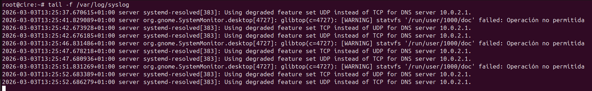

## Inserir log

Amb la comanda logger podem inserir missatges al sistema de logs. Ex: `logger -i -s -p mail.notice Prova4567`

| Descripció                 | Imatge                                  |
| -------------------------- | --------------------------------------- |
| Inserció de log amb logger | 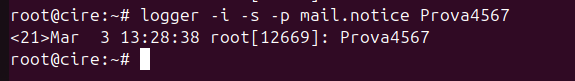 |
| Resultat en var/log/syslog | 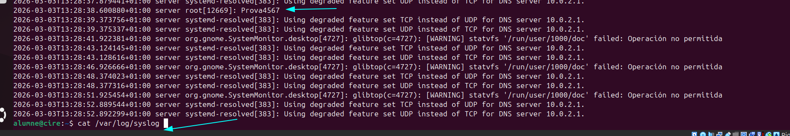  |
| Resultat en var/log/mail   | 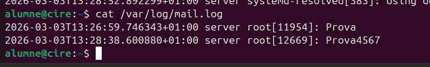 |

Si modifiquem el '50-default.conf' per a que sols guardi registres en ca d'error, podem comprovar després de reiniciar que no n'hi registres. I si que surten errors.

- Els errors tenen menys preferència que els crítics i a baix de tot els notice, per ende els crítics no sortiran.

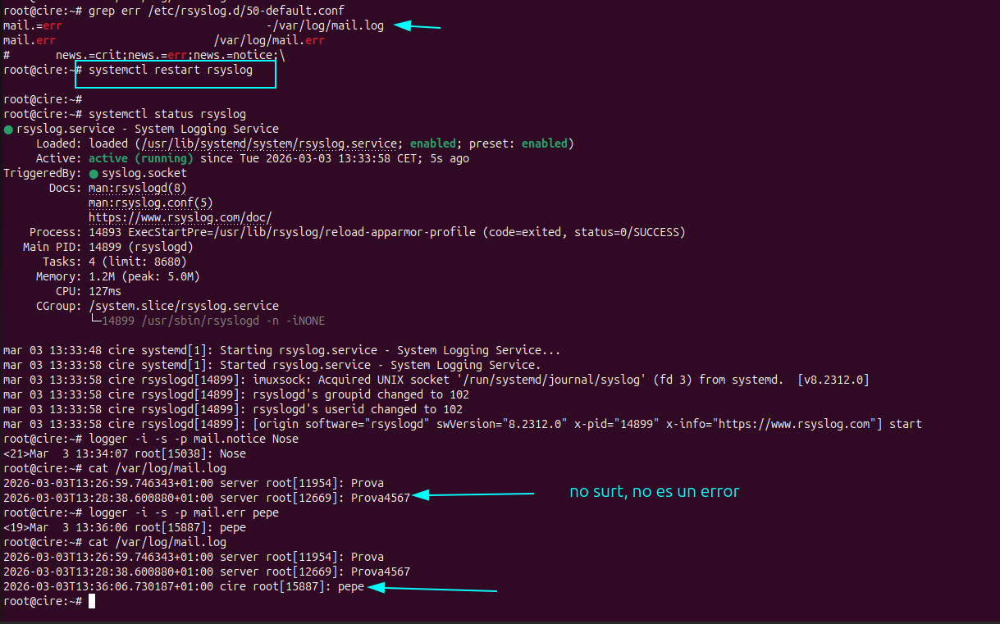
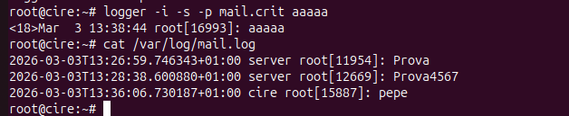

| Si tornem a modificar la configuració per que sols se guardin els errors de importància major, veurem que sols surt el crític. | Si usem el comodí i posem `*.crit`, es guardaran els crítics a la ruta que donem. |
| ------------------------------------------------------------------------------------------------------------------------------ | --------------------------------------------------------------------------------- |
| 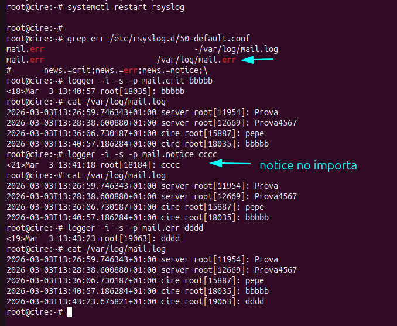                                                                                        | 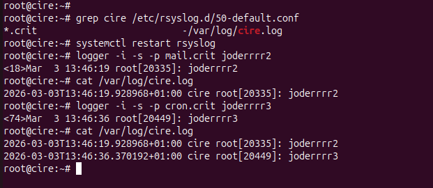                                           |

## Enviar logs entre maquines

### Configuració client i servidor

En el client l'unica configuració que he hagut de fer es en el `/etc/rsyslog.conf` a on he posat que és guardin tots per TCP a la IP del servidor que esta.

L'unica configuració :) :

```bash
*.* @@192.168.203.207:514
```

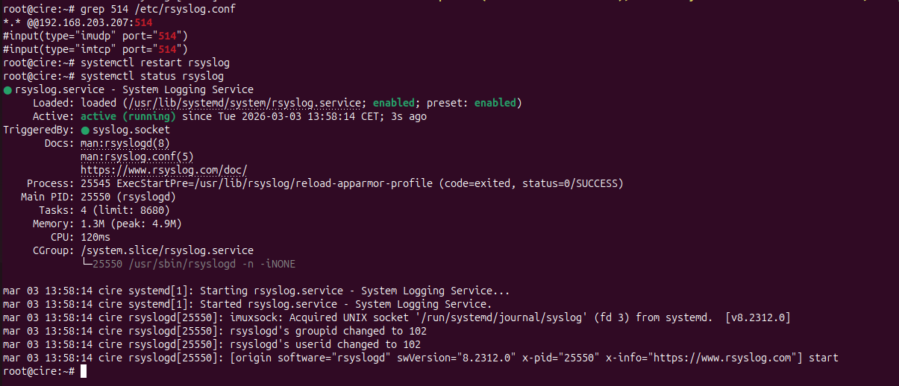

En el server el mateix (posterior a instal·lar) però descomentant les línies del module tcp de rsyslog (òbviament reiniciat el servei).

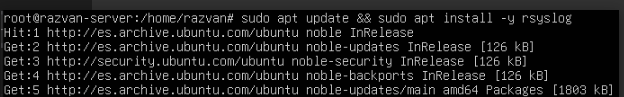
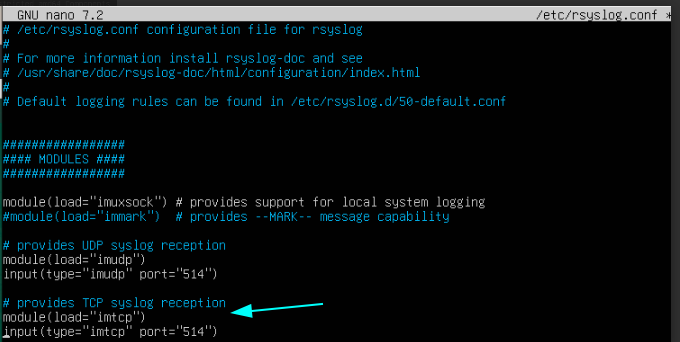
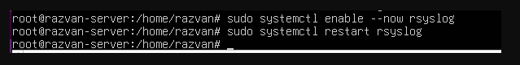

Si tinguessim firewall, hauriem de obviament permetre el trafic.

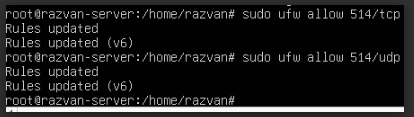

### Proves

Aquest proves estan pensades per enviar els logs d'un client a un servidor

#### Linux

He provat a crear un log amb `logger` i podem observar que en el server ha arribat.
Si mirem el syslog.

| Descripció                 | Imatge                                  |
| -------------------------- | --------------------------------------- |
| Enviant error              | 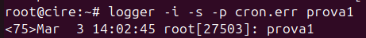 |
| Confirmació en el servidor | 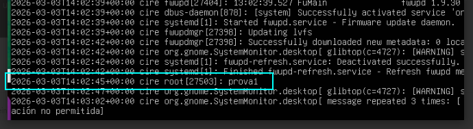 |

##### Windows

Per a Windows, hem usat NxLog Community Edition

- Posterior a instal·lar, hem editat l'arxiu `C:\Program Files\nxlog\conf\` per descomentar les linies que tenen la directiva amb la IP desti.
- I reinicat el servei

```bash
## NXLog CE - Windows EventLog -> Syslog (TCP)
## Minimalista

define ROOT C:\Program Files\nxlog
Moduledir %ROOT%\modules
CacheDir  %ROOT%\data
Pidfile   %ROOT%\data\nxlog.pid
SpoolDir  %ROOT%\data
LogFile   %ROOT%\data\nxlog.log

<Extension syslog>
    Module      xm_syslog
</Extension>

<Input in>
    Module      im_msvistalog
    # Podem filtrar per logs; por defecte llegeix diversos.
    Query       <QueryList>\
                  <Query Id="0">\
                    <Select Path="Application">*</Select>\
                    <Select Path="System">*</Select>\
                    <Select Path="Security">*</Select>\
                  </Query>\
                </QueryList>
</Input>

<Output out>
    Module      om_tcp
    Host        192.168.203.207
    Port        514
    Exec        to_syslog_bsd();  # syslog estil BSD/RFC3164 (per a la compatibilitat)
</Output>

<Route 1>
    Path        in => out
</Route>
```

A continuació envio un log de tipus Information (ho podriem canviar eh) usant powershell.

```bash
Write-EventLog -LogName Application -Source "Application Error" -EntryType Information -EventId 1000 -Message "Prueba envio a Linux"
```

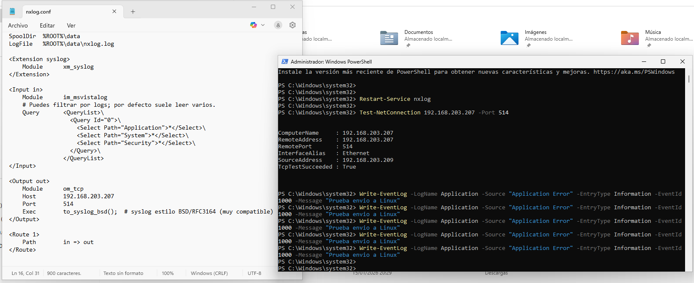

En el servidor observarem el trafic si mirem al syslog (podria realment estar altres pero com que aquest els té 'tots' :/)

- Observem que ja havia estat rebent logs d'altres serveis /notificació del sistema de windows...

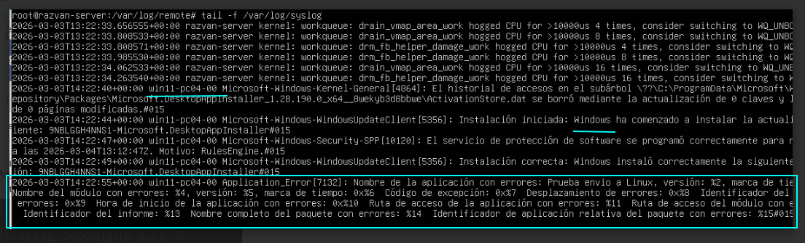

- Tota la metralla que hi després de 'Prueba envio a Linux' són coses dels objectes/ com guarda Windows els logs.
- Respecte al Firewall de windows, el tinc desactivat, suposo que també funcionaria amb ell activat i amb la regla sortida (perque sols envia dades)

```bash
New-NetFirewallRule -DisplayName "NXLog Sortida TCP 514" -Direction Outbound -Protocol TCP -LocalPort Any -RemotePort 514 -Action Allow -Profile Any
```

# Servidor d'actualitzacions

## Server

Servidor d’actualitzacions
És un `servidor`/ equip que gestiona i distribueix les actualitzacions de programari als altres ordinadors o sistemes de la xarxa.
Permet descarregar, emmagatzemar i instal·lar actualitzacions del sistema (com paquets de Linux) perquè els equips es mantinguin segurs i actualitzats.

Per compartir paquets, en aquesta practica farem servir apache2 i apt-mirror per a `configurar` el servidor.

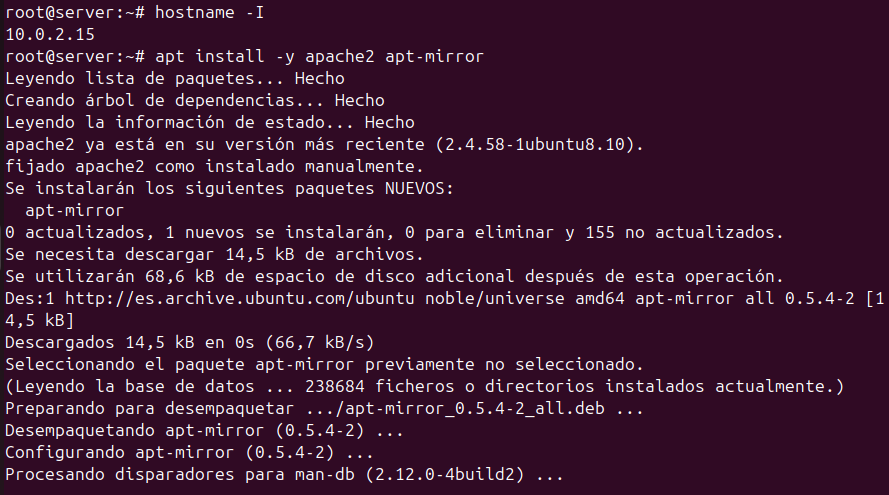

Fet aixó editem el llistat de 'mirrors' de repositoris, per comentar els altres (pa no descargar tants)
I posem els que volem, en aquest cás sols he posat el repositori per al paquet de google-chome

```bash
deb [arch=amd64] http://dl.google.com/linux/chrome/deb stable main
```

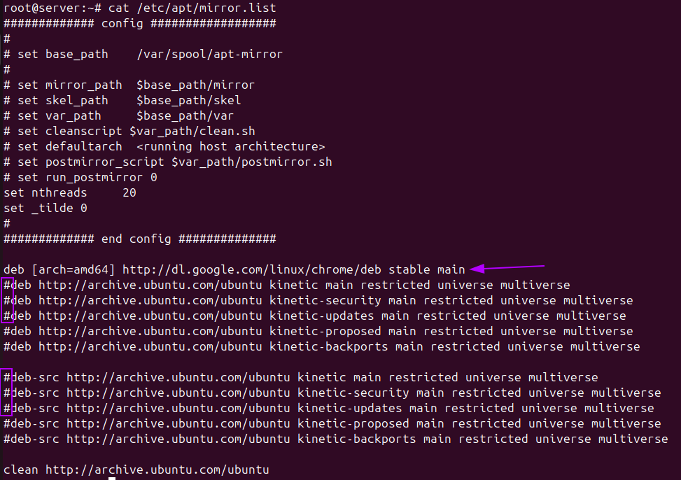

| Amb la comanda `apt-mirror` descarreguem el paquet. | Observem que s'ha descarregat el paquet en `/var/spool/apt-mirror/mirror`.I ho enllaçem (amb `ln -s`) al directori arrel de apache |
| --------------------------------------------------- | ---------------------------------------------------------------------------------------------------------------------------------- |
| 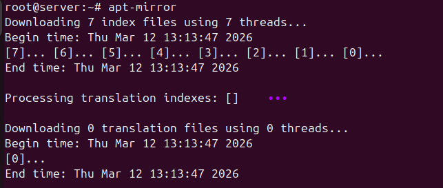         | 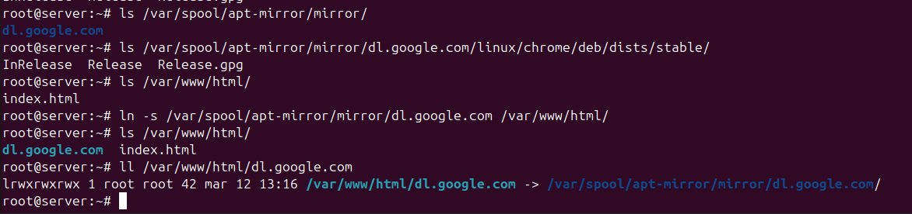                                                                                            |

En aixó ja tenim la configuració del server

## Client

Per al client simplement, afegim el repositori al sources.list o dintre del directori.

- Obviament a la nostra IP.
- I `d'extra` signem el paquet.

```bash
deb [arch=amd64] http://10.0.2.15/dl.google.com/linux/chrome/deb stable main
wget -q -O - https://dl.google.com/linux/linux_signing_key.pub | apt-key add -
```

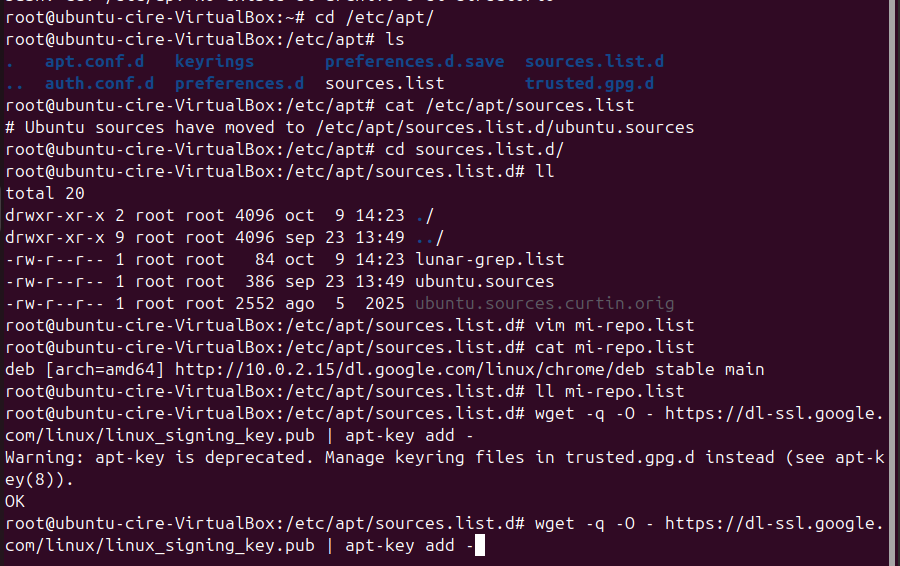

Observem que al actualitzar i instal·lar, que consulta al server.

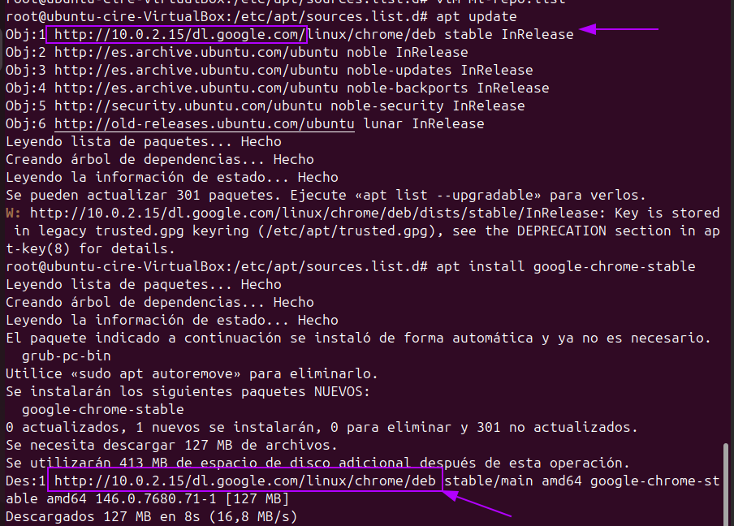

## Exercici

He elegit el paquet de php, que no té un d'oficial.
Però he usat el de `Ondřej Surý`.

```bash
deb [arch=amd64] https://packages.sury.org/php noble main
```

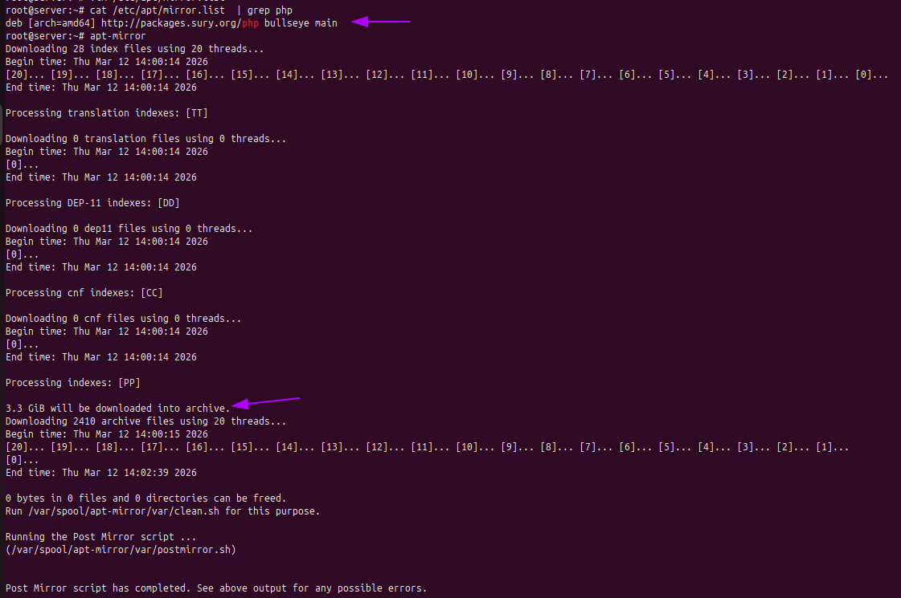

He enllaçat

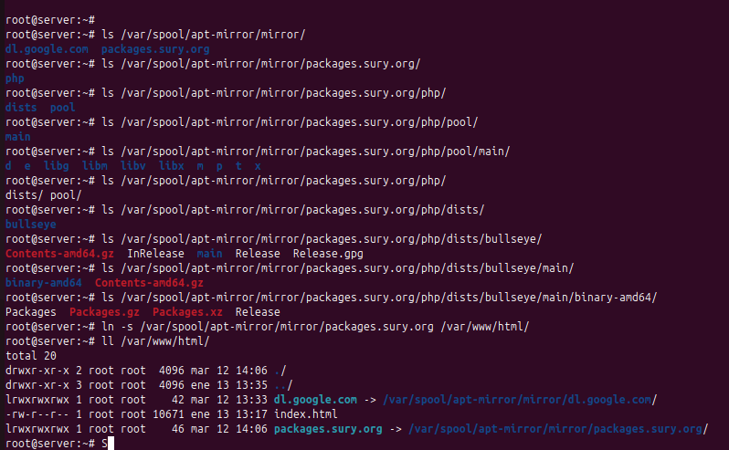

I en el client afegit el repositori i signat

```bash
deb http://10.0.2.15/packages.sury.org/php bullseye main
wget -q -O - https://packages.sury.org/php/apt.gpg | apt-key add -
```

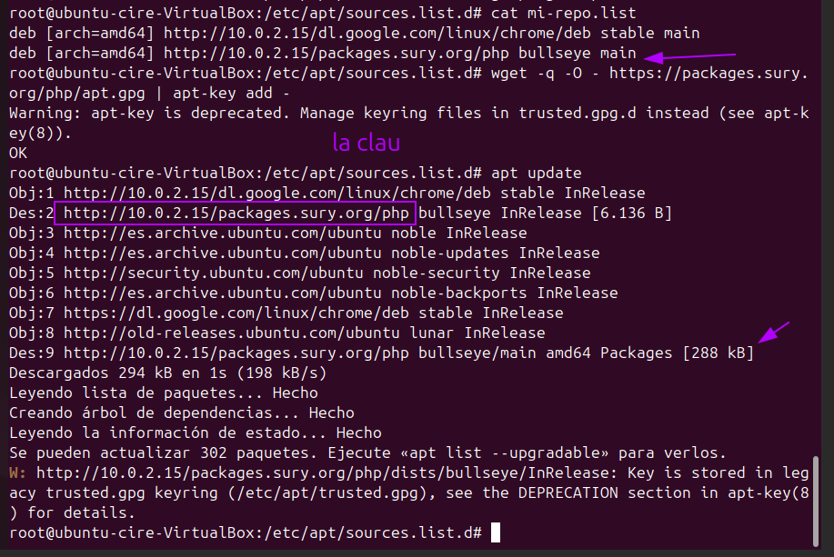

En instal·lar observem que s'instal·la d'ahí.

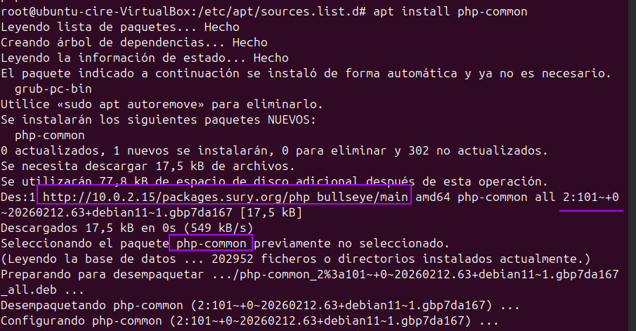
