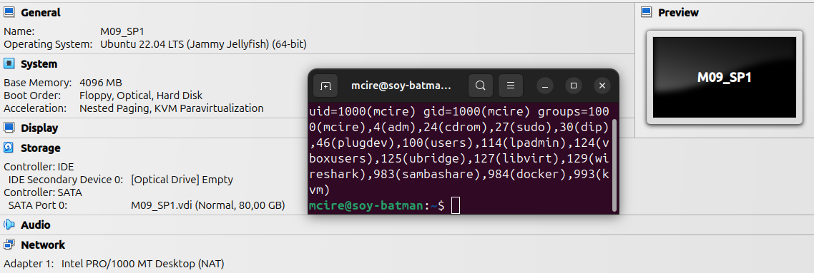
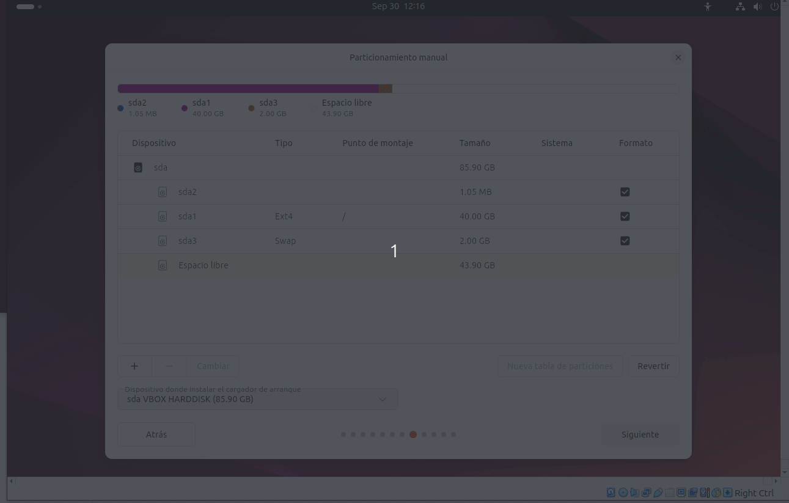
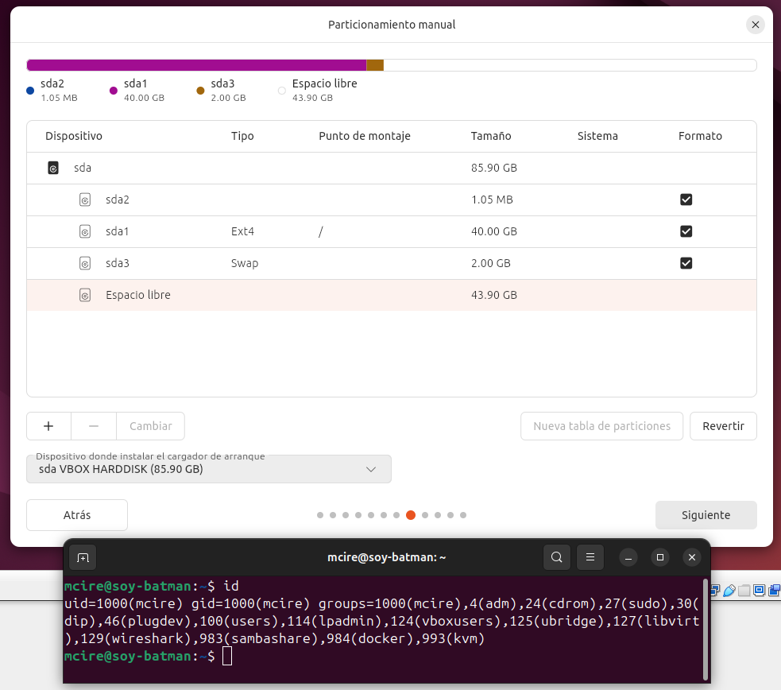
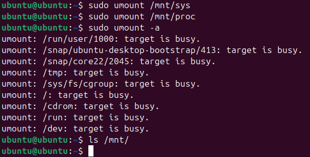
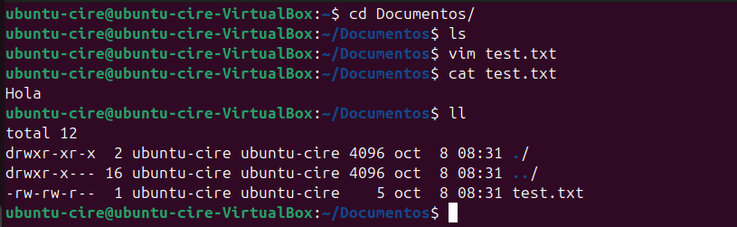
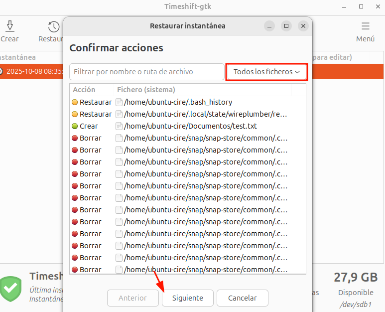
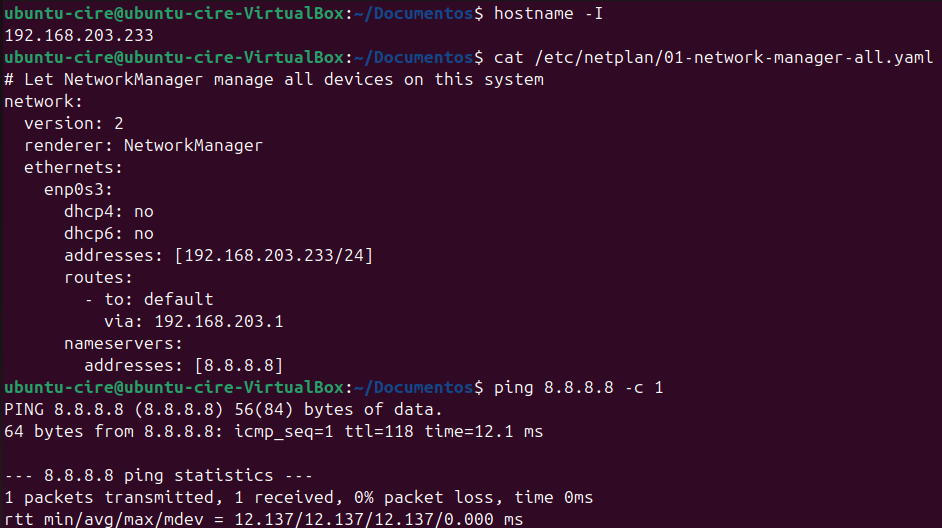

# Índex

- [Virtualització i instal·lació del so Ubuntu](#virtualització-i-installació-del-so-ubuntu)
  - [Llicenciament](#llicenciament)
  - [Configuració VirtualBox](#configuració-virtualbox)
  - [Procediment animat](#procediment-animat)
  - [Instal·lació guiada](#installació-guiada)
  - [Gestors d'arrencada](#gestors-darrencada-per-a-installacions-dual)
    - [Instal·lació dual](#installació-dual)
    - [Recuperació escenari 1](#recuperació-escenari-1)
      - [SuperGrub](#super-grub-disk)
      - [Live ISO](#live-iso)

# Virtualització i instal·lació del so Ubuntu

## Tasca: crear màquina virtual per instal·lar Ubuntu 24

Ubuntu és una distribució de Linux (basada en [Debian](https://www.debian.org/index.ca.html)) molt popular (en servidors) de codi obert. En aquest document, explicaré el procediment d'instal·lació, configuració i algunes comandes bàsiques.

## Llicenciament

Ubuntu té una llicència GPL (GNU General Public License), que permet modificar, distribuir i utilitzar el sistema de manera lliure.

N'Hi han de diverses tipus de llicències en Linux, per exemple:

- **MIT license**: similar a la GPL, permet modificar, distribuir i usar el programari de manera lliure, però a diferencia de la GPL, s'ha de redistribuir el codi amb mínimes restriccions, sempre incloent-hi l'avís de **copyright** original i la renúncia de responsabilitat
- **Apache License**: permet als desenvolupadors utilitzar, modificar i redistribuir el programari, obligant de mencionar cadascun dels canvis que es facin.

Alguns dels conceptes que més es mencionen en llicencies són:

- **copyleft**: els usuaris poden utilitzar, modificar i distribuir lliurement l'obra. Requereix que les obres derivades estiguin subjectes a la mateixa llicència de copyright.
  - Promou la col·laboració i l'intercanvi en la comunitat creativa, com per exemple GPL o Creative Commons licenses.
- **copyright**: protegeix els drets del creador de controlar l'ús, la distribució i la modificació de l'obra, no requereix que les obres derivades siguin llicenciades sota els mateixos termes.
  - Protegeix els drets dels creadors i incentiva la innovació. Exemple: All Rights Reserved, Public Domain Dedication, copyright

## Configuració VirtualBox

En iniciar, el programari de VirtualBox creem una nova màquina virtual, amb la següent configuració mínima es prou.

- RAM: 4 GB, en l'experiència d'usar les maquines virtuals.
- Processador: en 4 fils de CPU anirà fluid, encara que en 2 funcionarà, al ser una maquina que creixerà, necessitarem més potència.
- Xarxa: NAT, l'entorn que farem servir serà un de proves i degut a que permet aïllar la màquina virtual.
- Posem la ISO d'ubuntu.



## Procediment animat

En iniciar seguim els passos que mostra al vídeo, fins arribar al particionat.


En el particionat s'ha creat l'arrel, que és la partició a on es troba tot el sistema de fitxers i el swap que és la partició arxiu que és farà servir en cas que la ram no sigui prou.



## Instal·lació guiada

Posteriorment d'inicar, pressionem **Enter** per iniciar el instal·lador.


Seguim el procés d'instal·lació seleccionant les nostres opcions.

> Per mes informació mirar la part del [procediment animat](#procediment-animat)


En les particions he creat les següents bàsiques:

- **'/'**: per al sistema i aplicacions. Ocupant tot el disc.
- **'/efi'**: es crea automàticament (és la de menor mida) actua com el lloc d'emmagatzematge per als carregadors d'arrencada EFI, les aplicacions i els controladors que seran llançats pel firmware UEFI.
- **'swap'**: memòria virtual per evitar bloquejos amb 4 GB de RAM.

Fent servir el sistema de fitxers ext4 que és el més comú fet servir en Ubuntu, que menys problemes dona.



I finalment després d'acabar l'instal·lació tindrem l'instal·lació feta:


## Gestors d'arrencada per a instal·lacions dual

Un gestor d’arrencada és un programa que permet triar quin sistema operatiu iniciar al engegar l’ordinador. A Linux normalment es fa servir **GRUB**, mentre que Windows té el seu propi gestor (**BOOTMGR**).

Els discos poden tenir

- **MBR**: antic, limitat a **4 particions** primaries o pots tenir **3 primàries + 1 estesa**, i dins l’estesa crear particions lògiques.
- **GPT**: moderna, més flexible.

En cas de realitzar instal·lació dual amb un sistema com Windows (**BOOTMGR**) que no evita _"trencar"_ els altres gestors, és "perdrà" l'accés, degut a que:

- **BOOTMGR**: sobrescriu MBR/EFI, només arrenca Windows, no detecta Linux.
- **GRUB**: gestiona múltiples SO, detecta Windows, s’instal·la a MBR/EFI i mostra menú d’arrencada.

En aquest apartat explicaré com realitzar l'instal·lació dual i com recuperar el GRUB, fent ús de:

- supergrub2 + iso ubuntu

### Instal·lació dual

En primer lloc hem de realitzar canvis en la configuració de VirtualBox degut a que requereix una configuració específica. Els canvis duts a terme són:

- Habilitar el EFI.
- Traure la xarxa per no haver-hi de iniciar sessió.
- Canviar el tipus de sistema a Windows i la pantalla (per no tenir-hi problemes).

Afegida la ISO de Windows i iniciat.


Realitzem el procés d'instal·lació normal fins a la finestra de particions a on seleccionem la buida. I esperem fins que finalitzi i continuem el procés d'instal·lació.

| Pas 1                                                                        | Pas 2                                                                               |
| :--------------------------------------------------------------------------- | :---------------------------------------------------------------------------------- |
|  |  |

| Pas 3                                                                          | Pas 4                                                                             |
| :----------------------------------------------------------------------------- | :-------------------------------------------------------------------------------- |
|  |  |

| Pas 5                                                                       | Pas 6                                                                              |
| :-------------------------------------------------------------------------- | :--------------------------------------------------------------------------------- |
|  |  |

### Recuperació escenari 1

En cas d'haver instal·lat primer Ubuntu i posteriorment Windows, aquestes són algunes formes de recuperar-ho.
Podem comprovar que el GRUB no es troba degut a que inicia automàticament i surt "**grub rescue**".

| Comprovació que grub no inicia                                        | Imatge grub rescue error                                          |
| --------------------------------------------------------------------- | ----------------------------------------------------------------- |
|  |  |

#### Super Grub Disk

Aquesta eina ens permet detectar i inicia el sistema que no es troba, posteriorment hem de seguir els passos a partir del **punt 5** en **[Live ISO](#live-iso)**

| Pas 1                                                | Pas 2                                                           |
| ---------------------------------------------------- | --------------------------------------------------------------- |
|  |  |

#### Live ISO

Inserim la imatge i iniciem el sistema en **mode Live**.

1. Identifiquem la partició arrel de Linux amb **`lsblk`** o **`fdisk -l`**.


2. Montem la partició:

```bash
sudo mount /dev/sda2 /mnt
```

3. Muntem els sistemes necessaris per al chroot i accedim al sistema:

> El **chroot** és un **entorn Linux** que fa que el directori especificat es comporti com a **arrel del sistema**, permetent executar comandes com si s’estigués arrencant des del sistema instal·lat.

```bash
for i in /sys /proc /run /dev; do sudo mount --rbind "$i" "/mnt$i"; done
sudo chroot /mnt
```

| Directori | Contingut                                                       | Per què és necessari en chroot                                                               |
| --------- | --------------------------------------------------------------- | -------------------------------------------------------------------------------------------- |
| /dev      | Conté els dispositius (sda, tty, null, etc.)                    | Sense /dev no es pot interactuar amb discs, terminals ni instal·lar GRUB correctament        |
| /proc     | Pseudo-sistema de fitxers amb informació del kernel i processos | GRUB i `update-grub` necessiten llegir informació del kernel, UUID dels discs, memòria, etc. |
| /sys      | Pseudo-sistema que mostra dispositius i controladors del kernel | Permet detectar particions, controladors i configuracions de maquinari reals                 |
| /run      | Conté fitxers d’estat temporals i sockets actius                | Necessari per serveis que esperen que aquests sockets existeixin mentre estem en chroot      |


4. Editem l'arxiu de grub `/etc/default/grub` i activem la detecció de sistemes, canviant el valor a false en `GRUB_DISABLE_OS_PROBER`


5. Reinstal·lem GRUB al disc principal i actualitzem les entrades.

```bash
grub-install /dev/sda; update-grub; exit
```


6. Desmuntem i podem comprovar al reiniciar que el grub és troba recuperat.

| Desmuntem tot amb `umount -a`             | Comprovem que el grub es troba recuperat            |
| ----------------------------------------- | --------------------------------------------------- |
|  |  |

### Extra

En cás que posterior a realitzar alló i reiniciar i no veure l'entrada de Windows, realitzem el següent.
Muntem novament tot, peró en aquest cás d'extra muntem l'EFI que és el **sda5** en el meu cás.

```bash
sudo mount /dev/sda2 /mnt
sudo mount /dev/sda5 /mnt/boot/efi
for i in /sys /proc /run /dev; do sudo mount --rbind "$i" "/mnt$i"; done
chroot /mnt
grub-install --target=x86_64-efi --efi-directory=/mnt/boot/efi --bootloader-id=GRUB
update-grub
```

## Punts de restauració

Les instantànies són còpies puntuals de l‟estat d‟un sistema o disc que permeten restaurar-lo fàcilment en el futur sense perdre dades.

### Instal·lació i creació partició

TimeShift és una eina Linux que crea aquestes instantànies per protegir dades i facilitar recuperacions; la farem servir per fer una còpia aun disc extern i recuperar un document posteriorment.

Afegim un nou disc a on guardarem la instantánea.


Instal·lem **timeshift** amb `sudo apt install timeshift -y"


Amb **`fdisk`** creem la partició (`n`) al disc nou identificat (sdb) amb `**lsblk**` .

- De tipus primària (`p`), fent ús de tot l'espai. I escrivim els canvis amb `w`


> L'error que surt de **ioctl()**, és normal després de canviar particion; el kernel no reconeix els canvis. S'arreglaria amb **sudo partprobe /dev/sda5** o amb un **reinici**

I l'he formatat a **ext4** amb `sudo mkfs.ext4 /dev/sdb1`.


### Creació còpia

He creat l'arxiu `"test.txt"` amb el contingut `"Hola"`.

I posteriorment fent la còpia, excloent els directoris no volem.

- Posterior d'esborrar l'arxiu l'he recuperat fent clic en **Restaurar**
- Podem observar que s'ha recuperat



Aquest és el destí de la còpia (la partició que hem "creat").

|  |  |
| ------------------------------------------------------ | ------------------------------------------------------ |

Podem veure que la còpia s'ha fet i he esborrar l'arxiu.

|  |  |
| ----------------------------------------- | -------------------------------------------------- |

Posterior he recuperat (el program reinicia el sistema) i podem observar que l'arxiu s'ha recuperat.

|  |    |
| ------------------------------------------------ | -------------------------------------------------- |
|  |  |

## Configuració de la xarxa

La configuració de la xarxa és essencial per garantir la connexió a Internet i altres dispositius dins una xarxa local. A continuació ho realitzaré amb dos mètodes.

### Interfície gràfica Ubuntu

En la configuració, creem un nou perfil, especifiquem la IP, mascara (pot ser decimal o CIDR) i la porta d'enllaç (passarela).

- I podem comprovar que tinc internet

| Configuració IP                                                        | Comprovació d'Internet                                 |
| ---------------------------------------------------------------------- | ------------------------------------------------------ |
|  |  |

### Netplan

El **netplan** és un arxiu ubicat a **`/etc/netplan/01-network-manager-all.yaml`**. Algunes de les paraules claus de Netplan, són:

| Keyword         | Descripció                                                |
| --------------- | --------------------------------------------------------- |
| `network`       | Arrel de la configuració de xarxa.                        |
| `version`       | Versió de l’esquema YAML (normalment `2`).                |
| `ethernets`     | Defineix interfícies Ethernet (per cable).                |
| `addresses`     | Assigna IP estàtica. Format: `[192.168.203.233/24]`.      |
| `nameservers`   | Servidors DNS, ex: `[8.8.8.8, 1.1.1.1]`.                  |
| `dhcp4`/`dhcp6` | Activa/desactiva DHCP IPv4 (`true` o `false`).            |
| `routes`        | Defineix rutes estàtiques.                                |
| `to`            | IP o xarxa de destinació de la ruta.                      |
| `via`           | IP de la passarel·la per a la ruta.                       |
| `renderer`      | Indica quina eina gestionarà la configuració de la xarxa. |

Apliquem la configuració amb **`netplan apply`** i comprovem que tenim internet.

| Configuració Netplan                                      | Comprovacio d'Internet                               |
| --------------------------------------------------------- | ---------------------------------------------------- |
|  |  |

## Comandes generals i instal·lacions

Apart de l'instal·lació habitual de "**apt install**" i "**dpkg**", tenim l'opció d'instal·lar una versió específica que desitgem.

### Llista versions

1. En primer lloc per llistar les versions del paquet que tenim als repositoris, hi han diverses formes. A continuació faré servir d'exemple el paquet "`grep`" a la versió 3.8-5.

La diferencia entre aquesta versió i la més nova és que, posterior a 3.8-5, és va introduïr per exemple:

- Optimització de --color=auto i detecció de TTY, mostrant colors correctament fins i tot en tuberies.


Amb l'opció `list` i el paràmetre `-a` (que mostra tots):

```bash
apt list -a grep
```

Amb el `apt-cache policy`, a on:


- apt-cache: mostra gran part de la informació emmagatzemada a la base de dades interna d'APT.
- policy: mostra les prioritats dels repositoris o dels paquets

### Afegir repositori

2. Seguidament hem d'afegir el repositori
   En les captures podem observar que no tenim la versió desitjada, per aquesta raó hem d'afegir un repositori que sapiguem que el tingui, mirant el [LaunchPad](https://launchpad.net/ubuntu/+source/grep/3.8-5).

> Segons el LaunchPad la versió d'Ubuntu que la té és `"Lunar"`

He afegit el repositori a `/etc/apt/source.list.d/` i afegit l'arxiu amb el nom de `lunar-grep.list` (el nom pot ser qualsevol) i actualitzat amb `**apt update**` sent `root` en tot moment.

> També ho podriem afegit amb `sudo add-apt-repository "deb http://old-releases.ubuntu.com/ubuntu lunar main restricted universe multiverse"`
> El subdomini **`old-releases`** es on es troben les versions Ubuntu 'no' suportades.


### Pinning i instal·lació

Al ser un repositori més antic o experimental, hem d'usar pinning per evitar que altres paquets s'actualitzin accidentalment.

Editant l'arxiu **`sudo nano /etc/apt/preferences.d/lunar-grep`**
I afegint la configuració:

```conf
Package: *
Pin: release n=lunar
Pin-Priority: 100
```

I ja podem instal·lar.

```bash
sudo apt install grep=3.8-5build1
```

Podem comprovar que efectivament aquesta versió no té color mitjançant **pipes** `|`
