# Instal·lació i configuració programari de base i gestió de fitxers

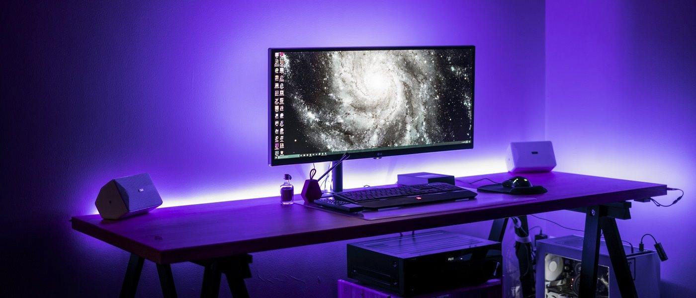

# Índex

- [Instal·lació i configuració programari de base i gestió de fitxers](#instal·lació-i-configuració-programari-de-base-i-gestió-de-fitxers)
- [Conceptes bàsics](#conceptes-bàsics)
  - [Formes de formatar](#formes-de-formatar)
    - [Amb GPARTED](#amb-gparted)
    - [Via linia comandes](#via-linia-comandes)
  - [Muntatge](#muntatge)
  - [Gestió de processos](#gestió-de-processos)
  - [Copies de seguretat i automatització tasques](#copies-de-seguretat-i-automatització-tasques)
    - [Teoria copies seguretat](#teoria-copies-seguretat)
    - [Practica comandes backup](#practica-comandes-backup)
      - [cp](#cp)
      - [rsync](#rsync)
      - [dd](#dd)
    - [Practica programes backups](#practica-programes-backups)
    - [Teoria automatització scripts, cron i anacron](#teoria-automatització-scripts-cron-i-anacron)
    - [Pràctica automatització](#pràctica-automatització)
      - [cron](#cron)
      - [anacron](#anacron)
  - [Gestió d'usuaris i grups i permisos](#gestió-dusuaris-i-grups-i-permisos)
  - [Directoris i fitxers importants](#directoris-i-fitxers-importants)
    - [Directoris importants](#directoris-importants)
    - [Fitxers usuaris i grups](#fitxers-usuaris-i-grups)
  - [Comandes bàsiques / gestió](#comandes-bàsiques--gestió)
    - [Exercis](#exercis)
      - [Canvia nom usuari](#canvia-nom-usuari)
      - [Crear usuari amb useradd](#crear-usuari-amb-useradd)
  - [Gestió bàsica d’usuaris i grups](#gestió-bàsica-dusuaris-i-grups)
    - [adduser / addgroup](#adduser-addgroup)
    - [useradd/ groupadd](#useradd-groupadd)
    - [usermod / grupmod](#usermod-grupmod)
    - [adduser / gpasswd](#adduser-gpasswd)
    - [userdel/ grupdel](#userdel-grupdel)
    - [chage](#chage)
  - [Permissos](#permissos)
    - [icacls](#icacls)
    - [Exercici](#exercici)
  - [Gestió avançada](#gestió-avançada)
    - [TTY](#tty)

# Conceptes bàsics

Quan treballem amb discs i sistemes de fitxers, és important entendre com s’organitza la informació dins del dispositiu d’emmagatzematge. Cada nivell (físic, lògic i del sistema operatiu) té les seves pròpies unitats i funcions.

- **sector**: Unitat minima fisica a on es guarden les dades, per defecte **512 bytes**, no se pot canviar, el disc treballa a este nivell
- **cluster**: unitat logica minima a on es guarden les dades a nivell de sistema operatius, 4096 bytes, se pot canviar al formatar el disc.
- Habitualment té una mida de 4096 bytes, és a dir, 8 sectors (**4096/ 512 = 8**).

La mida del bloc y cluster així com el sistema de fitxers pot ser diferent a cada particio del disc.

Si llistem amb `fdisk -l` per trobar la nostra partició

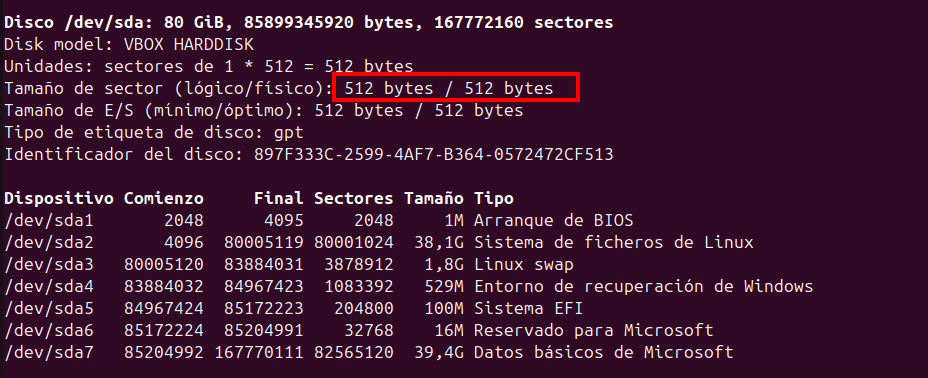

> Podem observar que la mida del sector es 512 bytes

Amb el temps i l’ús, els arxius es creen, esborren i modifiquen contínuament. Aixó pot fer que els blocs es distribueixin de manera dispersa al disc.

- Aixó ho nomenem **fragmentació externa**

La **fragmentació interna** és quan es desaprofita espai del disc perquè els blocs són massa grans per al que s’ha de guardar dintre. Problema comú del FAT32.

> Exemple: un fitxer de 8 bytes ocupa un bloc de 4096 bytes: tenim 4088 bytes desaprofitats.

Per mirar la mida del bloc de la partició podem usar `tune2fs`, filtrar per Block

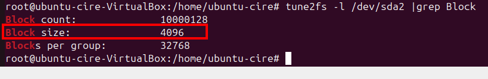

Per a la fragmentacio externa amb la comanda "e4defrag" ens indica si una partició fa falta fragmentar.

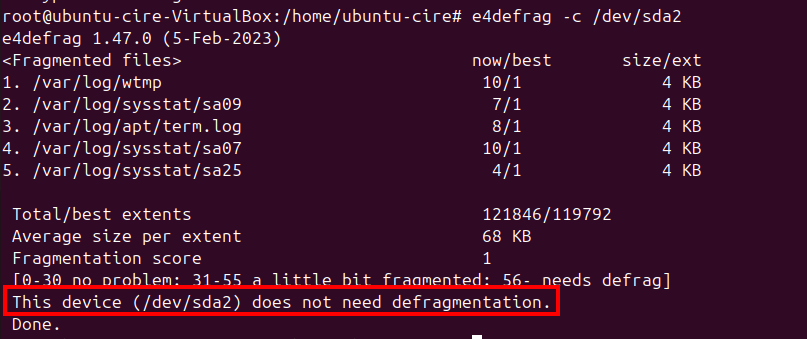

En cas de haver desfragmentar, traiem el paràmetre `-c`


Sistemes de fitxers habituals:

- FAT32 / exFAT – simple però tendeix a ser afectat per la fragmentació, és reconegut per Windows i Linux.
- EXT4 – modern, optimitzat per a Linux, redueix molt la fragmentació.
- NTFS – sistema de Windows, compatible també amb Linux.

Per poder gestionar correctament un disc, primer cal dividir-lo o organitzar-lo lògicament. Que són:

- **partició**: és una **divisió lògica d’un disc dur** que permet separar i organitzar l’espai d’emmagatzematge en unitats independents.
- **volum**: és una **unitat lògica d’emmagatzematge** formada per una o més particions o discs, gestionada pel sistema operatiu com si fos un sol espai. Com afegir una capa d'abstracció damunt de les particions/ discs.

Abans d’utilitzar una partició ( o en la propia fabricació del dispositiu d'enmagatzematge).
Cal aplicar un formatat, és a dir, preparar-la amb un sistema de fitxers concret. N'hi han de 3 tipus:

- Formatat alt nivell: simplement esborra els punters/ taula fitxer, només borra "sistema fitxers".
- Formatat mig nivell: borra sistema fitxer, si troba sector defectuos el marca per a no guardar-hi informació.
- Formatat baix: borra sistema fitxer, si troba sector defectuos els intenta arreglar. No es pot fer a nivell sistema operatiu, només amb eines de fabricant.

Podem veure l'espai desaprofitat amb una simple prova.

> Escrivint un text com "Bon dia" que són 8 bytes reals i en el sistema ocupa 4096 bytes (la mida d’un bloc).

```bash
echo "Bon dia" > hola
```

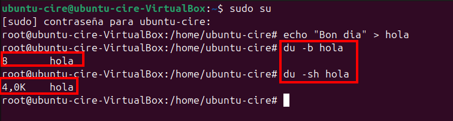

Això significa que hi ha fragmentació interna de 4096 − 8 = 4088 bytes, és a dir, espai desaprofitat dins del bloc.

## Formes de formatar

Fent servir GPARTED i la linia de comandes, formatare dues particions a EXT4 i NTFS respectivament.
Intentant canviar la mida del bloc si ho permet l'eina.

### Amb GPARTED

És una eina visual per crear, eliminar o formatar particions.

- Permet triar el sistema de fitxers (FAT32, EXT4, NTFS...) però **no permet canviar la mida del bloc**.

Els passos a seguir són:

1. Iniciem l'eina i Seleccionem el disk dalt a la dreta

|         | 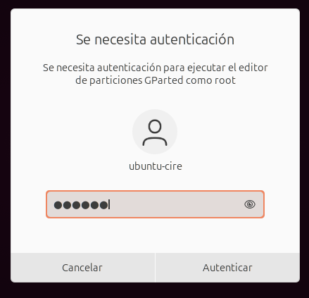 |
| --------------------------------------------------------- | -------------------------------------------------------------------------------------------- |
|  |                                  |

2. Creem nova taula particions GPT

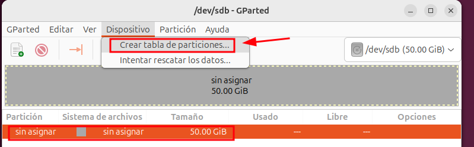


2. Creem nova partició i la formatem a EXT4


3. Repetim el pas anterior pero a format NTFS i fem clic en **Aplicar totes les operacions**

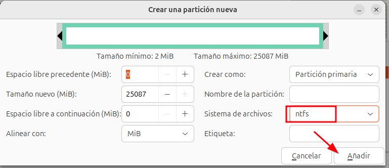

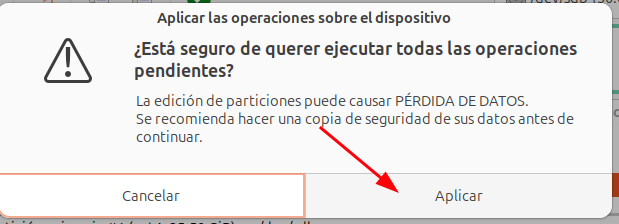


4. Comprovem que les dues particions és troben creades


### Via linia comandes

Amb `fdisk` podem crear i modificar particions manuals.

Posterior d'identificar el disc amb el paràmetre `-l`, he creat una partició nova primaria fins al sector 204600

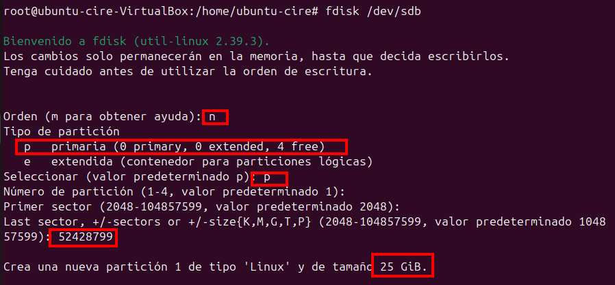

I una altra en el que resta, comprovem amb `fdisk` que ho tenim creat.

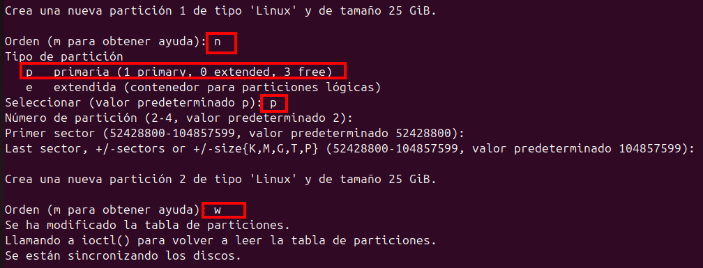


Posteriorment, amb `mkfs.ext4 -b 2048 /dev/sdb1`estem formatant amb una mida de block diferent a la partició 1


I podem comprovar amb `tune2fs -l /dev/sdb1 | grep Block`

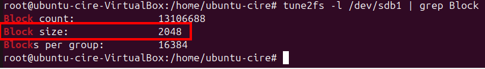

I a l'altra partició com a NTFS per a que Windows ho reconegui `mkfs.ntfs /dev/sdb1`


En el GParted podem comprovar que es troben les particions

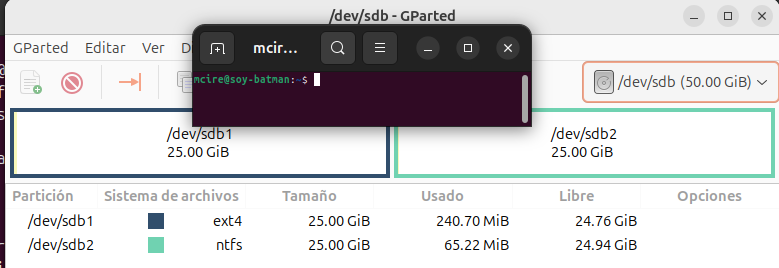

## Muntatge

Per treballar amb aquestes particions les hem de muntar, per això, se sol realitzar el següent:

He creat les dues carpetes a on muntare cadascun de les particions

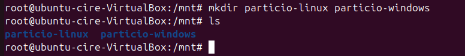

Afegim un arxiu per a despres de muntar, comprovar que no es trobara dintre.

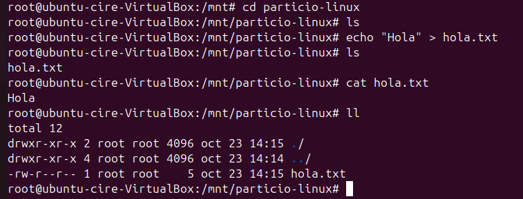

Montem "temporalment" amb `mount -t ext4 /dev/sdb1 /mnt/particio-linux`, i afegim un arxiu dintre

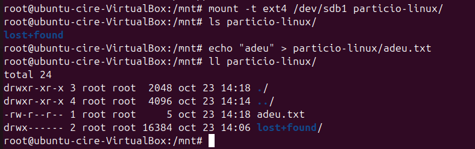

En reiniciar no tornem a veure l'arxiu, de fet ni es troba muntat.


Si volem fer-ho permanent, ho afegim al `/etc/fstab`, la linia que he afegit ha sigut

```bash
/dev/sdb1   /mnt/particio-linux   ext4   defaults   0  1

```

> El fitxer de **/etc/fstab ** indica què s’ha de muntar automàticament en iniciar el sistema i com s’ha de fer.

Cada línia descriu una partició o dispositiu amb sis camps separats per espais o tabulacions:

> <dispositiu> <punt_muntatge> <sistema_fitxers> <opcions> <dump> <pass>

- Dispositiu: pot ser /dev/sdb1, una UUID, o una etiqueta (LABEL) de la partició.
- Punt de muntatge: carpeta on s’accedirà al contingut, si no existeix, no la crea, sino que falla.
- Sistema de fitxers: tipus utilitzat. Per exemple: ext4, ntfs, vfat, xfs, etc.
- Opcions: paràmetres de muntatge (separats per comes)
  - defaults: valors per defecte (lectura/escriptura, execució, etc.)
  - ro / rw: només lectura o lectura/escriptura
  - noexec: no permet executar arxius
  - nosuid: ignora bits SUID/SGID
  - nodev: no permet dispositius especials
  - auto / noauto: si es munta automàticament o no
  - user / nouser: si usuaris normals poden muntar-la
- Dump: valor 0 (no es fa) o 1 (es fa).
  Controla si es fa còpia amb l’eina dump. El sistema faria ús de l’eina antiga **dump** per fer còpies de seguretat del sistema de fitxers.

- Pass: ordre de verificació amb fsck durant l’arrencada.
- Amb 0 no comprova el sistema de fitxers (es salta).
- Amb 1 comprova primer (prioritat més alta), normalment s'aplica a l'arrel `/`
- Amb 2 o superior comprova després de la 1, en segon pla (qualsevol valor >= 2 es tracta igual que 2.)


Ara en reiniciar, es `guarda` el muntatge i veiem l'arxiu


# Gestió de processos

Els processos són programes en execució dins del sistema. Cada procés té un PID (Process ID), un usuari propietari i pot estar en diferents estats (actiu, en espera, aturat...). El sistema operatiu planifica i reparteix el temps de CPU entre ells.

Eines bàsiques per gestionar-los:

- ps, top, htop: veure processos actius.
- kill, pkill: finalitzar un procés per PID o nom.
- nice, renice: ajustar la prioritat d’execució.
- systemctl, service: controlar serveis (daemons). No es exactament per a processos, així no el tocarem aqui.

A nivell pràctic, cada procés hereta permisos de l’usuari que l’ha iniciat i pot estar vinculat a un servei o a una sessió d’usuari.

Ara veurem com fer-les servir minimament.

Amb **pstree**

Paràmetre Funció

| Paràmetre | Funció                                              |
| --------- | --------------------------------------------------- |
| -p        | Mostra el PID de cada procés.                       |
| -u        | Mostra l’usuari propietari de cada procés.          |
| -h        | Ressalta el procés actual (útil quan es filtra).    |
| -n        | Ordena processos per PID dins de cada arbre.        |
| -a        | Mostra els arguments complets del procés (cmdline). |

Per filtrar un procés podem usar`grep`


Aqui podem veure els processos de root i tambe filtrant per la terminal


**ps**
Aquesta comanda, mostra informació sobre una selecció dels processos actius.
Si volem una actualització repetitiva de la selecció i la informació mostrada, hauriem de usar top en comptes d'això.

Alguns dels parametres mes comuns són:

- `a`: mostra processos de **tots els usuaris**, no només del terminal actual.
- `u`: mostra informació en **format d’usuari**, amb columnes com `%CPU`, `%MEM`, `USER`.
- `x`: inclou processos **sense terminal associat** (daemons i serveis).
- `-e`: Mostra tots els processos del sistema, equivalent a -A.
- `-o`: Permet personalitzar exactament quines columnes vols que surti.
- i molts més


Podem filtrar per obtenir les terminals que l'usuari fa servir amb `ps aux | grep usuari | grep tty`

Aixó, mostra els processos d’un usuari concret que s’estan executant en terminals.

- **ps aux**: mostra tots els processos amb informació detallada.
- **grep usuario**: filtra només els processos propietat de l’usuari “usuario”.
- **grep tty**: filtra només els processos que tenen un terminal associat (tty).


Si volem matar un proces, podem fer servir **kill**, te diversos modes de terminar:

| Tipus de Kill      | Senyal  | Descripció                                      | Comanda        |
| ------------------ | ------- | ----------------------------------------------- | -------------- |
| Kill suau          | SIGTERM | Demana al procés finalitzar netament            | kill PID       |
| Kill forçat        | SIGKILL | Mata immediatament, sense netejar recursos      | kill -9 PID    |
| Recarregar config  | SIGHUP  | Demana al procés que recarregui la configuració | kill -1 PID    |
| Pausa              | SIGSTOP | Pausa l’execució del procés                     | kill -STOP PID |
| Continuar          | SIGCONT | Continua un procés pausat                       | kill -CONT PID |
| Interrupció Ctrl-C | SIGINT  | Senyal d’interrupció (Ctrl+C)                   | kill -2 PID    |
| Abortar            | SIGABRT | Senyal d’error abortat, sovint genera core dump | kill -6 PID    |

Aqui tenim un exemple obrint xclock al fons amb el "&" i matant-lo suau, mentres comprovem amb `ps aux` que s'ha mort.


També tenim dos altres comandes mes simples i que ens permeten buscar pel nom del procés, que són:

- pgrep: per obtenir el PID del proces
- pkill: per matar amb el nom del procés

> Nota: si estem en interficie grafica, podem usar **xprop** (necessites usar servidor X (Xorg)) per obtenir les propietats d'una finestra, que inclou també el PID.
> I matar la ventana amb **xkill**


Per altra banda també tenim la comanda `pidof` que en retorna el PID del programa.


Amb **top**
Poden veure els processos en temps real, del que mes consumeix a menys

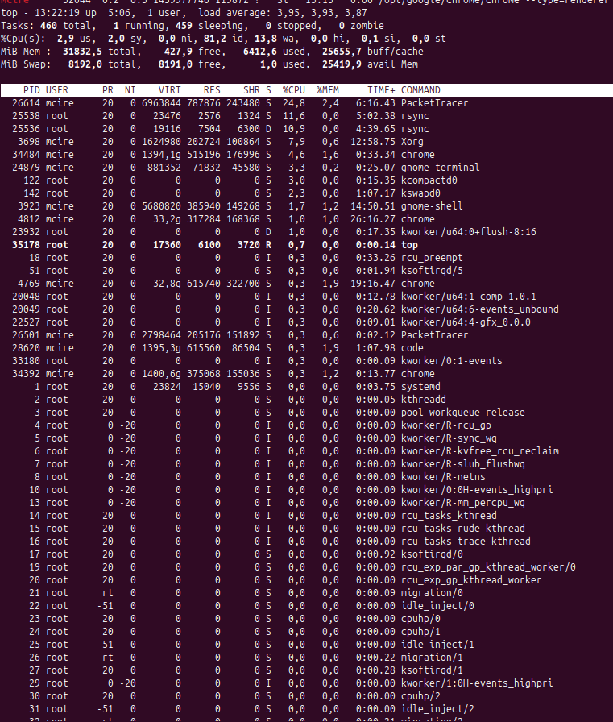

Quan executem **top**, veiem un resum del sistema i una llista de processos amb diferents columnes:

Inclou informació global del sistema:

- load average: càrrega mitjana (1, 5 i 15 minuts).
- Tasks: processos totals, en execució, dormint, aturats, zombis.
- %Cpu(s): percentatge d'ús de CPU (user, system, idle…).
- Mem / Swap: memòria RAM i swap disponible, usada i lliure.

| Columna | Significat                                                 |
| ------- | ---------------------------------------------------------- |
| PID     | Identificador únic del procés.                             |
| USER    | Usuari que ha iniciat el procés.                           |
| PR      | Prioritat del procés (valors negatius = més prioritat).    |
| NI      | Nice value: ajust de prioritat (-20 a +19).                |
| VIRT    | Memòria virtual total utilitzada pel procés.               |
| RES     | Memòria física (RAM) real utilitzada.                      |
| SHR     | Memòria compartida amb altres processos.                   |
| S       | Estat del procés (S = sleeping, R = running, Z = zombie…). |
| %CPU    | Percentatge de CPU que consumeix.                          |
| %MEM    | Percentatge de RAM que consumeix.                          |
| TIME+   | Temps total de CPU consumit.                               |
| COMMAND | Nom o ruta del procés executable.                          |

Respecte als estats, podem troba:

- Executant (Running, **R**): El procés està actiu o llest per ser assignat a la CPU.
- Esperant (Waiting, **W**): El procés espera un recurs o un esdeveniment.
- Aturat (Stopped, **S**): El procés ha estat detingut, normalment per un senyal, sovint durant depuració.
- Zombi (Zombie, **Z**): El procés ha finalitzat però encara conserva una entrada a la taula de processos.
- Trencat (**T**): Procés aturat per depuració o per senyal de trencament.
- Dormint (**D**): Procés inactiu, esperant I/O, no pot ser interromput.
- Idle (inactiu,**I**): El procés està completament inactiu, sense consumir CPU; molt habitual en fils del kernel.

> Mes informació els tipus estats: https://tldp.org/LDP/tlk/kernel/processes.html

Com usar-lo

- Per sortir de la execució de la comanda, pressionem `q` o `CTRL+C`
- Per matar un procés, ens movem amb les fletxes i pressionem `k`


El **numero negatiu en PR es que te major prioritat**, no podem augmentar o disminui.
**Si augmentem el NI, disminueix la prioritat.**

Per a donar mes prioritat a un proces que s'esta executant, usem **renice -n -19 -p xclock &**

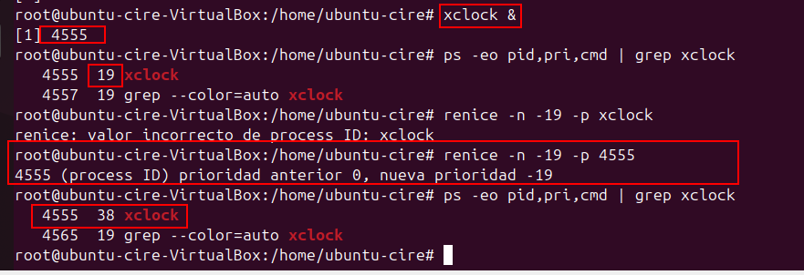

A on:

- `-n`: indica el valor de niceness.
- `-19`: és el valor de nice (quasi la més alta prioritat possible).
- `-p`: indica que li passes un PID.

> Nota: Els valors de bondat van de -20 (el més favorable al procés) a 19 (el menys favorable al procés). Segon el [manual](https://linux.die.net/man/1/nice)
> En cas posar-ho superior al limit, es mante a 0

Per llançar-los directament nou processos amb una prioritat determinada usem **sudo nice -n -18 xclock**

> que tambe podem canviar novament...
> Aqui podem veure varies comprovacions del nices, inclos mirant els limits a quin valor posat. Ha posat 39 al valor negatiu mes petit (-20) i 1 al més gran (0)


I en l'altra terminal observem la prioritat amb `htop`.

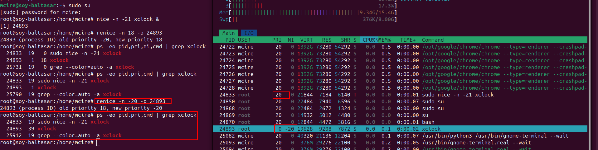

> Nota: podem observar que el PRI és ligerament diferent, aixó es perque eines com _htop, btop_, recalculen la prioritat per mostrar la forma més intuïtiva;
> Mentre que `top` o `ps` , mostren la prioritat real del kernel (/proc/[pid]/stat)

**Detallets respecte als processos**

A Linux, un procés es pot executar en primer pla (foreground) o segon pla (background).

- Primer pla: La terminal està “ocupada” amb aquest procés. No pots escriure altres ordres fins que s'acabi o ho passis a segon pla.
- Segon pla: El procés continua executant-se, però pots continuar usant la terminal.

En una comanda que hem executat, amb **CRTL+Z** podem aturar momentaniament (durant el que duri la sessió) un procés.
I podem observar que es troba com "treball" de fons amb **jobs** veiem els processos en segon pla/stop que hem posat

- També en les columnes de htop/top, etc, el stat posar **T**, de aturat.

> Nota: - (actual) i + (previ) són marcadors especials de treball, que indiquen prioritat per a certes operacions del shell.


La comanda **fg** per tornar/ reanudar un treball (per defecte a primer pla)

- Si no afegim paràmetre, reanudara l'ultim, sino el número del treball (de **jobs**)


També tenim **bg** reanuda un proces susp (STOP) en segon pla.

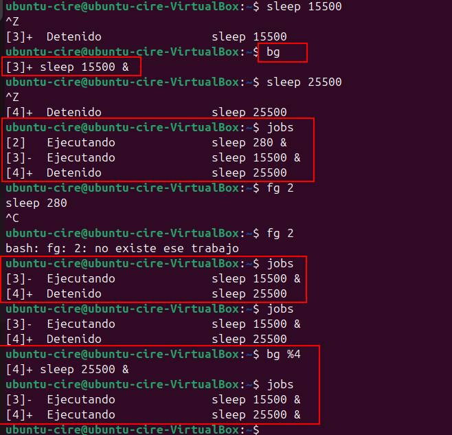

Respecte a iniciar processos directament en segon pla, per tenir lliure la terminal.

- Podem afegir el ampersand (**&**) que es un metacaracter especial per posar processos en segon pla.


El **htop** es el top en esteroides amb colors i més visual i interactiu.


El **btop** el mateix per més modern i en més animacions.


## Copies de seguretat i automatització tasques

### Teoria copies seguretat

Una còpia de seguretat (còpia de seguretat) és una còpia de dades pensada per a la recuperació en cas de pèrdua, corrupció o desastre. S'emmagatzema de forma independent de l'origen (idealment en un altre lloc/servidor/servei cloud), i sovint segueix polítiques de retenció, versions i proves de restauració.

Tipus comuns: completa, incremental i diferencial.
| Tipus de còpia | Què copia? | Velocitat | Espai ocupat | Avantatges | Inconvenients |
|----------------|------------|-----------|--------------|------------|----------------|
| **Completa** | Totes les dades cada vegada | Lenta | Molt | Molt segura i fàcil de restaurar | Necessita més temps i espai |
| **Incremental** | Només els canvis des de l'última còpia (de qualsevol tipus) | Molt ràpida | Poc | Estalvia molt espai i temps | Restauració més lenta (cal la completa + totes les incrementals) |
| **Diferencial** | Canvis des de l’última còpia completa | Ràpida | Mitjà | Restauració més simple que incremental | Cada dia ocupa més espai fins a la següent completa |

---

Ejemples:
| Tipus de còpia | Exemple de còpies fetes | Si perds un fitxer el dijous, què necessites per recuperar-lo? | Explicació senzilla |
|----------------|--------------------------|---------------------------------------------------------------|----------------------|
| **Completa** | Dilluns (completa), Dimarts (completa), Dimecres (completa) | La còpia completa de **dimecres** | Cada dia tens una còpia total nova. Només agafes l’última (la de dimecres) i ho tens tot fins ahir. |
| **Incremental** | Dilluns (completa), Dimarts (incremental), Dimecres (incremental) | **Dilluns + Dimarts + Dimecres** | Es necessita la cadena: la completa de dilluns i totes les incrementals fins al dimecres, perquè cadascuna només guarda els petits canvis del dia. |
| **Diferencial** | Dilluns (completa), Dimarts (diferencial), Dimecres (diferencial) | **Dilluns + Dimecres** | La diferencial de cada dia conté tots els canvis des de dilluns. Per això només cal la completa i l’última diferencial. |

---

Dintre dels **sistemes d’emmagatzematge**, tenim els **RAID**, que d’unir diversos discs perquè treballin junts.

- RAID 0: suma capacitat i rendiment, però si un disc falla ho perds tot. Zero seguretat.
- RAID 1: còpia mirall. Si un disc cau, l’altre segueix funcionant.
- RAID 5 / 6: combinen velocitat i seguretat repartint dades i “paritat” entre diversos discs.
- RAID 10: ràpid + segur (combinació de RAID 1 i 0).

> **Important**: RAID no és una còpia de seguretat.
> Si esborrem fitxers o entra un virus, RAID replicarà l’error a tots els discs.

---

**Una imatge (disk image)**
És una còpia exacta (portable) de tot un disc o partició: sistema operatiu, programes, configuracions i dades.
Serveix per clonar equips o restaurar-ho tot tal qual estava.

- Molt completa, però pesada i **lenta de crear**.
- Pot restaurar un PC sencer en minuts.

**Un snapshot**
És una captura puntual de l'estat d'un sistema de fitxers o d'un dispositiu de blocs que normalment depèn de la tecnologia d'emmagatzematge (LVM, ZFS, Btrfs, VM snapshots, etc.). És ràpid de crear i sovint és incremental: només registra els canvis des del moment del snapshot. Els snapshots són ideals per a punts de recuperació ràpids o per a proves, però solament són segurs com a còpia de seguretat si s'emmagatzemen fora del mateix suport físic (un snapshot local no protegeix contra fallades del mateix disc).

Diferències clau (resum):

La còpia de seguretat guarda les teves dades en un lloc segur per recuperar-les, la imatge del disc copia tot el sistema exactament tal com és, i el snapshot és una foto ràpida de l’estat actual per tornar enrere però no és segur si es guarda al mateix disc.

> Nota: no confiar només en snapshots locals com a única protecció; implementar una estratègia que combini snapshots per recuperacions ràpides i còpies de seguretat fora del lloc per a desastres.

### Practica comandes backup

##### cp

És una copia simple no intel·ligent, només transfereix fitxers localment, es molt simple d'utilitzar però no optimitzar.

##### rsync

És una eina intel·ligent que només copia els fitxers modificats i la sincronització pot ser local o en remot (via SSH).

##### dd

És una eina per a clonar discos o particions i no es intel·ligent, copia tots els sectors.

### Practica programes backups

Previ a les practiques hem afegit dos discos d'1 GB i formatat (fdisk)


Per a la comanda `cp`, podem comprovar que la copia es simple i el que esborrem de la font original no afecta la la nova:

```bash
cd Documents
mkdir prova
touch prova2

cd /var
mkdir copies
mount -t ext4 /dev/sdb1 /var /copies

cp -R /home/ubuntu-cire/Documents/* /var/copies
ls copies
touch /home/ubuntu-cire/Documents/hola
rm -r /home/ubuntu-cire/Documents/prova
cp -R /home/ubuntu-cire/Documents/hola

ls copies/
```

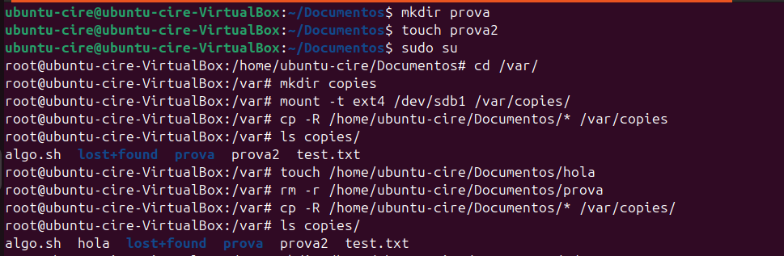

Amb **rsync** si esborrem algo a l'origen perdem a la copia

```bash
mkdir /home/ubuntu-cire/Documents/adeu
rm /home/ubuntu-cire/Documents/hola
rsync -ay --delete /home/ubuntu-cire/Documents /var/copies
```

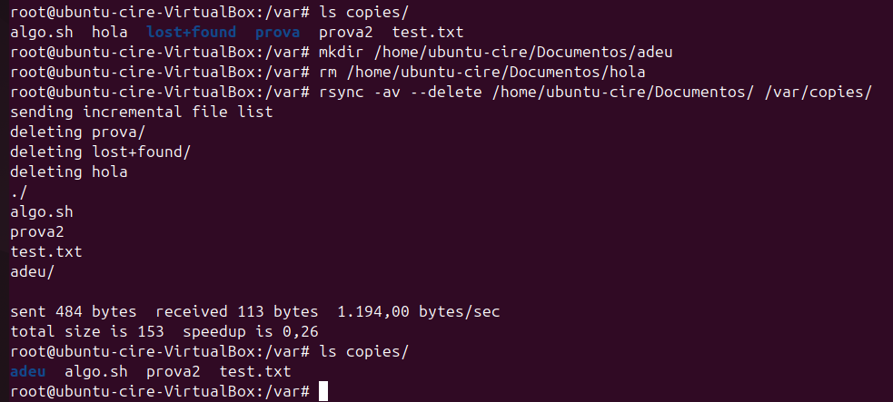

### Teoria automatització scripts, cron i anacron

### Pràctica automatització

##### cron

##### anacron

## Gestió d'usuaris i grups i permisos

La seguretat en Linux es basa en usuaris i grups, que determinen qui pot accedir o modificar arxius i processos.

**Tipus d’usuaris**

- Usuari normal: pot iniciar sessió i executar programes dins del seu espai.
- Superusuari (root): té tots els permisos i pot gestionar el sistema sencer.
- Usuari de servei (daemon): creat per executar serveis com www-data, mysql, sshd (no inicien sessió interactiva).
- Usuari de sistema: similar al d’un servei, amb UID baix (<1000), reservat per processos interns.

**Grups**
Un grup agrupa diversos usuaris amb permisos comuns sobre arxius o directoris.
Cada usuari pertany a:

- un grup principal, i
- pot formar part de grups secundaris.

Els grups permeten definir permisos col·lectius, per exemple, donar accés a una carpeta compartida sense fer-ho usuari per usuari.

| Fitxer       | Funció principal                               |
| ------------ | ---------------------------------------------- |
| /etc/passwd  | Llista tots els usuaris definits al sistema.   |
| /etc/shadow  | Desa les contrasenyes xifrades dels usuaris.   |
| /etc/group   | Conté la llista de grups i els seus membres.   |
| /etc/gshadow | Desa contrasenyes i administradors dels grups. |

### Directoris i fitxers importants

En Linux, la informació d’usuaris i grups està centralitzada en fitxers de configuració de text dins /etc.

### Directoris importants

#### /etc/skel

El directori **/etc/skel** (de skeleton) conté els fitxers i carpetes base que es copien automàticament al directori personal de qualsevol nou usuari creat al sistema.

Quan executem `adduser` o `useradd -m`, el contingut d’aquest directori es replica dins de /home/nom_usuari, garantint que cada compte disposi d’un entorn mínim de configuració per a la shell i altres programes.

- **.bash_logout**: el script s’executa quan l'usuari tanca sessió.
- **.profile**: s'executa quan l'usuari inicia sessió.
- **.bashrc**: s'executa per afegir una configuració a la nostra sessió el .bashrc.

**1. Proves del skel**
A mode d'exemple, la prova mes simple que podem fer es crear una carpeta/ arxiu que vulguem que tots els usuaris tinguin.
I podrem observar que als _nous_ usuaris, tenen aquesta carpeta.


**2. Proves .bash_logout**

En sortir, potser a l'usuari l'interessa que és moguin Captures, Baixades a una carpeta de sessió, que identifica quantes vegades ha entrat i sortit (per si l'hi agrada tindreu net cada vega).

Això, ho he aconseguit afegint unes quantes linies en aquest arxiu

```bash
ORIGEN="$HOME/Imágenes/Capturas de pantalla/"
DESTI="$HOME/sessions/session_$(date +%d_%Y)"
mkdir -p "$DESTI"
mv "$ORIGEN"/* "$DESTI"
```

Així es troba l'estructura previ a sortir.


I aquesta es l'estructura més `neta`:

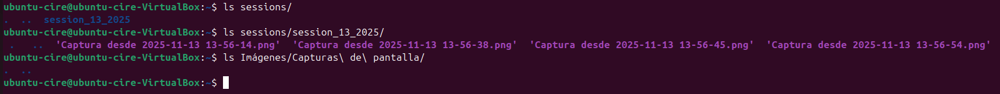

**3. Proves .profile**
Una de les coses que un usuari podria valorar, és que en iniciar sessió , se l'obrir el navegador, hi han molts formes de fer-ho-

- Una d'elles és fent servir la comanda `xdg-open` del paquet `xdg-utils`. I tambe afegim un log per demostrar que s'ha obert


I podem comprovar que s'obri.


**4. Proves .bashrc**
Com a admin, per a quedar amigables amb l'usuaris, podriem fer que en obrir la terminal s'envie una notificació deien "**Un gran poder, convella una gran responsabilitat**". I també podem afegir una eina que és _**cowsay**_ (una vaca ASCII) amb fortune (frases de `fortuna`)

Ho podem fer, fent ús **`notify-send`**

```bash
notify-send "Un gran poder, convella una gran responsabilitat"
cowsay $(whoami)
```

| Descripció                | Captura                                                               |
| ------------------------- | --------------------------------------------------------------------- |
| Configuració test .bashrc | 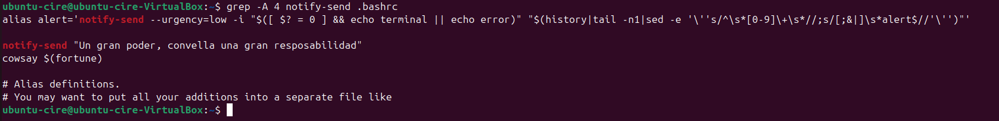       |
| Comprovació test .bashrc  | 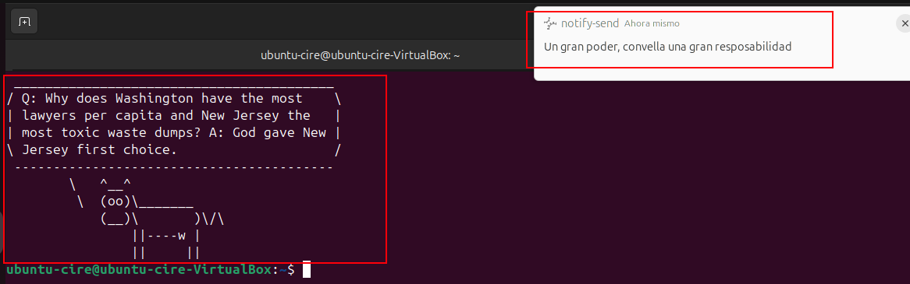 |

D'aquesta forma cada cop que s'obri una terminal amb bash, li surten els missatges.

### Fitxers usuaris i grups

El comportament per defecte en la creació i gestió d’usuaris es defineix en diversos fitxers de configuració del sistema.

Aquests controlen paràmetres com l’UID inicial, el directori personal, els permisos predeterminats, la caducitat de contrasenyes o el grup primari assignat.

Els principals són:

- /etc/adduser.conf: conté els valors per defecte dels programes adduser(8), addgroup(8), deluser(8) i delgroup(8).
- /etc/login.defs: defineix la configuració específica del lloc per a el conjunt de shadow password.
- /etc/default/useradd: configura els valors per defecte que useradd utilitza per a nous usuaris

Ara veurem algunes proves que podem fer.

**Arxiu `/etc/login.defs`**
En aquest arxiu podem configurar coses respecte a la contrasenya de l'usuari, com la duració.

Un test simple es limitar els dies màxims abans de canviar la contrasenya (`PASS_MAX_DAYS`) i el maxim de canvi en un dia `PASS_MIN_DAYS`.

- Per als nous usuaris.


Podem comprovar que tenim 3 dies abans que caduqui la contrasenya, això, en una empresa ho podriem realitzar mensualment.


I també que al intentar canviar la contrasenya amb `passwd`, per corroborar que efectivament no permet després del 1r intent

> Nota: un altre usuari li pot canviar la contrasenya si es troba al mateix sistema sense les limitacions d'esperar


**Arxiu `/etc/adduser.conf`**
Podriem afegir que tinguin permisos de root, afegit la opció de `ADD_EXTRA_GROUPS`, més `EXTRA_GROUPS` a on posem `root`


Podem comprovar que és troba al grup de superusuaris


**Arxiu `/etc/default/useradd`**
Podriem canviar el $HOME per a que el posi a una carpeta muntada, que perfectament podria ser un recurs xarxa muntat del servidor.
Així els perfils d'usuari es troben guardats ahi.

```bash
HOME=/mnt/particio-linux
```


**Arxiu `/etc/passwd`**

_Conté tots els usuaris del sistema i la informació bàsica de cadascun._

Cada línia té `7 camps` separats per `::`

```bash
nom_usuari : x : UID : GID : GECOS : directori_home : shell
```

| Camp           | Descripció                                                                   |
| -------------- | ---------------------------------------------------------------------------- |
| nom_usuari     | Nom identificatiu de l’usuari.                                               |
| x              | Indicador que la contrasenya es troba a /etc/shadow.                         |
| UID            | Identificador únic incremental de l’usuari (els de sistema solen ser <1000). |
| GID            | Identificador incremental del grup principal.                                |
| GECOS          | Informació opcional (nom complet, telèfon, etc.).                            |
| directori_home | Carpeta personal (p. ex. /home/usuari).                                      |
| shell          | Intèrpret d’ordres per defecte (p. ex. `/bin/bash`, `/usr/sbin/nologin`).    |


Podem identificar que és usuari que podem iniciar sessió per:

- Té un directori /home/usuari o qualsevol altra ruta.
- Té un shell vàlid (no `/usr/sbin/nologin` ni `/bin/false`).


**Arxiu `/etc/group`**

Defineix els grups del sistema i els usuaris que en formen part. I no hi podem veure l'administrador, ell es troba al `gshadow`.

Te el següent format:

```bash
nom_grup : x : GID : membres
```

| Camp     | Descripció                           |
| -------- | ------------------------------------ |
| nom_grup | Nom del grup.                        |
| x        | Referència al fitxer /etc/gshadow.   |
| GID      | Identificador únic del grup.         |
| membres  | Llista d’usuaris separats per comes. |

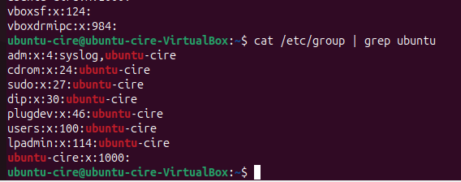

**Arxiu `/etc/shadow`**
Fitxer restringit a root, conté les contrasenyes xifrades i paràmetres de caducitat.

Te el següent format:

```bash
usuari : contrasenya_xifrada : últim_canvi : mínim : màxim : avís : inactiu : caducitat : reserva
```

| Camp                | Significat                                                  |
| ------------------- | ----------------------------------------------------------- |
| usuari              | Nom d’usuari.                                               |
| contrasenya_xifrada | Hash SHA‑512 o indicador: ! (bloquejat) o \* (sense login). |
| últim_canvi         | Dies des de l’1/1/1970 de l’últim canvi de contrasenya.     |
| mínim/màxim         | Dies mínims/màxims entre canvis de contrasenya.             |

```bash
nom_grup : contrasenya_xifrada : administradors : membres
```

| Camp                | Descripció                                        |
| ------------------- | ------------------------------------------------- |
| nom_grup            | Nom del grup.                                     |
| contrasenya_xifrada | Normalment `!` (sense contrasenya).               |
| administradors      | Usuaris amb permís per afegir o eliminar membres. |
| membres             | Usuaris que pertanyen al grup.                    |

Captura `gshadow`, excloent (`-v`) els bloquejats amb `grep`:

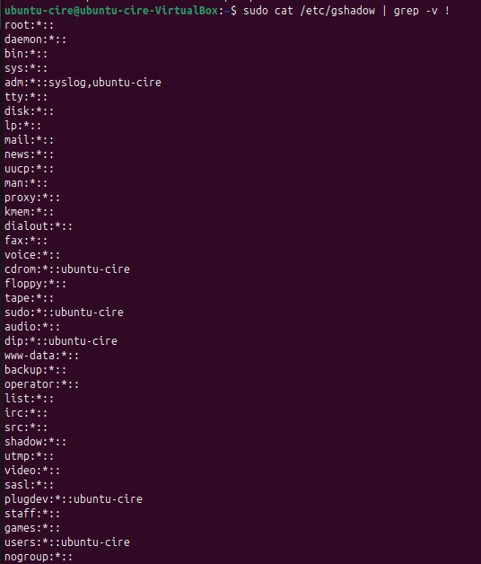

## Comandes bàsiques / gestió

En sistemes GNU/Linux, la gestió d’usuaris i grups es pot fer tant des de terminal com gràficament (en entorns com GNOME o KDE).
Per obtenir ajuda sobre qualsevol `comanda` podem utilitzar:

```bash
man comanda
# o
comanda --help
```

### Exercis

#### Crear usuari amb useradd

Com podem crear un usuari completament amb useradd, lo maxim possible?

Amb la comanda:

```bash
sudo useradd -m -s /bin/bash -c "Merda que s'actualitza cada dia i peta" -p $(openssl passwd -6) windows10
```

Paràmetres importants:

- -m: Crea el directori personal
- -s: Defineix l’intèrpret (ex: /bin/bash)
- -c: Afegeix informació GECOS
- -g: Defineix grup principal
- -G: Defineix grups addicionals
- -p <hash>: Defineix la contrasenya xifrada de l'usuari
  - openssl passwd -6: Genera el hash SHA-512 compatible amb /etc/shadow

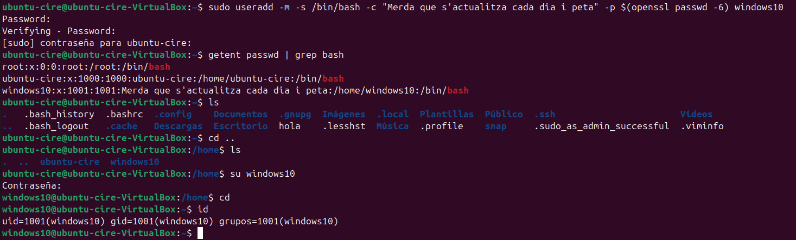

#### Canvia nom usuari

Quina comanda o comandes hem de fer servir per canviar el nom d'usuari correctament.

```bash
# Per canviar el nom d'usuari
sudo usermod -l nou_nom antic_nom

# Per canviar el nom del grup
sudo groupmod -n nou_nom antic_nom

# Per canviar carpeta personal, movent el contingut
sudo usermod -d /home/nou_nom -m nou_nom #

```

> He canviat el nom de windows10 a windows11, el 10 ja no rep actualitzacions, ja es bon sistema.

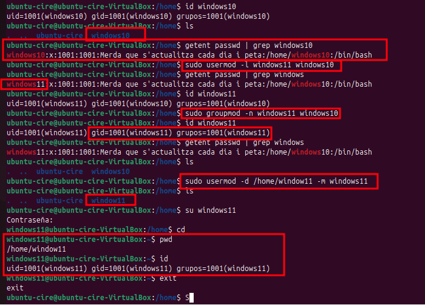

### Gestió bàsica d’usuaris i grups

En distribucions basades en Ubuntu, la configuració gràfica permet afegir o eliminar usuaris bàsics des del panell de **Configuració **> **Sistema** > **Usuaris**.

|  | 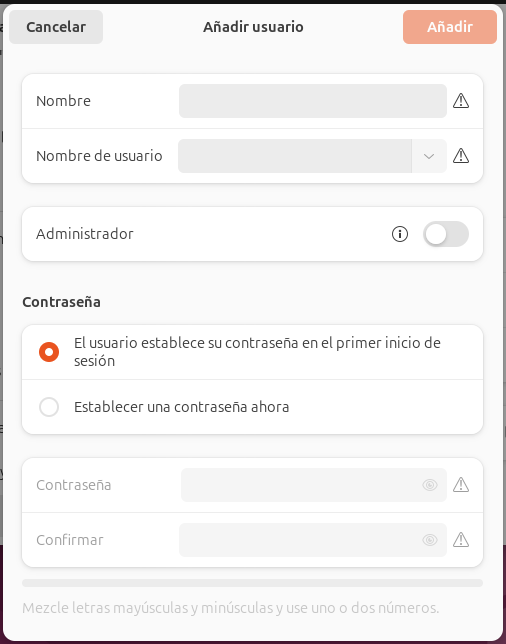 |
| ----------------------------------------------------------------------------------------- | --------------------------------------------------------------------- |

També tenim l'utilitat que ve en instal·lar _`gnome-system-tools`_. Que permet un poquet més.


Encara que és més comú fer servir comandes, que veurem a continuació.

### Adduser/ addgroup

La forma més habitual i senzilla és amb:

```bash
sudo adduser nomusuari
```

Aquesta **comanda és interactiva**, demana **contrasenya** i **opcionalment nom complet, telèfon, etc**.

- Si només pressionem **Enter**, això deixa els camps opcionals (_GECOS_) buits.


Després de crear-lo, podem comprovar el resultat a `/etc/passwd` o amb `id`:


I veure que s’ha creat automàticament:

- El usuari amb **nou UID** (1001)
- El **grup** principal amb el **mateix nom**
- El **directori** personal **/home/nomusuari**
- L’**intèrpret** de comandes per defecte (**/bin/bash**)

I tambe el seu grup:


També podrem iniciar sessió gràficament amb aquest usuari.


---

**addgroup**

_És la versió més amigable de **groupadd**, disponible a Ubuntu i derivades._

- és essencialment un _wrapper_ de groupadd amb menys paràmetres i més fàcil d’usar.

```bash
sudo addgroup nomgrup
```

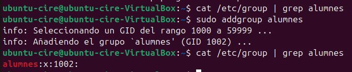

### useradd/ groupadd

A banda de la posterior comanda, aquesta serveix per crear els usuaris sense demanar-nos (preguntar-nos) en l'entrada estàndard (Standard Input), ens ho permet configurar practicament amb els paràmetre.

La creació d'un usuari directe sense paràmetres amb `useradd usuari` no crea la carpeta d'usuari, si que crea l'usuari, grup.
I assigna l'interpret SH (Dash Shell), en sistemes anteriors es possibles que assigne el Bourne Shell (sh també), que és antic i lent.

```bash
sudo useradd nomusuari
```


Podem canviar l'interpret amb la comanda **usermod** i el paràmetre `-s`

```bash
sudo usermod -s /bin/bash nomusuari
```


Per a la carpeta d'usuari, primer l'hauriem de crear amb `mkdir` i canviar els permisos amb `chown`

- El paràmetre `-R` es per a que sigui recursiu a qualsevol carpeta/arxiu dintre, en aquest cas no faria falta, pero es una recomanació

```bash
sudo mkdir /home/nomusuari
sudo chown -R nomusuari:nomusuari /home/nomusuari
```


Finalment hem d'assignar contrasenya a l'usuari, per a poder accedir-hi, podem comprovar al shadow que no n'hi ha. Això ho podem realitzat amb `passwd`

```bash
sudo passwd nomusuari
```


En resum, per crear un usuari amb useradd minim hem d'afegir, ja sigui amb els paràmetres o nosaltres manualment:

- Carpeta d'usuari en la mateixa ruta del definida al `passwd`
- Contrasenya
- L'interpret es opcional

> També podem `iniciar` sessió amb `su`, encara que no compta com inici grafic.

| Login amb `su` a jesus                                        | Login gràfic jesus                                                 |
| ------------------------------------------------------------- | ------------------------------------------------------------------ |
|  |  |


> En cás de voler bloquejar un usuari ho podem fer amb el paràmetre `-L` amb `usermod`, al `passwd` identifiquem que és troba bloquejat per l'exclamació a l'inici `!`

```bash
sudo usermod -L nomusuari
```

o

```bash
sudo passwd -l nomusuari
```

Les dues comandes són diferents tecnicament.

Amb **usermod -L** bloquejar el compte complet.

> Encara que ambdós casos és pot continuar accedint si utilitza altres mètodes (per exemple, claus SSH).

En tots dos casos casos, a `/etc/shadow` apareixerà un `!` davant del hash.

> Per desbloquejar és el paràmetre `-U`

```bash
usermod -U nomusuari
passwd -u nomusuari
```

| Bloquejant i desploquejant amb usermod -L i -U                    | Bloquejant i desploquejant passwd -l i -u                       |
| ----------------------------------------------------------------- | --------------------------------------------------------------- |
|  | 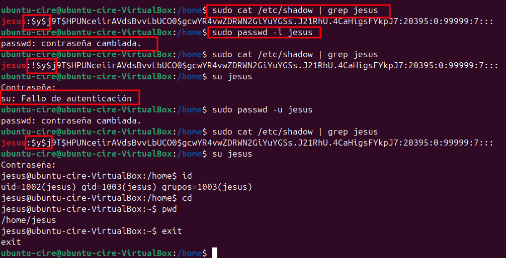 |

> En l'inic gràfic amb els dos mètodes, sortiria el següent error de "Fallada autenticació en contrasenya":
> De fet ni sortirá l'usuari, l'haurem de posar nosaltres


> Nota: els usuaris creats, per defecte no tenen permisos admin (sudo), com podem observar.

---

`groupadd` serveix per crear un grup nou al sistema. Observarem el /etc/group que

```bash
sudo groupadd nomgrup

```

Algunes opcions simples són:

| Opció  | Descripció                                      |
| ------ | ----------------------------------------------- |
| -g GID | Assigna un GID concret al grup                  |
| -r     | Crea un grup de sistema (UID/GID baixos, <1000) |

Exemples:

|   # | Acció               | Comanda / Notes                                                                              |
| --: | ------------------- | -------------------------------------------------------------------------------------------- |
|   1 | Creació grup simple | sudo groupadd alumnes2, segueix l'ordre GID anterior                                         |
|   2 | GID específic       | sudo groupadd -g 1500 alumnes3, el GID és 1500                                               |
|   3 | Grup de sistema     | sudo groupadd -r alumne4, en el arxiu groups, el GID es inferior als 1000, al ser de sistema |


### usermod / grupmod

Previament mencionat, permeten modificar propietats usuaris i grup existents
Tenen la següent estructura:

```bash
sudo usermod [opcions] nomusuari
sudo groupmod [opcions] nomgrup
```

Alguns exemples d'ús (a banda dels ja mostrats) són:

```bash
sudo usermod -aG sudo nomusuari   # afegir a un grup
sudo usermod -d /nou/home -m nomusuari  # canviar carpeta personal, movent el contingut
```


### adduser / gpasswd

El mètode més simple per afegir l'usuari a un grup és amb `adduser`, el primer paràmetre es el nom d'usuari i el segon el del grup.

```bash
sudo adduser nomusuari nomgrup
```


L'altre metode és amb el paràmetre `-a` amb `gpasswd`

```bash
sudo gpasswd -a nomusuari nomgrup
```


També está `sudo usermod -aG`, previament mencionat.

### userdel/ grupdel

Podem esborrar amb `userdel`, si afegim el paràmetre `-r` per esborrar "recursivament", sense l'opció no esborra la carpeta $HOME de l'usuari.

```bash
sudo userdel nomusuari
sudo userdel -r nomusuari
```

| Sense el paràmetre                                                   | Amb el paràmetre                                                 |
| -------------------------------------------------------------------- | ---------------------------------------------------------------- |
|  | 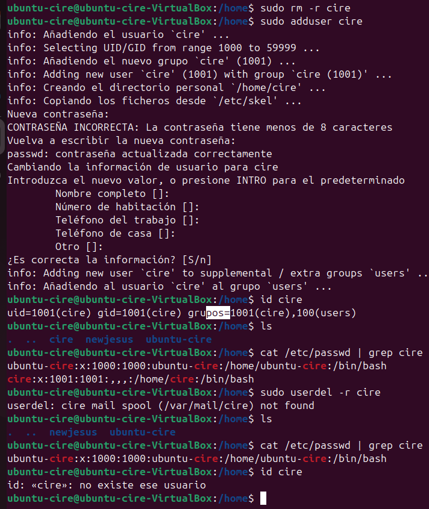 |

Per borrar un grup podem simplement amb `grupdel` o `delgroup`


```bash
sudo groupdel nomgrup
```


També podem fer servir **`deluser`** amb `--remove-all-files` (per sols arxiu) o `--remove-home`.
Normalment si esborrem un usuari, és problable que vulguem tots els seus arxius repartits en el sistema fora.

```bash
sudo deluser --remove-all-files --remove-home nomusuari
```


### chage

La comanda `chage` ens permet visualitzar i modificar les polítiques de caducitat i expiració d’usuaris.

Una prova que podem fer és la de forçar que caduqui la contrasenya. Aixó en el cás d'un despit d'empleat, és possible que ho hàgim de fer.

- Amb el paràmetre `-E` posa com que el `compte` va caducar el 01 de gener del 1970, per lo tant l'usuari no pot entrar
- El `-l` ens permet veure l'informació.

| Acció                        |                                  Captura                                   |
| ---------------------------- | :------------------------------------------------------------------------: |
| Execució `chage -E 0`        |       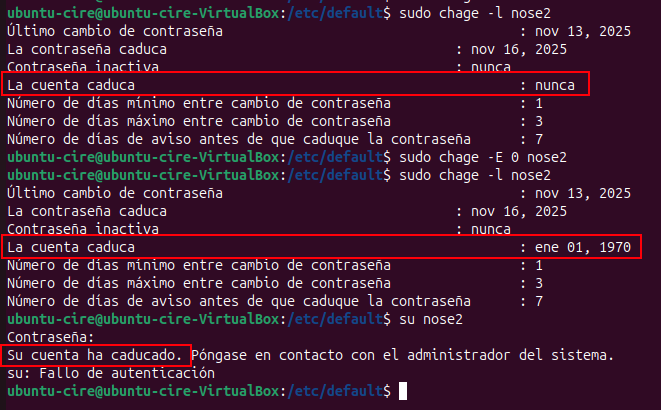       |
| Comprovació compte bloquejat |  |

> Per traure la caducitat seria `chage -E -1 `

Hi ha un altre interessant que és el `-d` que posa la data de caducitat de la `contrasenya` a 0.
Obligant a que en el proxim inici de sessió, es canvïi.

> per si volem fer rotació contrasenya a un usuari en específic.


## Permissos

En sistemes UNIX, els permisos fan part del sistema. Sense ells no podem visualitzar, alterar o executar fitxers, entrar en directoris o llistar-ne el contingut.
És basen en tres atributs fonamentals:

- Lectura (**r**): permet veure el contingut d'un fitxer o llistar els continguts d'un directori, té el **valor numèric de 4**.
- Escriptura (**w**): Permet modificar un fitxer o crear i eliminar fitxers dins d'un directori, té el **valor numèric de 2**.
- Execució (**x**): Permet executar scripts o programes. Sense aquest permís, no es pot executar programari ni accedir a directoris, té el **valor numèric de 1**.

> Nota: si surt `-` és que no te permissos

La seva estructura es la següent:


```bash
[d/-][rwx][rwx][rwx]
│    │    │    └── Altres (others)
│    │    └──────── Grup
│    └───────────── Propietari (owner)
└────────────────── Tipus: d = directori, - = fitxer
```

- El primer indica si es directori (d) o fitxer (-)
- Els tres primers atributs després del primer (que identifica directoris), són per a **propietaris**
- Els tres següents són per a **grup**
- Els ultims són per als altres usuaris/ grups

A banda existeixen permissos especials, com:

**SUID**, user + s (pecial)

Un fitxer amb SUID sempre s'executa com a l'usuari propietari del fitxer, independentment de si l'usuari passa l'ordre. Si el propietari del fitxer no té permisos d'execució, fa servir una S majúscula aquí.

> Important: A la majoria de distribucions Linux modernes, SUID en scripts de shell no funcionen per seguretat. En executables binaris sí funciona.
> Així que en un script .sh normal, es faria servir usuari actual.
> Font: https://linuxvox.com/blog/suid-not-working-with-shell-script/


**SGID**, other + t (sticky)

- Si es defineix en un fitxer, permet que el fitxer s'executi com el grup propietari del fitxer (similar a SUID).
- Si es defineix en un directori, qualsevol fitxer creat al directori tindrà la propietat del grup definida com la del propietari del directori.

**Sticky bit**, other + t (sticky)
L'últim permís especial s'ha anomenat `bit fix`. Aquest permís no afecta els fitxers individuals.
A nivell de directori, restringeix l'eliminació de fitxers. Només el propietari (i root) d'un fitxer pot eliminar el fitxer dins d'aquest directori.

Tots estos permissos (ja sigui els octal o en forma llegible) i grups podem canviarlos amb `chmod` e `chown`.

Per defecte el sistema operatius tenen uns `permissos` teorics base de fitxer i directoris, per exemple en Ubuntu:

- Fitxers: 666 (rw-rw-rw-)
- Directori: 777 (rwxrwxrwx)

> Nota: no s'apliquen directament perquè serien massa permissius (tothom podria llegir, escriure o entrar a tot).

Dit alló, posteriorment fan servir el _umask_ (**user file-creation mode mask**), que és un número octal de quatre dígits. Aixó per obtenir permisos finals.

Es pot calcular el resultat final de dues formes diferents:

| 1. Restant el permís teòric amb el umask, per exemple: | 2. Convertint en binari i realitzant l'operació AND                                               |
| ------------------------------------------------------ | ------------------------------------------------------------------------------------------------- |
| 666 - 022 = 644 (rw-r--r--)                            | permisos base (666): 110 110 110 <br> umask (0022): 000 010 010<br> NOT umask (0022): 111 101 101 |

> Nota: el pimer digit (0 en aquest cás) del umask indica el permís especials (previament mencionat)

Per exemple en Ubuntu s'aplica `0002` a l'usuari per defecte i `0022` pel root, resulta en que els fitxers tinguin 644 (666-022).

Ho podem comprovar en la comanda `umask`


### ICACLS

Les ACL són representacions de permisos per a elements del sistema d'arxius, que extienden els permisos natius POSIX. Donar excempcions.

Per comprovar els permissos ACL que hi ha, ho podem obtenir amb `getfacl`, per exemple a la carpeta `numeros`

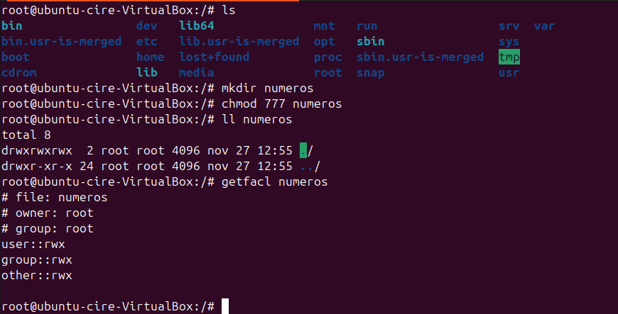

En cas per exemple no voler que el `segon` no accedeixi a la carpeta, podem afegit una exempció restrictiva amb **setfacl**

```bash
setfacl -m user:segon:--- numeros
```


I podem comprovar que el segon no pot accedir.


Amb `setfacl -b ` numerò resetjem els permissos


### Exercici

Podem realizar algunes proves, per mostrar aixó abans he preparat l'entorn:

1. He creat el grup paloma amb els integrants nick, deivy. I crear els usuaris ferran e cire

```bash
groupadd palomes
useradd -m -G palomes -p $(openssl passwd -6 'alumne99') nick
useradd -m -G palomes -p $(openssl passwd -6 'alumne99') deivy
useradd -m -p $(openssl passwd -6 'alumne99') ferran
useradd -m -p $(openssl passwd -6 'alumne99') cire
```


2. Creat una carpeta i una arxiu dintre que sera `comuna` entre els cuatre.

```bash
mkdir palomes
echo "Palomas torcaces estofadas" > sopar.txt
```


A continuació hem de posar els permissos correctes, de forma que és compleixi aixó:

- nick: es omnipotent, llistar, borrar, modificar
- deivy: pot llistar, no borrar ni modificar, ni crear res
- ferran i cire res, per a la carpeta paloemes

```bash
chown -R nick:palomes palomes
chmod 750 palomes

chgrp palomes palomes ## També podem canviar el grup amb chgrp grup directori
```


En un altre contexte a on vulguessim una carpeta colaborativa a on los del grup puguin pujar penjar coses pero no esborrar ni modificar lo dels altres, hauriem de usar el sticky bit. Per exemple:

```bash
chown -R nick:palomes palomes
chmod 1770 palomes
```

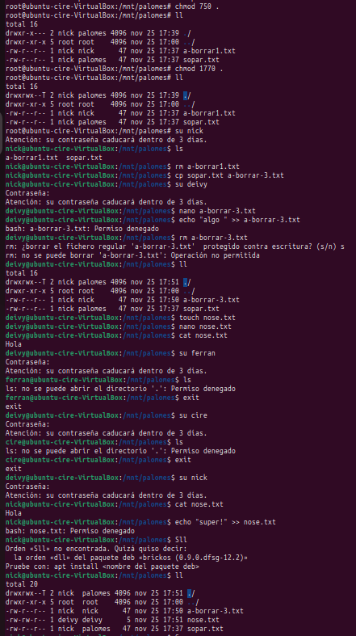

En la captura podem veure que els arxius creats, nomes els podem modificar i eliminar els propietaris.

Respecte a posar els permissos amb chmod, ho podem posar en la notació decimal o en lletres, les lletres serien:

- a: tots els usuarios
- o: els altres usuaris
- u: propietari
- g: grup

**Proves umask**
Respecte a l'umask per defecte, tenim diversos arxiu a on realitzar els canvis:

El primer i més util seria el temporal, que seria fer servir la comanda `umask`+ mascara, aquest canvi és solament durant la sessió actual de la SHELL

- En aquets cás ho he fetr en el root, posant 001, de forma que el grup root i altres tindran permisos lectura i d'escriptura i (carpetes i arxius)

> Nota: el que he fet és molt mala practica, podrien colar una comanda maliciosa a l'arxiu que he creat

[Comprovació umask temporal](../images/sp2/sp2-umask-temporal.png)

El segon (i permanent) seria en el login.defs, previament mencionat, d'aquesta forma, a qualsevol **nou** usuari, se li aplicara el umask als arxiu/carpetes que creïi.

- He posat el `umask 077` que sols dona tots els permissos a l'usuari i el seu grup


Per ultim, també tenim el **.profile**, amb el que sols canviariem en aquell usuari específic.

- Aqui he fet que sols el grup pugui llegir, els altres res (umask 027).


I aquesta hauria de ser la sortida (carpeta cc)


## Gestió avançada

### TTY

La "terminal" que hem estat fent servir, realment no ho és, es una pseudoterminal, podem canviar a una més propera al concepte, que és la TTY, amb CTR-F2-F6

> La TTY és una **terminal física o virtual** que permet interactuar directament amb el nucli de Linux

- Resum tècnic: control d'accés, autenticació i mecanismes del sistema per administració avançada.


