# Administració de dominis i seguretat


# Índex

- [Administració de dominis i seguretat](#administració-de-dominis-i-seguretat)
- [Conceptes bàsics](#conceptes-bàsics)
- [Creació i configuració](#creació-i-configuració)
  - [Configuració previa](#configuració-previa)
  - [Creació i configuració servidors](#creació-i-configuració-servidors)
  - [Configuració client](#configuració-client)
  - [Entorn gràfic](#configuració-client)
- [Ús de les comandes](#us-comandes)
- [Samba](#servidor-samba)
  - [Configuració server smb](#configuració-server-smb)
  - [Configuració client smb](#configuració-client-smb)
    - [Test amb l'usuari anonim](#test-amb-lusuari-anonim)
    - [Test amb edgar](#test-amb-edgar)
    - [Test amb naim](#test-amb-naim)
    - [Test amb eros](#test-amb-eros)
  - [Integració OpenLDAP](#integració-openldap)
    - [Configuració server](#configuració-server)
    - [Proves client](#proves-client)

- [NFS](#servidor-nfs)
  - [Configuració server NFS](#configuració-server-nfs)
  - [Configuració client NFS](#configuració-client-nfs)

# Conceptes bàsics

# Creació i configuració

## Configuració previa

He postat les dues maquines en la mateixa xarxa virtual interna, creant la `NatNetwork` i assignant-la a les maquines


| Server                                                               | Client                                                             |
| -------------------------------------------------------------------- | ------------------------------------------------------------------ |
|  |  |

Hem configurat la IP a estatica en el servidor, perque en principi "sempre" hauria de tenim la IP fixa, per fer-ho senzill ho he fet en interficie grafica (i no el netplan). I comprovat que s'ha aplicat correcta i tenim sortida a internet.

|  |  |
| :--------------------------------------------------------: | :----------------------------------------------------------: |

He canviat del hostname amb `hostnamectl` i posat el domini "cire.cat" en el /etc/hosts, degut a que no tenim DNS


### Creació i configuració servidors

Els paquets a instal·lar per a configurar el domini són `slapd` i `ldap-utils`, a on surtira un prompt per posar la contrasenya de l'administrador del domini


Amb la comanda `slapcat` podem obtenir l'informació dels objectes, unitats, etc, del domini

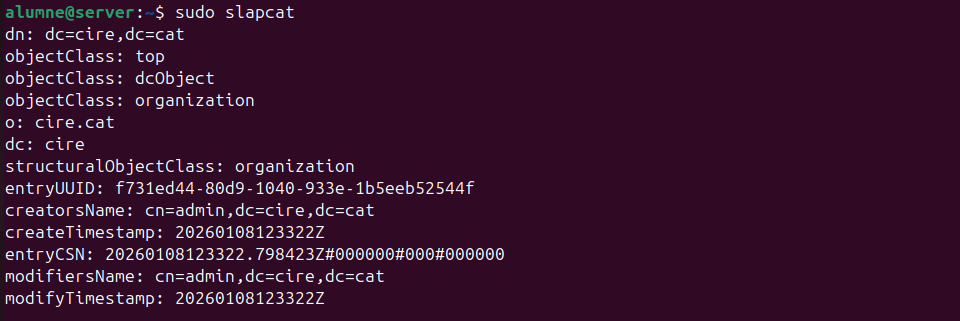

Per configurar comodament algunes opcions del domini he executat `dpkg-reconfigure slapd`

|                               |                             |
| :----------------------------------------------------------------------------------------------: | :-------------------------------------------------------------------------------------: |
|                                    |                               |
|                            | 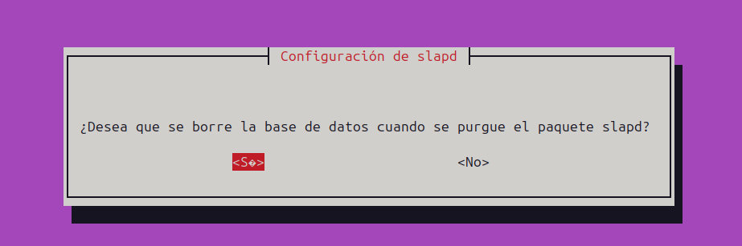 |
|  |                |

Posteriorment he modificat el ou.ldif (amb `sed`), usu.ldif i el de grups, per canviar al meu domini

|  |  |
| :--------------------------------------: | :--------------------------------------: |

I finalment he afegit la unitat amb `ldapadd -c -x -D "cn=admin,dc=cire,dc=cat" -W -f ` i els arxius.


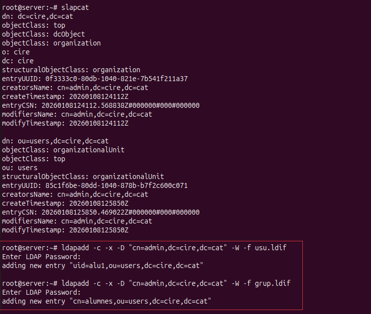

I podrem veure al slapcat que s'han creat.


### Configuració client

He instal·lat els paquets libnss-ldap libpam-ldap nscd

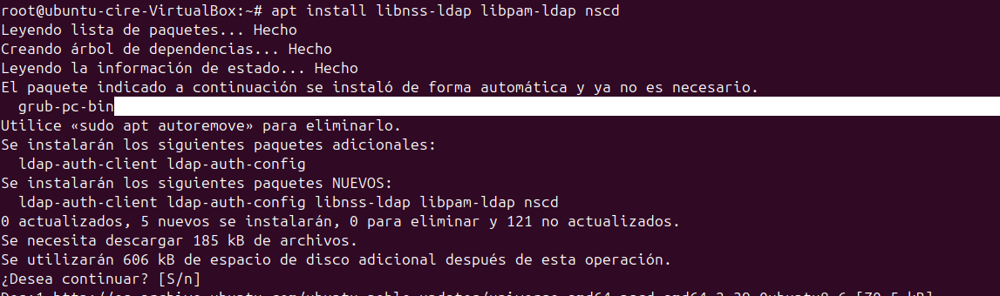

En el prompt que surt en l'instal·lació, he posat la IP del servidor i emplenat les dades.

|            |            |
| :------------------------------------------------------------------: | :--------------------------------------------------------: |
|                 | 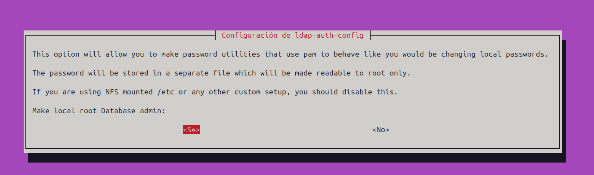 |
| 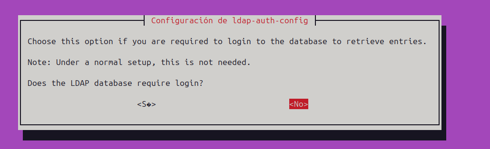 | 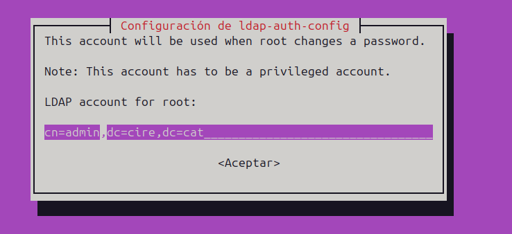 |
|                 |                                                            |

En principi podriem reconfigurar amb el paquet el ldap-auth-config, que es practicament mateix que surt a l'instal·lació

|  |  |
|  |  |  |

Després al `/etc/nsswitch.conf` he afegit la base `ldap` abans de totes, per a que cerqui ahi usuari, contrasenyes i grups

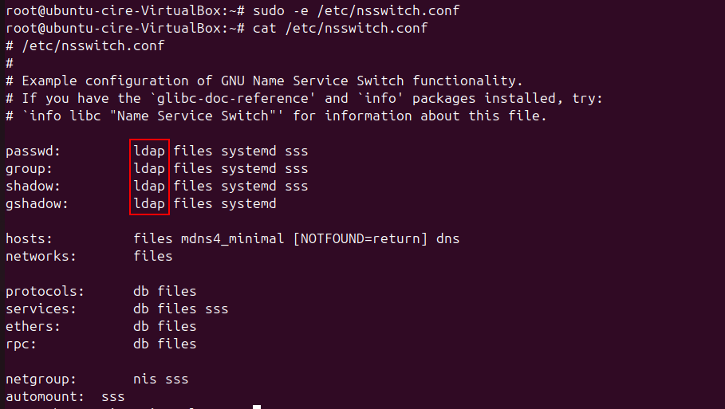

Per finalitzar en el arxius de autenficació he fet:

- En el /etc/pam.d/common-password he eliminat el `use_authtok`
- Afegit `session optional pam_mkhomedir.so skel=/etc/skel umask=077` al final en el `common-session`
- encara que també executant `pam-auth-update` i marcant "LDAP Authentication" i "Create home directory on login", funcionaria.

| 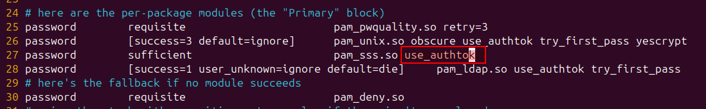 | 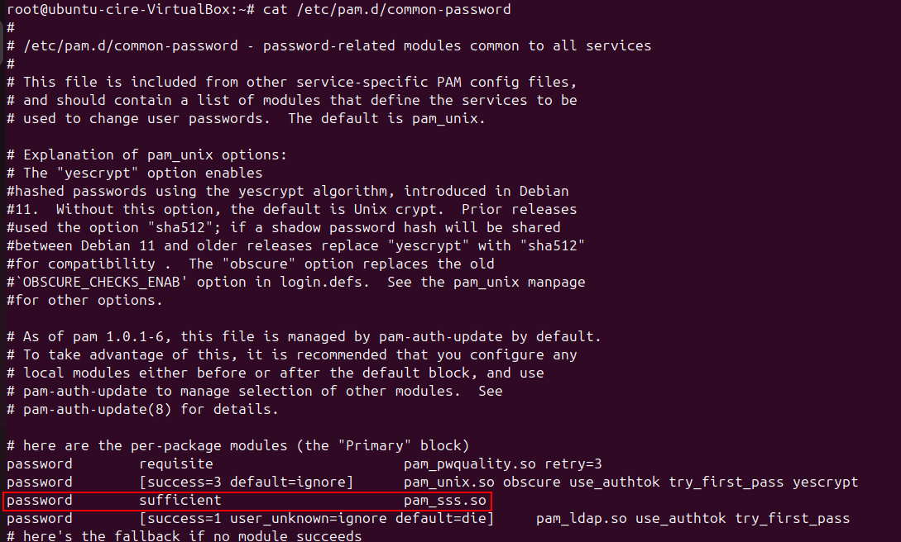 |  |
| :-------------------------------------------------------------: | :----------------------------------------------------------: | :--------------------------------------------------------: |

I he configurat el fitxer de configuració de LightDM per permetre l'inici de sessió manual d'usuaris LDAP. Això és necessari perquè, per defecte, LightDM només mostra els usuaris locals i no permet introduir manualment un nom d'usuari. Afegint aquestes opcions:

```bash
[Seat:*]
user-session=ubuntu
greeter-show-manual-login=true
```


Ens assegurem que aparegui l'opció "Login manual" al gestor d'inici de sessió, permetent així que els usuaris autenticats pel servidor LDAP puguin iniciar sessió al sistema.

En reiniciar, podem comprovar que puc iniciar sessió

|          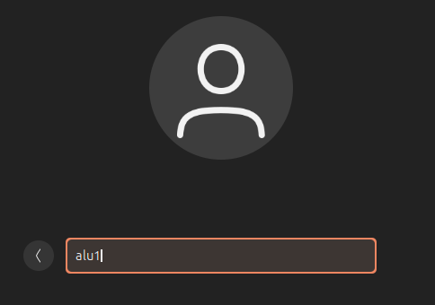           |                                 |
| :---------------------------------------------------------------: | :---------------------------------------------------------------------------------: |
|  |  |

### Entorn gràfic

Abanda de crear unitat/usuari/grups amb `scripts` .ldif, ho podem fer amb un programa grafic, com:

- phpldapadmin
- apache directory stdio
- jxplorer
- ldap account manager (LAM)

El programa que **documentaré es LAM**

De cada programa cal provar i documentar:

**Instal·lació**
Previ he instal·lat les dependencies de php i altres necessaries

```bash
apt install -y fonts-dejavu gettext libapache2-mod-php8.3 libphp-phpmailer \
  php php-bcmath php-constant-time php-gd php-gmp php-ldap php-monolog \
  php-mysql php-phpseclib3 php-random-compat php-sqlite3 php-xml \
  php8.3 php8.3-bcmath php8.3-gd php8.3-gmp php8.3-ldap \
  php8.3-mysql php8.3-sqlite3 php8.3-xml

```


Després, l'he instal·lat descarregant el **binari .deb** amb `wget` de la pàgina per **obtenir l'ultima versió**

```bash
wget -q https://github.com/LDAPAccountManager/lam/releases/download/9.4/ldap-account-manager_9.4-1_all.deb
dpkg -i ldap-account-manager_9.4-1_all.deb
```


**Configuració**
Per a configurar, he accedit mitjançant navegador web a `http://localhost/lam` i especificat una nova contrasenya. I en LAM Configuration he posat una contrasenya al perfil LAM per poder accedir-hi.

|             |          |  |  |
| :-------------------------------------------------------: | :------------------------------------------------------: | :-------------------------------------------------: | :--------------------------------------------------: |
| 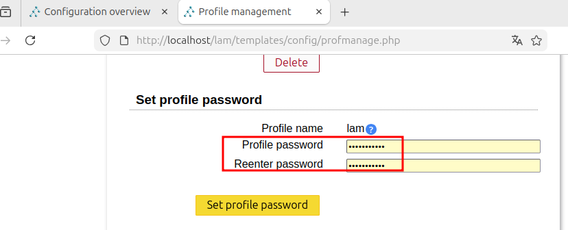 | 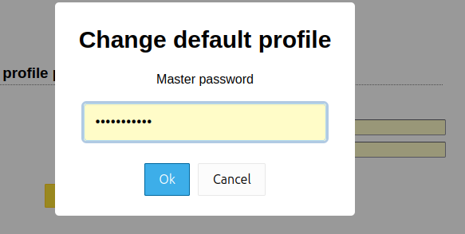 |  |                                                      |

Posteriorment he accedit amb LAM i proporcionat l'informació de servidor en `Ajustes generales` i els tipus de comptes en `Tipos de cuentas`

|          |  |
| :----------------------------------------------------------------------------: | :-------------------------------------------------------------------------------------: |
|  |          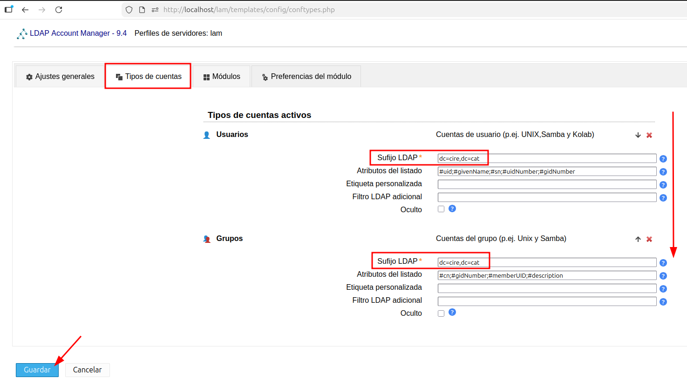           |

**Comprovar que l'arbre de directori és correcte**
Finalment, en connectar-me amb l'usuari `admin` i `alumne` de contrasenya, podrem veure que surt l'usuari i en l'arbre l'estructura.

|  | 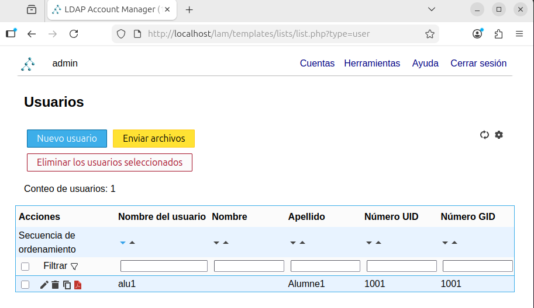 |  |
| :--------------------------------------------------------: | :---------------------------------------------------------------------------: | :--------------------------------------------------------------------------------------: |


**Crea una uo, un grup i un usuari**

> Nota: tot això es pot fer en el Visor d'arbre però amb les guiades es mes simple (no requereix saber les classes a afegir)

Per crear allò simplement he fet el següent.

1. Per a la OU en L'Editor de OU
2. Per al grup i usuari, he anat en Cuentas > Grupos / Usuarios i afegit

|                         Proces seguit                          |
| :------------------------------------------------------------: |
|  |

|  |  |  |
| :-----------------------------------------: | :------------------------------------------: | :----------------------------------------------: |
|                 **Usuari**                  |                   **Grup**                   |              **Comprovació final**               |

---

> Per fer-ho en el visor, seria:
> Creant un nou objecte amb la respectiva classe de `organizationalUnit` i automaticament, s'afegira la classe abstracta `top`, que defineix que cada objecte de LDAP ha de tenir un atribut objectClass.

---

**Accedir des del client amb aquest usuari**
Posterior a configurar, podem comprovar que puc accedir-hi:


### Us comandes

---

Distinguished Name: DN
CN: Common Name
dc: domain controller

El modify sols es per canviar els valors dels atributs

modrn

1 cas: SI volem cnavia rel dn usem modrdn
2n cas: si vol moure un objecte a un altre

---

Fes un **dpkg-reconfigure slapd** al servidor per tal de deixar la base de dades buida i només amb el domini i l’usuari admin creat. Comprova-ho amb un **slapcat**.

- Descarrega l'arxiu **dades_pt1.ldif** del moodle i amb la comanda **ldapadd carrega els usuaris**, grups i uos (Compte que el domini és **cire.cat**)
- Fes un altre **slapcat** per tal de comprovar que les dades s'han carregat correctament

---

Captura comprovament reconfigure (tot _net_):


He carregat els usuaris `ldapadd -x -D cn=admin,dc=cire,dc=cat -W -f dades_pt1.ldif`

Creació
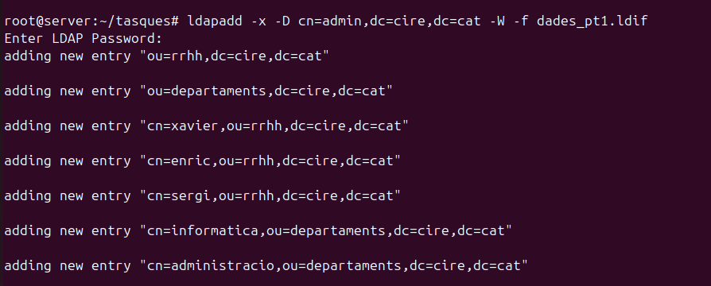

Comprovació slapcat


1. Crea un nou usuari directament al domini

**Arxiu creacioUsuari.ldif**

```bash
dn: cn=ferran,dc=cire,dc=cat
objectClass: inetOrgPerson
objectClass: organizationalPerson
objectClass: person
objectClass: posixAccount
objectClass: top
cn: ferran
gidNumber: 1001
homeDirectory: /home/ferran
loginShell: /bin/bash
sn: Reus
uid: ferran
uidNumber: 1001
userPassword: alumne
```

Ho he fet amb la següent comanda: `ldapadd -x -D "cn=admin,dc=cire,dc=cat" -w alumne -f creacioUsuari.ldif`

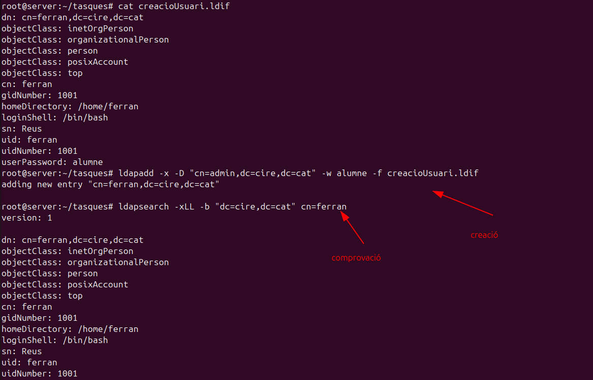

2. Crea una nova uo anomenada nòmines

**Arxiu creacioUO.ldif**

```bash
dn: ou=nomines,dc=cire,dc=cat
objectClass: organizationalUnit
objectClass: top
ou: nomines
```

Ho he fet amb la següent comanda: `ldapadd -x -D "cn=admin,dc=cire,dc=cat" -w alumne -f creacioUO.ldif`


3. Mou l’usuari que has creat dintre de la uo nòmines

**Arxiu moure.ldif**

```bash
dn: cn=ferran,dc=cire,dc=cat
changetype: modrdn
newrdn: cn=ferran
deleteoldrdn: 1
newsuperior: ou=nomines,dc=cire,dc=cat
```

Ho he fet amb la següent comanda: `ldapmodify -x -D "cn=admin,dc=cire,dc=cat" -w alumne -f moure.ldif`

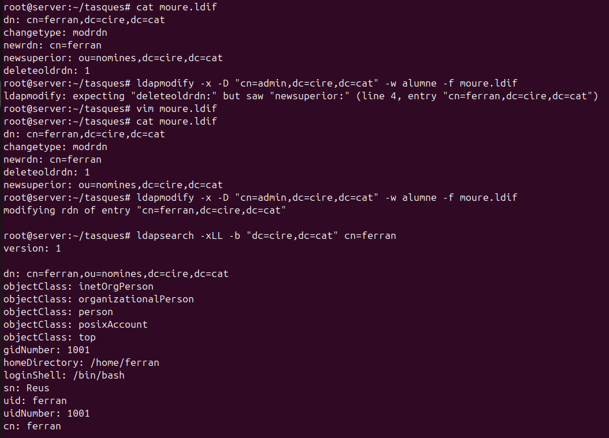

4. Quants grups hi ha al domini cire.cat? **N'hi han 2**

Ho he obtés amb: `ldapsearch -xLLL -b "dc=cire,dc=cat" objectClass=posixGroup`

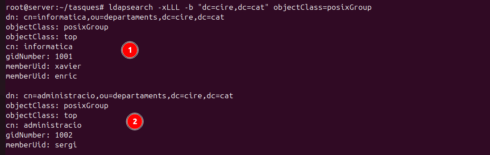

5. Afegeix l’usuari que has creat dintre d’un dels grups del domini

```bash
dn: cn=informatica,ou=departaments,dc=cire,dc=cat
changetype: modify
add: memberUid
memberUid: ferran
```

Ho he fet amb la següent comanda: `ldapmodify -x -D "cn=admin,dc=cire,dc=cat" -w alumne -f moure.ldif`


6. D'un sol cop: Afegeix un nou atribut opcional a l'usuari sergi, modifica el cognom de l'usuari sergi al valor Pallarés

```bash
dn: cn=sergi,ou=rrhh,dc=cire,dc=cat
changetype: modify
add: description
description: Usuari del departament d'informàtica
-
replace: sn
sn: Pallarés
```

ldapmodify -x -D "cn=admin,dc=cire,dc=cat" -w alumne -f modificarSergi.ldif


7. Quants usuaris hi ha dintre de la **uo rrhh**? **3 usuaris** Quins són? **xavier, enric i sergi**

Ho he comprovat amb `ldapsearch -x -LLL -b "ou=rrhh,dc=cire,dc=cat" "(objectClass=posixAccount)" cn`


8. Esborra el **gidNumber** del grup informàtica

```bash
dn: cn=informatica,ou=departaments,dc=cire,dc=cat
changetype: modify
replace: gidNumber
gidNumber: 1001
```

ldapmodify -x -D "cn=admin,dc=cire,dc=cat" -w alumne -f esborrarInformatica.ldif

- No es pot, aquest atribut é obligatori.

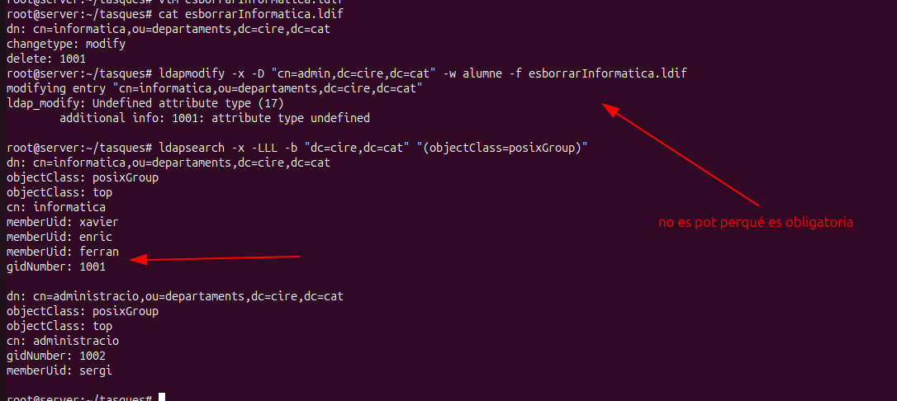

9. Quantes uos hi ha al domini cire.cat? **3, rrhh, departament i nomines**


10. Modifica el cn de Xavier per Francesc Xavier

```bash
dn: cn=xavier,ou=rrhh,dc=cire,dc=cat
changetype: modrdn
newrdn: cn=Francesc Xavier
deleteoldrdn: 1
```

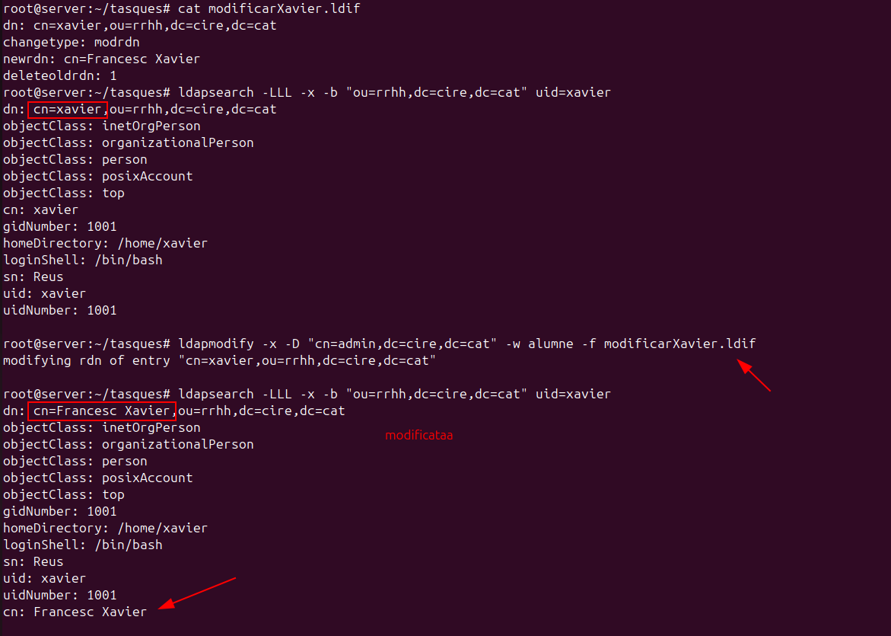

11. Esborra la uo nòmines

Ho he fer amb `ldapdelete -x -D "cn=admin,dc=cire,dc=cat" -w alumne "ou=nomines,dc=cire,dc=cat" -r`

- El paràmetre -r perque sigui recursiu i elimini també a ferran


12. Mostra els usuaris que tinguin com a grup principal el grup administració

ldapsearch -x -LLL -b "dc=cire,dc=cat" "(&(gidNumber=1001)(objectClass=inetOrgPerson))" cn

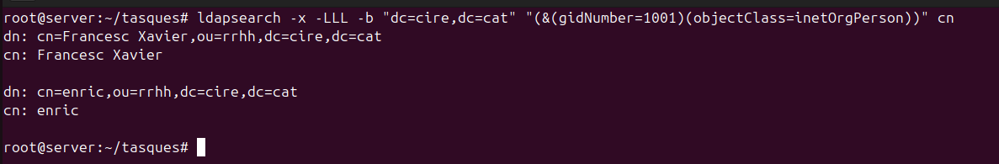

13. Quin usuari té el **uidNumber 1003**? **Cap**


14. Mostra quins són els usuaris on el seu cognom comenci per R i el seu uidNumber sigui més gran que 1003

- No hi ha ningu, Xavier i enric i que tenen cognom que comença per R (Reus) peró el seu uidNumber es menor a 1003.
- I sergi té un uid major pero el seus cognom no comença per R.

ldapsearch -x -b "dc=cire,dc=cat" "(&(sn=R\*)(uidNumber>=1004))" cn uidNumber sn


15. Mostra quins usuaris formen part del grup informàtica o aquells usuaris que tinguis de cognom Pallarés

ldapsearch -x -LLL -b "dc=cire,dc=cat" "(&(objectClass=inetOrgPerson)(|(gidNumber=1001)(sn=Pallarés)))" gidNumber sn

He usat un _or_


# Servidor samba

Un servidor samba ens permet compartir recursos (fitxers, impressores), tant en equips Windows com Linux
L'autentificació es a **nivell d'usuari** no de host com NFS, poden ser usuaris propis de Samba o d'ldap.

## Configuració server smb

El paquet requerit instal·lat és **samba**


A continuació he creat la carpeta a compartir amb permissos totals a tots, sense usuari i grup propietari

```bash
cd /
mkdir asixa
chmod 777 asixa && chown nobody:nogroup asixa
```


Seguidament hem preparat els **usuaris** i **grups** per realitzar proves, els hem creat de forma que no puguin accedir al sistema mitjançant shell/graficament

| Creació d'usuaris i grups                           | Assignació de contrasenyes                           |
| --------------------------------------------------- | ---------------------------------------------------- |
|  | 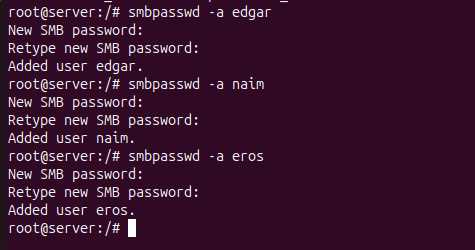 |

Per assignar les contrasenyes hem usat `smbpasswd`, el paràmetre `-a` és per indicar l'usuari.

Per configurar el recurs compartir hem d'editar **/etc/samba/smb.conf**

- La ruta amb `path`
- Permetem anonims/ invitats amb `guest ok`
- Els directoris/home creat tindra la mascara 0755 (directory mask)
- Permetem navegar (browseable), no llegir (read only), pero si escriure (writeable)
- Sols permetem llegir al grup de llista (read list = @madrid, naim) i a naim i l'invitat
- Sols naim i l'invitat poden escriure
- Edgar no pot entrar.

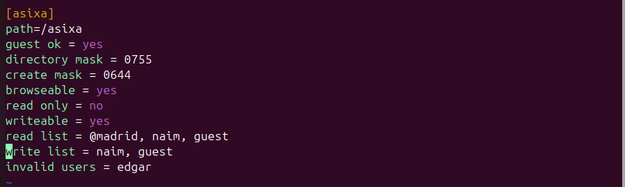

I reiniciem els serveis `smbd`, `nmbd` al editar.

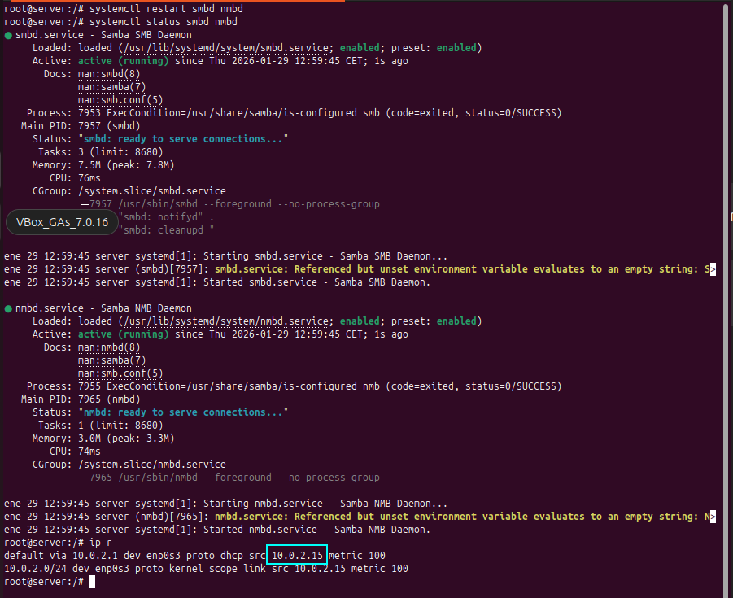

## Configuració client smb

Accedim al client, que es troba a la mateixa xarxa, com he comprovat amb el ping


El paquet a instal·lar és **smbclient**


I ja pdem connectar-nos mitjançant el navegador de fitxers


### Test amb l'usuari anonim

He provat amb l'anonim i he pogut conectarme i crear carpeta i esborar

| Connexió                                | Carpeta creada                                | Arxiu creat                                |
| --------------------------------------- | --------------------------------------------- | ------------------------------------------ |
|  |  |  |

I he desconnectat el recurs de xarxa per a les següents proves.

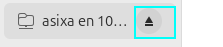

### Test amb edgar

No pot ni connectarse, després de fer clic en Connectar torna a sortir la mateixa finestra


### Test amb naim

Pot fer tot.

| Connexió                                | Crear carpeta                                | Afegir arxiu                                |
| --------------------------------------- | -------------------------------------------- | ------------------------------------------- |
|  |  |  |

Pot accedir pero no crear ni eliminar directoris o fitxers.

| Connexió                                | No pot esborrar                                | No pot afegir fitxers                                |
| --------------------------------------- | ---------------------------------------------- | ---------------------------------------------------- |
|  |  |  |

## Integració OpenLDAP

### Configuració server

---

Fonts consultades:

1. https://medium.com/@cminion/openldap-with-samba-bd929f93401a
2. https://documentation.ubuntu.com/server/how-to/samba/openldap-backend-legacy/

---

Per integrar amb el domini ldap configurat, he editat/afegit en la directiva `global` els paràmetres:

```bash
# per indicar a on buscar les contrasenyes
passdb backend = ldapsam:ldap://10.0.2.15

# Aqui l'informació del domini ldap 'cire.cat'
ldap suffix = dc=cire,dc=cat

# I l'administrador
ldap admin dn = cn=admin,dc=cire,dc=cat
# Sense SSL  perque ho vaig configurar així
ldap ssl = no

# I que sincronitzi les contrasenyes
ldap passwd sync = yes
```

L'usuari **admin** l'hi he posat contrasenya amb smbpasswd, el paràmetre **-w** és per especificar la contrasenya en línia.

```bash
smbpasswd -a admin
```


Perquè OpenLDAP es pugui utilitzar com a backend per a Samba, el DIT haurà d'utilitzar atributs que puguin descriure correctament les dades de Samba.
Aquests atributs es poden obtenir introduint un esquema LDAP de Samba.

L'esquema es troba al paquet Samba ara instal·lat i ja està en format LDIF. El podem importar amb una simple ordre:

```bash
sudo ldapadd -Q -Y EXTERNAL -H ldapi:/// -f /usr/share/doc/samba/examples/LDAP/samba.ldif
```


Per consultar i visualitzar aquest nou esquema: `sudo ldapsearch -Q -LLL -Y EXTERNAL -H ldapi:/// -b cn=schema,cn=config 'cn=*samba*'`


Després reiniciem els serveis.

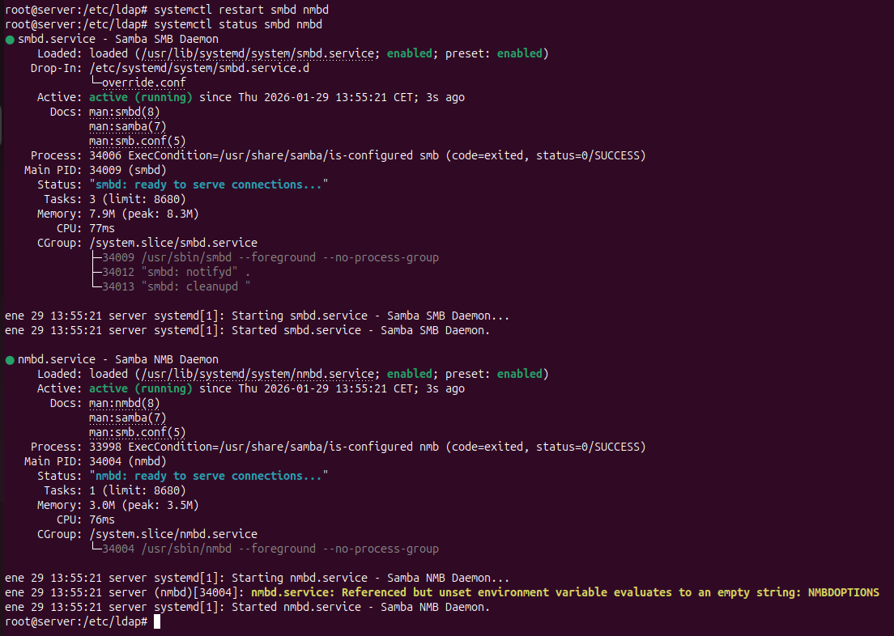

### Proves client

Podem veure que ens podem connectar, per exemple com **enric**

Al pareixer enric te tots els permissos, pot esborrar, crear, etc.

| Connexió                                 | Crear carpeta                                 | Crear arxiu                                 |
| ---------------------------------------- | --------------------------------------------- | ------------------------------------------- |
|  |  |  |

Comprovació en terminal que es veu millor:


# Servidor NFS

Un servidor samba ens permet compartir recursos (fitxers, impressores), tant en equips Windows com Linux
L'autentificació es a **nivell d'usuari** no de host com NFS, poden ser usuaris propis de Samba o d'ldap.

## Configuració server NFS

## Configuració client NFS
