# Instal·lació, Configuració Inicial i Programari de Base

- [Instal·lació, Configuració Inicial i Programari de Base](#installació-configuració-inicial-i-programari-de-base)
  - [Fase 1 - Instal·lació del sistema operatiu](#fase-1---instalació-del-sistema-operatiu)
  - [Fase 2 - Punts de restauració](#fase-2---punts-de-restauració)
  - [Fase 3 - Llicències de Windows](#fase-3---llicències-de-windows)
  - [Fase 4 - Gestor d'arrencada](#fase-4---gestor-darrencada)
  - [Fase 5 - Xarxa bàsica](#fase-5---xarxa-bàsica)
  - [Fase 6 - Comandes generals](#fase-6---comandes-generals)
    - [Comandes bàsiques](#comandes-bàsiques)
    - [Comandes sistema](#comandes-sistema)
    - [Comandes xarxa](#comandes-xarxa)
    - [Comandes avançades](#comandes-avançades)
  - [Fase 7 - Instal·lació d'aplicacions](#fase-7---instal·lació-daplicacions)
    - [Manual](#manual)
    - [Microsoft Store](#microsoft-store)
    - [Desinstal·lar](#desinstal·lar)

# Fase 1 - Instal·lació del sistema operatiu

> [!NOTE]
> Crear màquina virtual amb VirtualBox.
> Assignar recursos: RAM mínim 4 GB, disc mínim 40 GB.
> Carregar ISO de Windows 10 o Windows 11.
> Pas 1 al Pas 4: Procediments inicials.
> Pas 5: Instal·lar el sistema (idioma, usuari, contrasenya) i comprovar que arrenca correctament.

He afegit l'ISO i en la instal·lació realitzem la configuració típica.

- Seleccionar idioma, format i teclat
- Ometre la clau (no tinc)
- Seleccionem el disc
- Per evitar iniciar sessió amb Microsoft he seleccionat l'unió amb domini, tot i que no ho unire.

| Configuració maquina       | Configuració idioma          |
| -------------------------- | ---------------------------- |
| 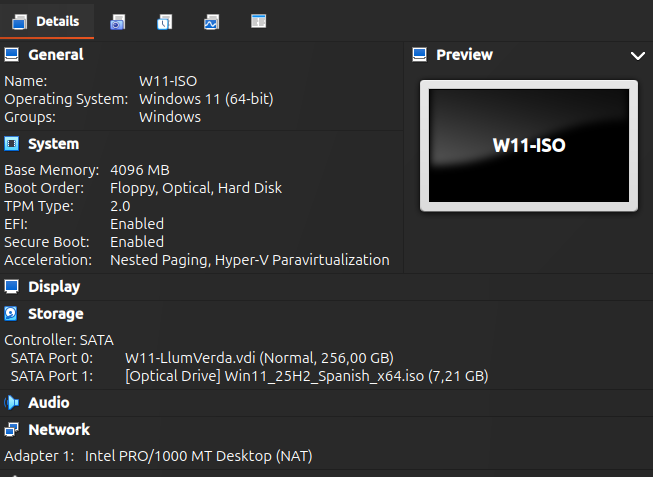 | 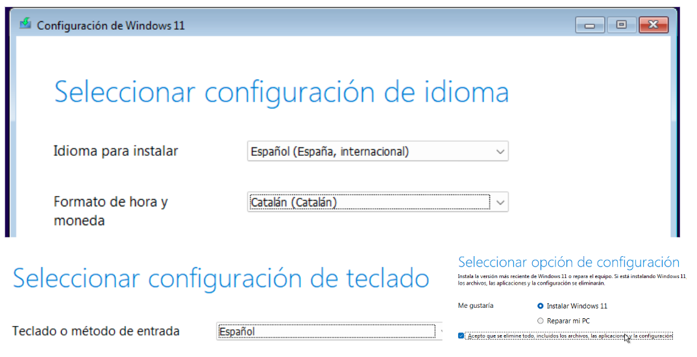 |

| Ometre la clau (no tinc)     | Per al disc, ho he deixat per defecte. |
| ---------------------------- | -------------------------------------- |
| 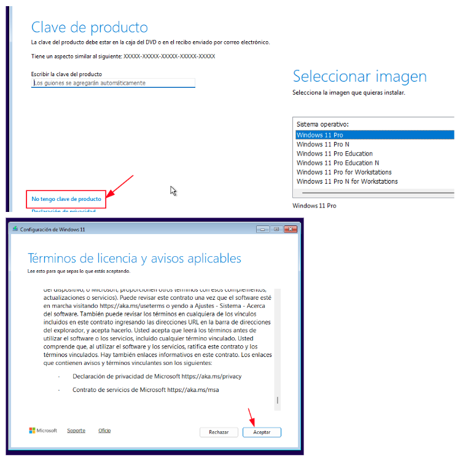 | 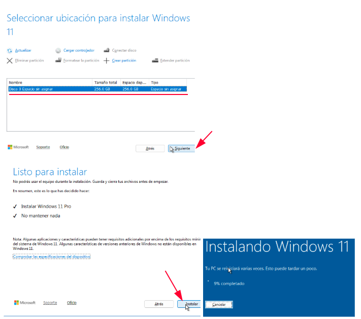           |

Posteriorment durant la configuració inicial, per evitar iniciar sessió amb Microsoft he seleccionat l'unió amb domini, tot i que no ho unire.

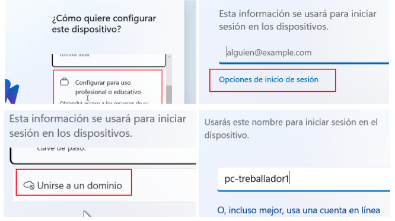

Resultat final

| Login                        | Final                        |
| ---------------------------- | ---------------------------- |
| 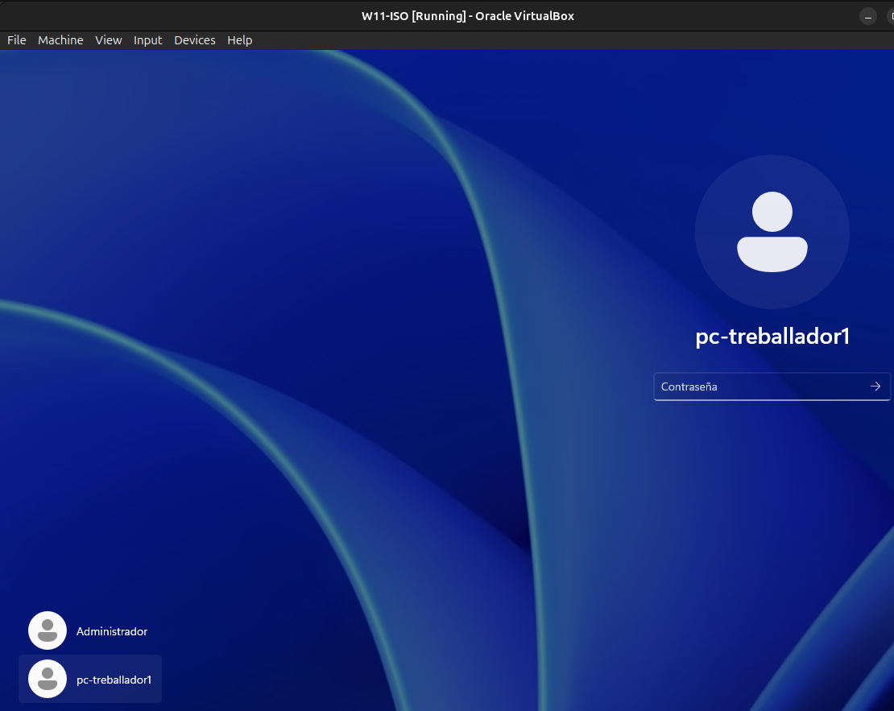 | 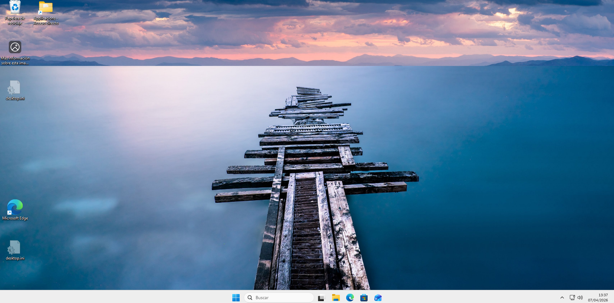 |

# Fase 2 - Punts de restauració

> [!NOTE]
> Pas 6: Cercar "Crear un punt de restauració".
> Pas 7: Activar protecció del sistema al disc C:.
> Pas 8: Crear un punt manual.
> Pas 9: Fer un canvi (instal·lar app o configuració).
> Pas 10: Restaurar i comprovar.

Buscar punt restauració

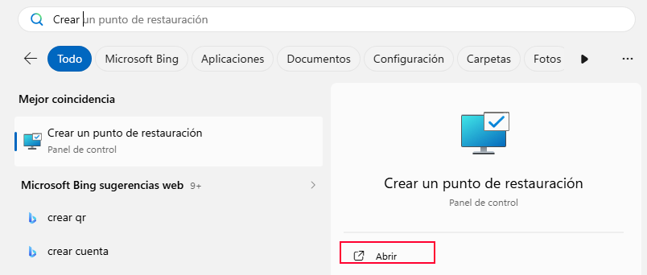

| Pas 1: Activar protecció del sistema | Pas 2: Crear punt manual     |
| ------------------------------------ | ---------------------------- |
| 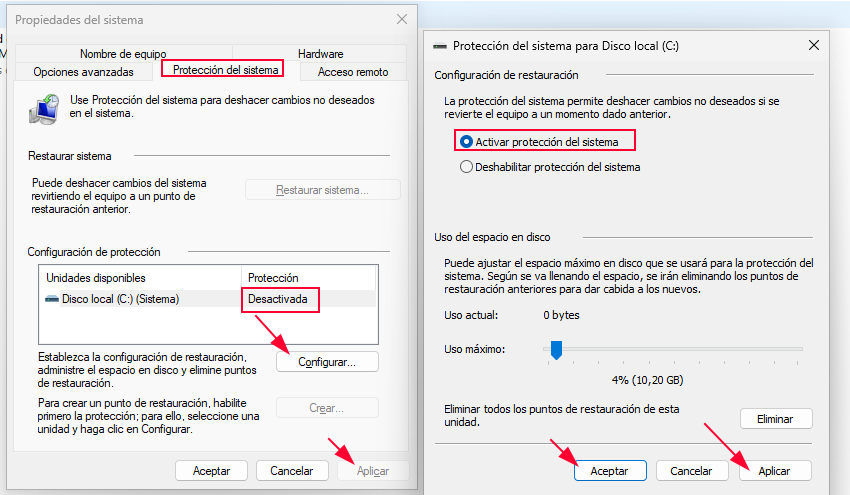         | 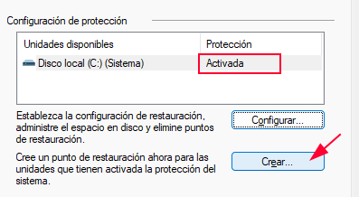 |

| Pas 3: Posar descripció i esperem que es faci |                               |
| --------------------------------------------- | ----------------------------- |
| 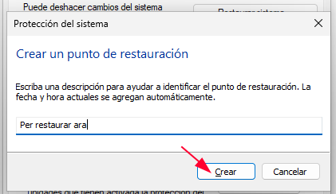                  | 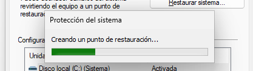 |

El canvi que he fet és `desinstal·lar 7-zip` i canviar la zona horaria de Madrid a Casablanca

Informació previa

| Aplicacions disponibles       | Configuració zona horaria     |
| ----------------------------- | ----------------------------- |
| 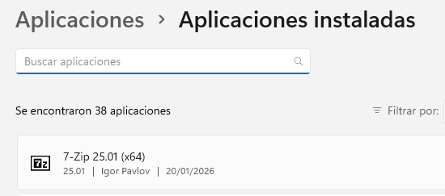 | 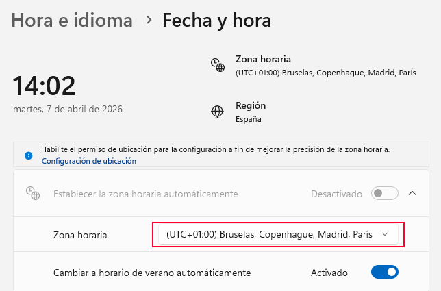 |

Canvis

| Aplicacions disponibles       | Configuració zona horaria     |
| ----------------------------- | ----------------------------- |
| 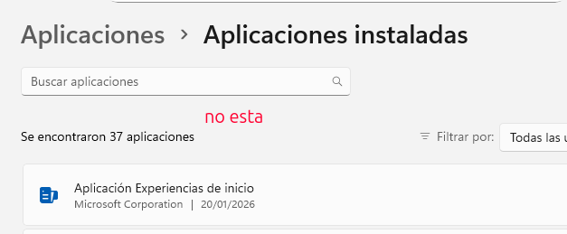 | 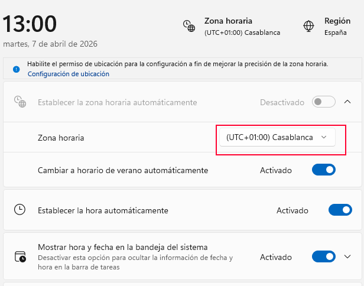 |

En restaurar podem comprovar que detecta que he esborrat el programa

|                               |                               |
| ----------------------------- | ----------------------------- |
| 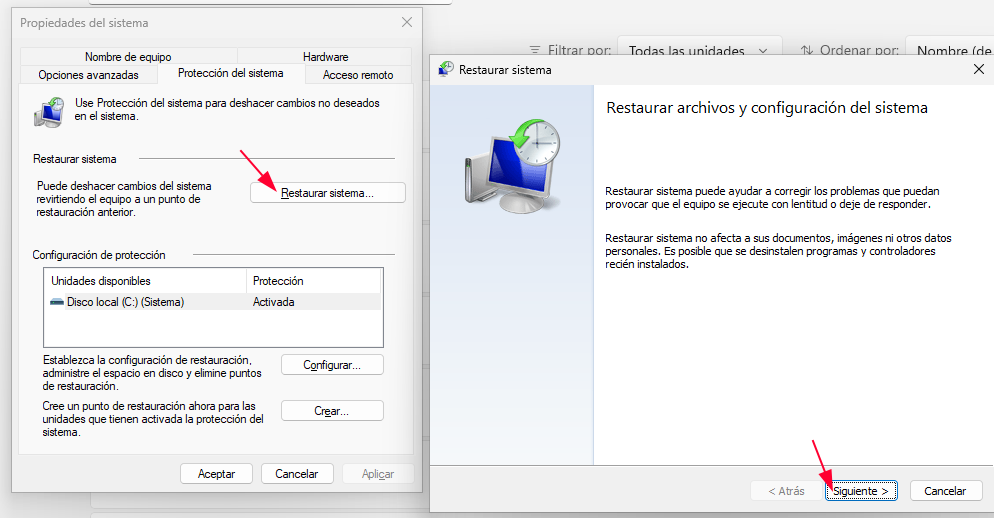 | 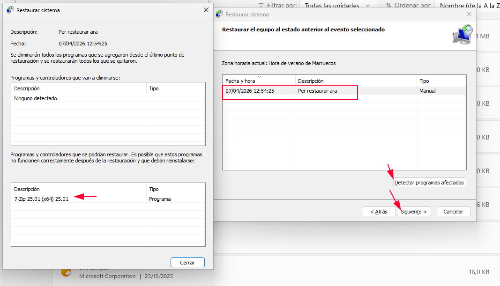 |

|                               |                               |                               |
| ----------------------------- | ----------------------------- | ----------------------------- |
| 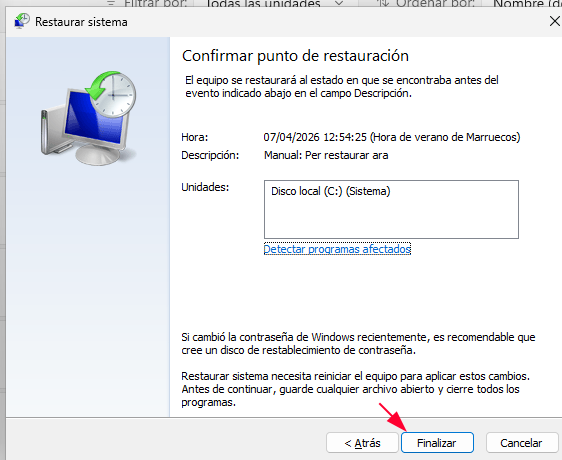 | 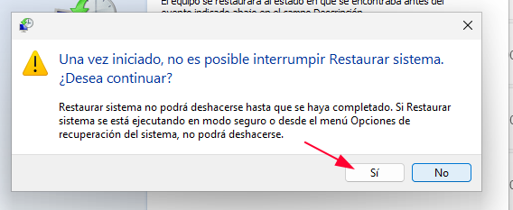 | 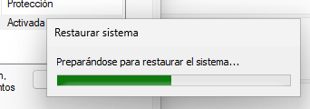 |

I és restaura al final, després que és reinicie.

|                               |                               |
| ----------------------------- | ----------------------------- |
|  | 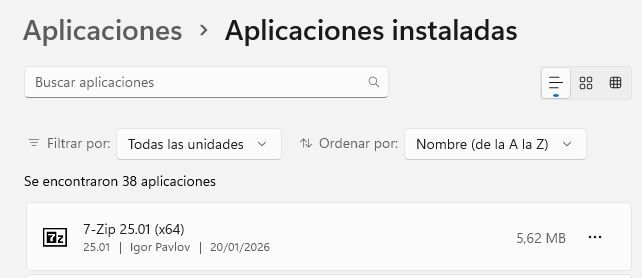 |
| 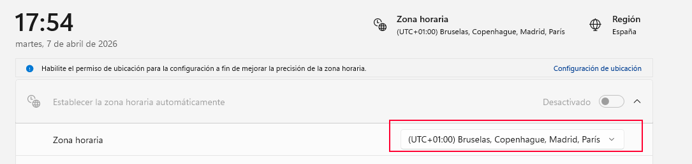 | 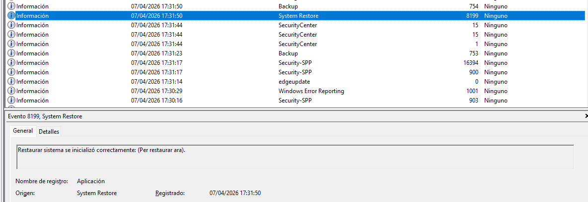 |

# Fase 3 - Llicències de Windows

> [!NOTE]
> Pas 11: Obrir Configuració → Sistema → Activació.
> Pas 12: Veure si Windows està activat.
> Pas 13: Executar al cmd: slmgr /xpr.
> Pas 14: Esbrinar llicenciament Windows i explicar breument.
> Pas 15: Consultar preu aproximat d'una llicència Windows (web oficial o botigues).

No tinc window activat. Tinc instal·lat Windows 11 Pro, sense llicencia

|                               |                               |
| ----------------------------- | ----------------------------- |
| 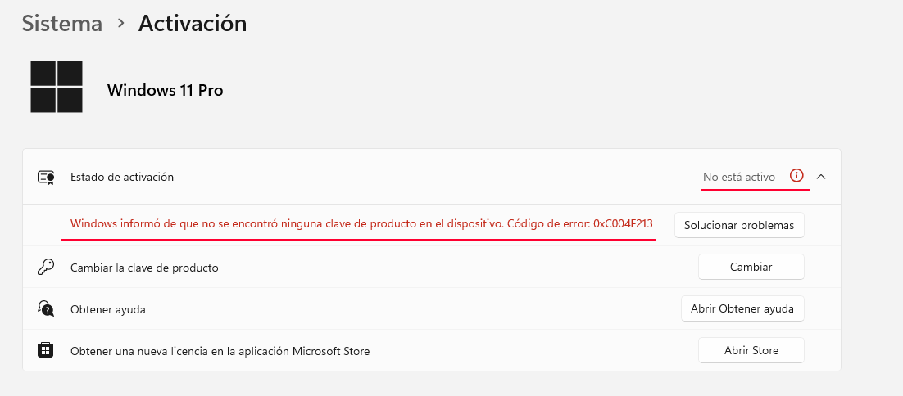 | 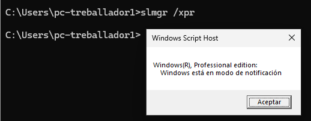 |

Tipus llicenciament Windows:

- OEM: Preinstal·lat en PC nous, no es pot transferir a maquinari nou.
- Minorista (Retail/FPP): Comprat a Microsoft o a botigues, es pot transferir a ordinadors nous.
- Volum (GVLK): Utilitzat per organitzacions per activar equips mitjançant un servidor central (KMS) o claus múltiples (MAK), no per a la revenda individual.

El preu que m'ha sortir per un Windows 11 Home ha sigut de 145 € en la [pàgina oficial](https://www.microsoft.com/es-es/d/windows-11-home/dg7gmgf0krt0/000k)
Windows 11 Pro ha sigut de [250€](https://www.microsoft.com/es-es/d/windows-11-pro/dg7gmgf0d8h4)

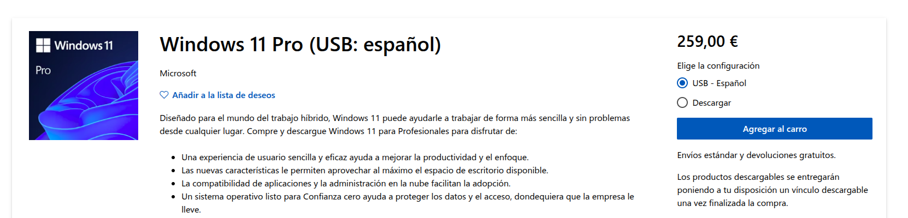

Mentre que en pàgines com [PCComponentes](https://www.pccomponentes.com/sistemas-operativos?s_kwcid=AL!14405!3!!!!x!!&gad_source=1&gad_campaignid=23573681029&gclid=CjwKCAjw1tLOBhAMEiwAiPkRHv2y_DRGmGeSlKDnhmVc9aJMNPKY-BHQsheZ_T3HZDk5IoNyQBAAexoCIz0QAvD_BwE) surt mes barat (almenys els d'escriptori)

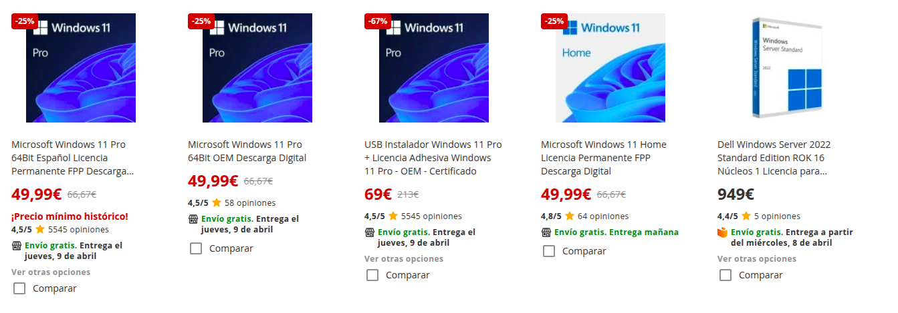

# Fase 4 - Gestor d'arrencada

> [!NOTE]
> Pas 16: Obrir `Command prompt com administrador`.
> Pas 17: Executar **bcdedit**.
> Pas 18: Identificar els blocs:
>
> - Administrador de arranque de Windows (Boot Manager)
> - Cargador de arranque de Windows (Boot Loader).

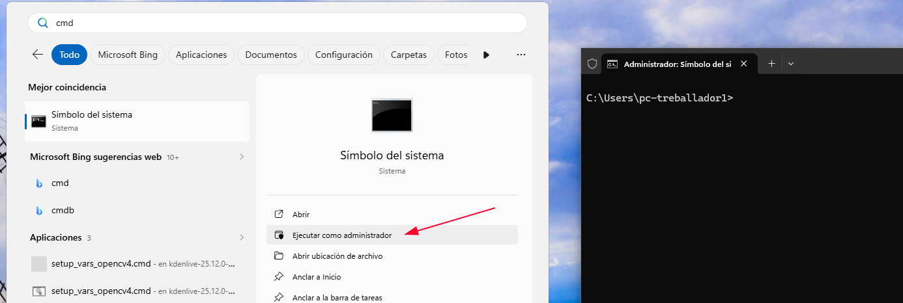
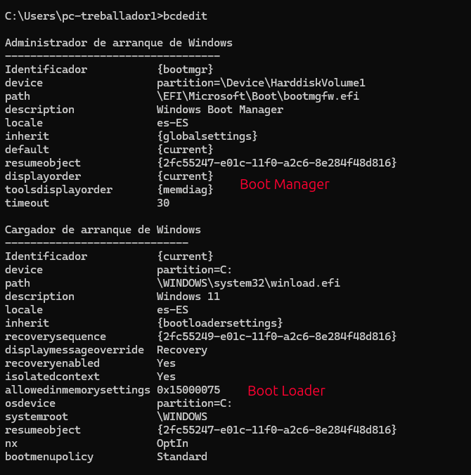

> [!NOTE]
> Pas 19: Interpretar dades concretes
>
> - Boot Manager: default {current} (sistema per defecte) y timeout 30 (temps d'espera).
> - Boot Loader: device partition = C: (ubicació), path \Windows\system32\winload.efi (fitxer de càrrega) y description Windows 11 (sistema operatiu).

El sistema que inicia per defecte és Windows, el de abaix amb l'identificador `current`, amb un temps d'espera de 30 segons.

- Carregant el firmware per a sistemes UEFI (`bootmgfw.efi`), el Boot Manager pertany al Volum 1 del disc

El '\Windows\system32\winload.efi' carrega el sistema Windows 11 (segons la descripció claro)

> Pas 20 y 21: Respondre preguntes curtes

- Quin sistema s'està arrencant. **Windows 11**
  A quin disc o partició està instal·lat. **la partició C:**
  Quant temps espera abans d'arrencar. **30 segons**
  Quin fitxer inicia Windows. **\Windows\system32\winload.efi**

> Pas 21: Interpretació final. Explicar en una frase:
> Boot Manager: Decideix quin sistema operatiu s’arrencarà segons la configuració d’arrencada.
> Boot Loader: Carrega el sistema operatiu seleccionat a la memòria i inicia el nucli de Windows.

# Fase 5 - Xarxa bàsica

He posat NAT Network com a adaptador.

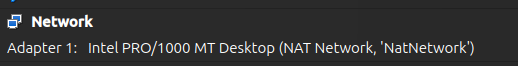

> Pas 22: Obrir configuració de xarxa.

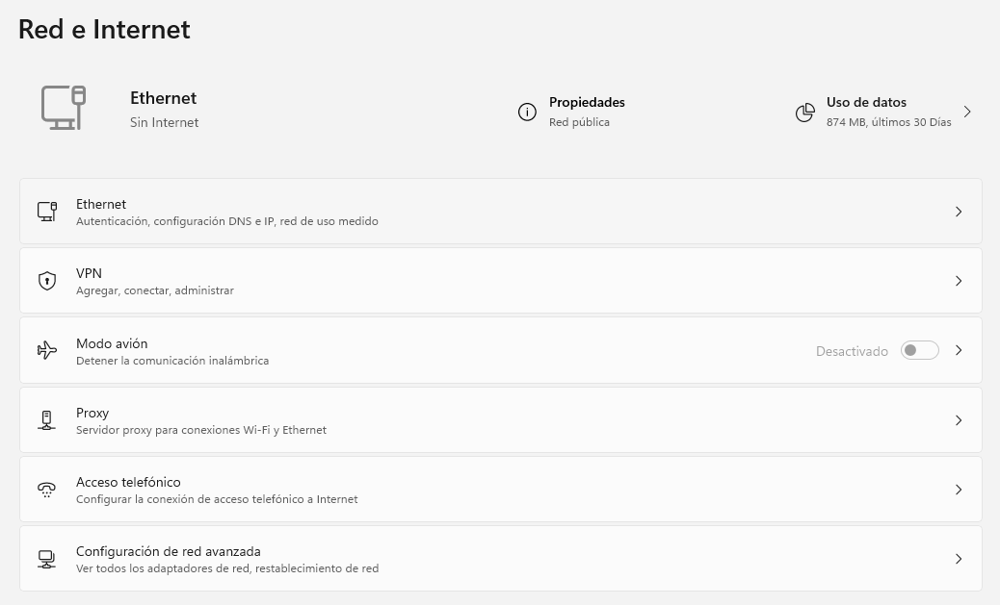

> Pas 23: Consultar IP amb: `ipconfig`.

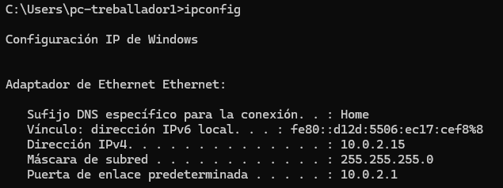

Amb aquesta comanda observem la configuració de xarxa aplicada a les interficies de l'equip (maquina virtual)

- El sufix DNS (en entorns AD, sortiria el domini) és el per defecte a Windows, el Home
- Ens mostra la adreça Ipv6 i també la Ipv4 (i la seva mascara )
- També trobem la porta d'enllaç a on aniran els paquets que surtin per aquella interficie
- La porta d'enllaç en aquest cas, 'actuara' com a DNS.

> Pas 24: Configurar IP dinàmica (DHCP automàtic).
> Ja ve així per defecte....

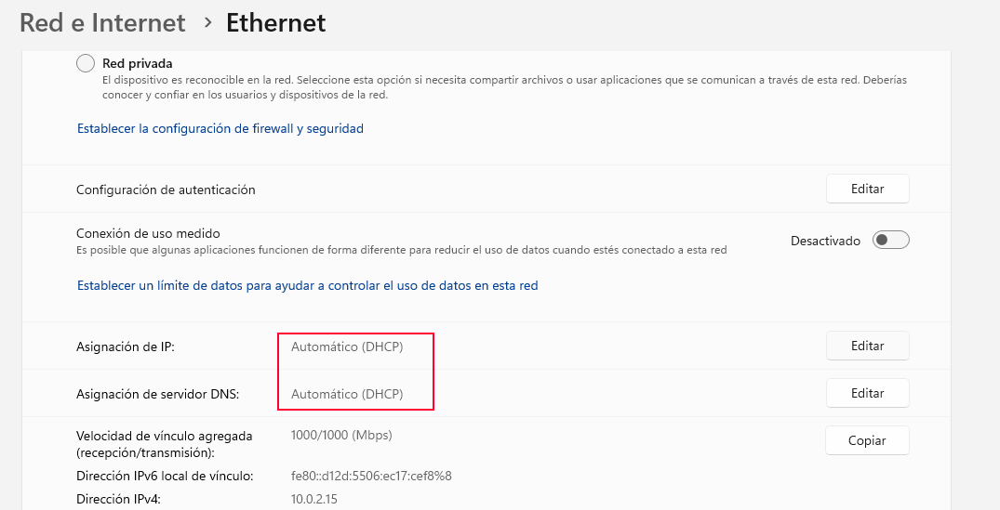

> Pas 25: Configurar IP fixa (manual: IP, màscara, gateway, DNS).
> M'he posat la 10.0.2.33, amb el DNS de google.

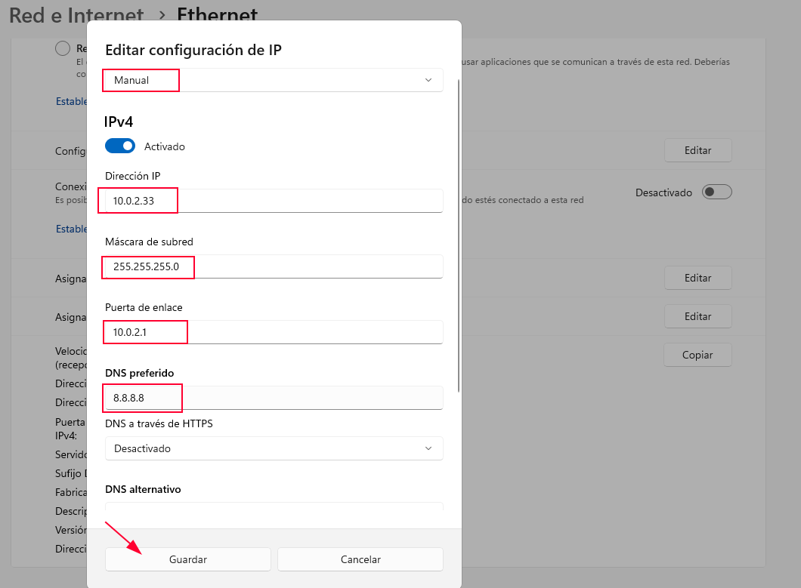

> Pas 26: Comprovar connexió amb: ping google.com.
> La connexió funciona

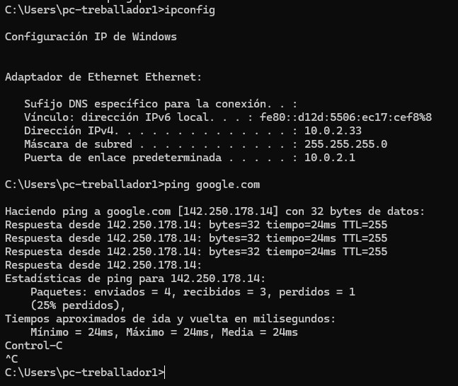

# Fase 6 - Comandes generals

> [!NOTE]
> Pas 28: Diferenciar cmd (comandes bàsiques) i PowerShell (més potent, objectes i automatització)
> CMD és més senzill, cosa que facilita que els principiants i altres usuaris realitzin tasques senzilles com ara navegar per directoris o llistar fitxers.
> PowerShell proporciona cmdlets avançats per a diagnòstics detallats de xarxa, com ara Test-Connection (que és com ping però més potent) i Get-NetIPAddress.

## Comandes bàsiques

> Pas 29: Comandes bàsiques:
>
> - dir: veure fitxers.
> - cd: moure's per carpetes.
> - mkdir prova: crear carpeta.
> - echo hola > fitxer.txt: crear fitxer.
> - del fitxer.txt: eliminar fitxer.

|                               |                               |
| ----------------------------- | ----------------------------- |
| 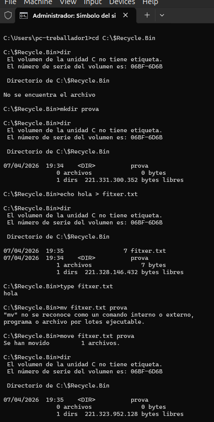 | 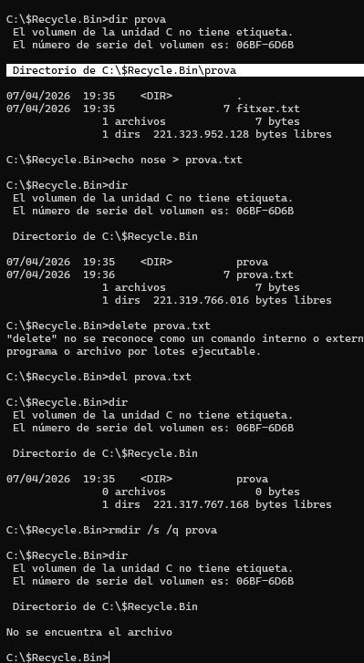 |

## Comandes sistema

> Pas 30: Comandes del sistema:
>
> - tasklist: veure processos actius.
> - taskkill /IM chrome.exe /F: tancar el procés de chrome.
> - - **/IM** chrome.exe: Especifica el nom del procés a acabar.
> - - **/F**: Força la terminació del procés.
> - systeminfo: informació completa del sistema.
> - hostname: nom de l'equip.
> - whoami: usuari actual.

Ho he realitzat sobre el procés de Google Chrome

Iniciant chrome amb la comanda `start`

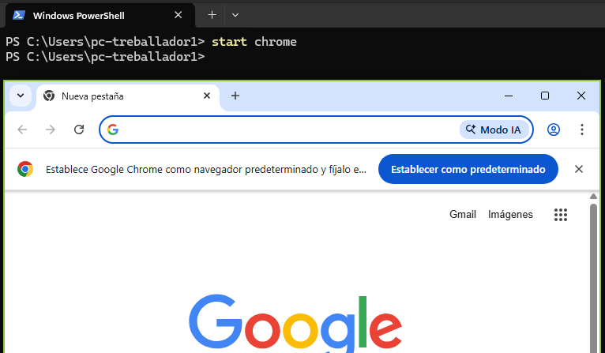

| Llistat processos actius      | Processos filtrant per chrome |
| ----------------------------- | ----------------------------- |
| 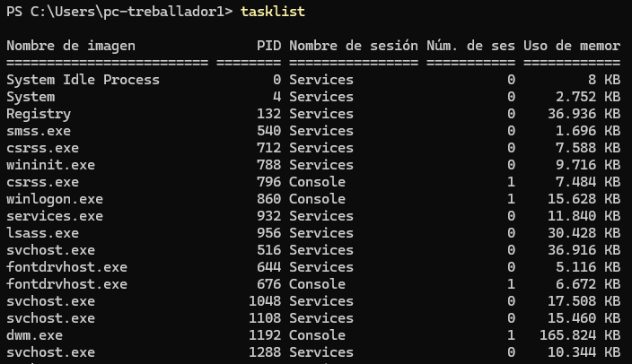 | 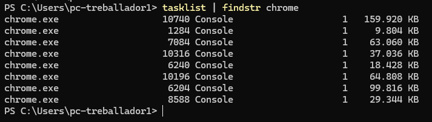 |
| Tancar el procés              | Informació del sistema        |
| 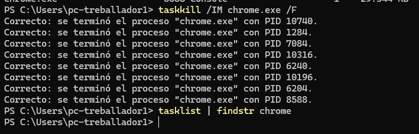 | 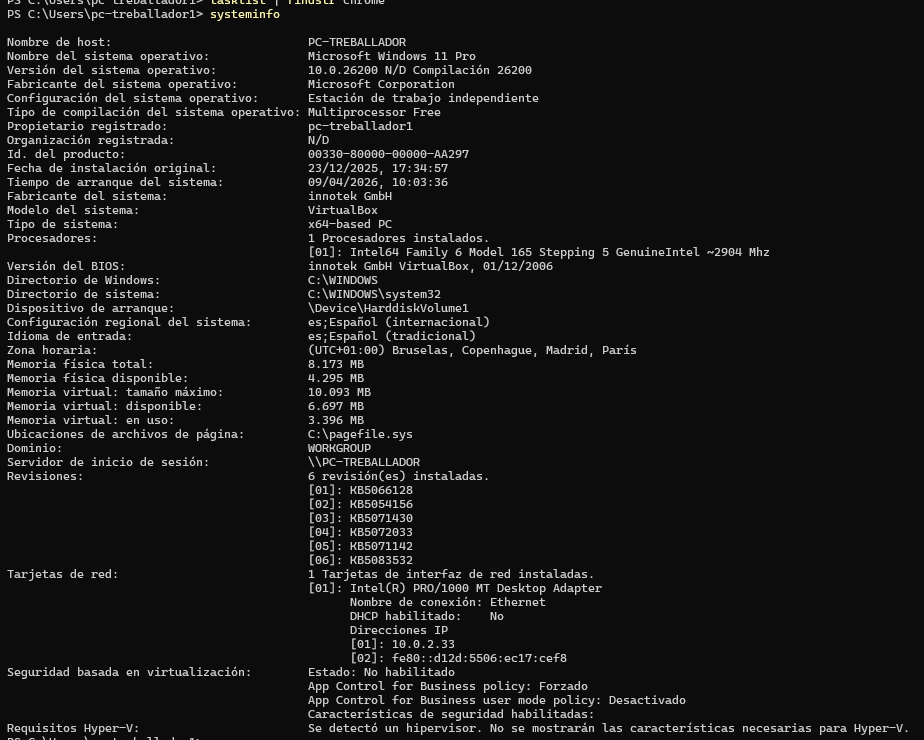 |
| Nom equip i usuari            |
| 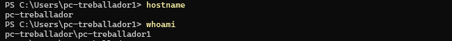 |

Podem veure en l'anterior captura de l'informació del sistema que tinc 8 GB RAM, dels quals 4 usat

- El fabricant és `innotek gmbh` que és l'empresa que va crear VirtualBox.
- És un resum molt utils que mostra les coses basiques com la xarxa (IP, domini), directoris del sistema Windows, quant de temps porta instal·lat el sistema, etc

És molt util si necessitem informació rapida.

Per al llista de tasques, podem veure el nom posat, alguns directamente usen l'executable i altres no

- PID: identifica un procés individual
- Nom de sessió: indica si pertany a Services (servicios del sistema) o Console (tu sessió d'usuari).
- Núm. de sessió: ID de la sessió, agrupa processos dins d'una mateixa sessió d'usuari.
- Ús de memòria: quanta RAM està utilitzant cada procés.

**[Proves amb cmdlets](https://www.ionos.es/digitalguide/servidores/configuracion/comandos-de-powershell/) powershell**

|                               |                               |
| ----------------------------- | ----------------------------- |
| 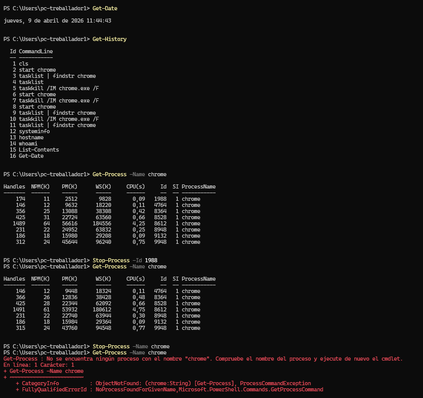 | 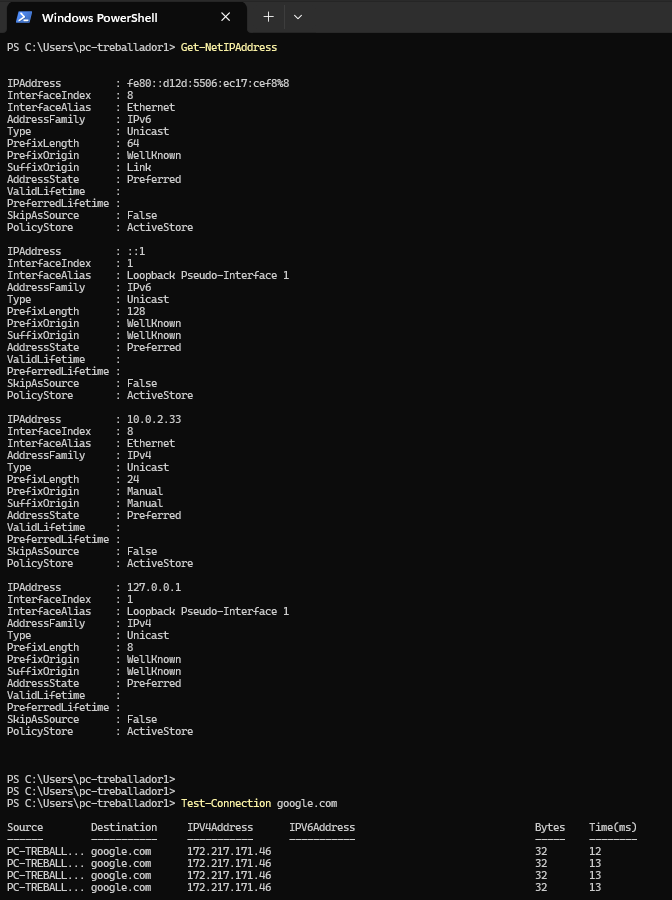 |

## Comandes xarxa

> Pas 31: Comandes de xarxa: ipconfig, ping google.com y netstat -an (connexions obertes).

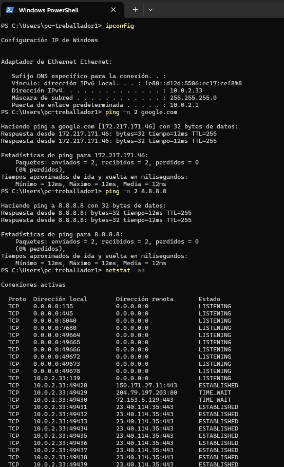

## Comandes avançades:

- tree (estructura de carpetes)
- cls (netejar pantalla)
- help (ajuda)

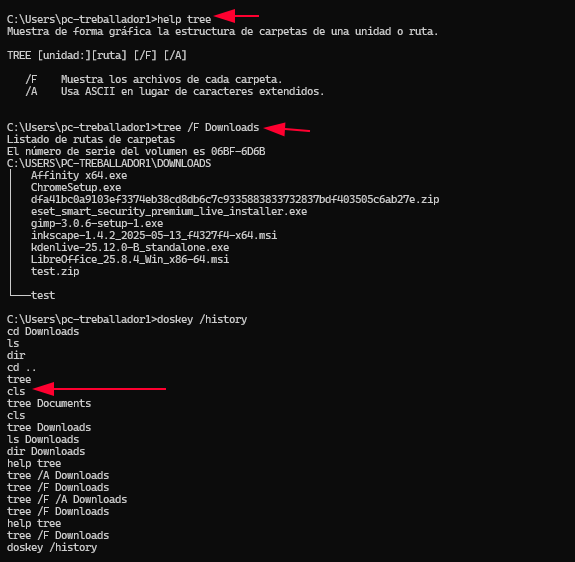

I **shutdown /s /t 2** (apagar equip).

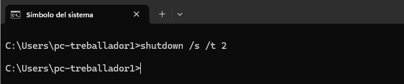

# Fase 7 - Instal·lació d'aplicacions

> [!NOTE]
> Pas 34 a 36: Descarregar i instal·lar programes des del navegador (ex: Chrome o VS Code).

## Manual

He instal·lat Google Chrome, descarregant l'executable des de la pàgina oficial i seguint l'assistent. I comprovem que funciona

|                       |                       |                       |                       |
| :-------------------: | :-------------------: | :-------------------: | :-------------------: |
| 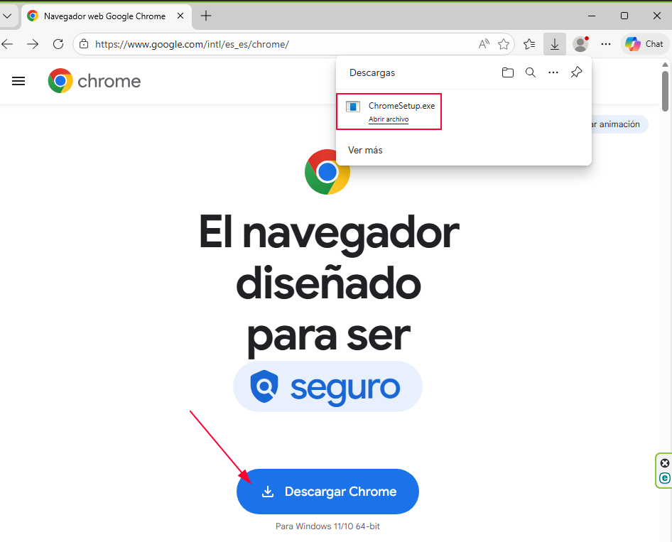 |  |  |  |
|  |  |  |  |

## Microsoft Store

> Pas 37 y 38: Instal·lar des de Microsoft Store.

He instal·lat VSCode

|                       |                       |                       |
| :-------------------: | :-------------------: | :-------------------: |
|  |  |  |
|  |  |  |

## Desinstal·lar

> Pas 39 y 40: Desinstal·lar aplicacions des de Configuració i verificar-ho.

He disinstal·lat VSCode

|                       |                       |                       |                       |
| :-------------------: | :-------------------: | :-------------------: | :-------------------: |
|  |  |  |  |

Comprovem que ja no está:


