# Instal·lació, Configuració de Programari de Base i Gestió de Fitxers (10h)

- [Instal·lació, Configuració de Programari de Base i Gestió de Fitxers](#installació-configuració-de-programari-de-base-i-gestió-de-fitxers-10h)
  - [Fase 1 – Preparació del sistema](#fase-1--preparació-del-sistema)
  - [Fase 2 - Punts de restauració](#fase-2---punts-de-restauració)
  - [Fase 3 - Script de còpia i automatització](#fase-3---script-de-còpia-i-automatització)
  - [Fase 4 - Verificació i documentació](#fase-4---verificació-i-documentació)
    - [Quotes de disc](#quotes-de-disc)
    - [Còpia de seguretat](#còpia-de-seguretat)
  - [Fase 5 – Gestió de processos i serveis](#fase-5--gestió-de-processos-i-serveis)
    - [Llistar processos actius](#llistar-processos-actius)
    - [Eliminar processos prescindibles](#eliminar-processos-prescindibles)
  - [Fase 6 – Gestió de permisos (ACLs)](#fase-6--gestió-de-permisos-acls)
    - [Assignació permisos grup](#assignació-permisos-grup)
    - [Assignació permisos alumne2](#assignació-permisos-alumne2)

# Fase 1 – Preparació del sistema

> [!NOTE]
> Pas 1. Afegir un nou disc virtual a la màquina virtual
> Pas 2. Iniciar Windows i obrir Gestió de discs
> Pas 3. Inicialitzar el disc, crear dues particions: una anomenada Dades i una en FAT32 anomenada Portable
> Pas 4. Assignar lletres i comprovar amb `diskpart` la configuració

| Sistema de Fitxers                   | Característiques                                                                                                                                               |
| ------------------------------------ | -------------------------------------------------------------------------------------------------------------------------------------------------------------- |
| FAT i FAT32 (File Allocation Table)) | - La seva principal limitació és que no permet arxius més grans de 4GB<br>- No permeten gestionar permisos per diferents usuaris                               |
| NTFS (File Allocation Table))        | - Particions de fins a 256 TiB <br> - Arxius tan grans com la partició <br> - És més eficient que FAT32 <br> - Permet gestionar permisos per diferents usuaris |

> [Font](https://docs.google.com/document/d/11jEB-gbZ68cQxG9Ic2Au0QgZ2L4gxiMe9egye5mLXaE/edit?tab=t.0#heading=h.lttvpymaa2n5)

Disc afegit de 2 GB aprox.

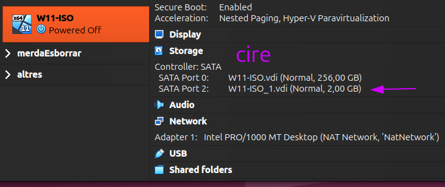

| En gestió de discos, l'inicialitzem | Identifico el disc i creo un nou `Volumen Simple`, per crear una partició. Fent clic dret |
| ----------------------------------- | ----------------------------------------------------------------------------------------- |
| 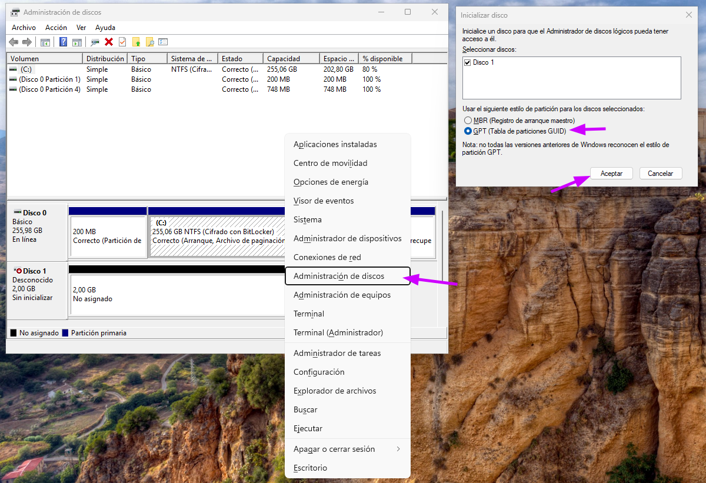        | 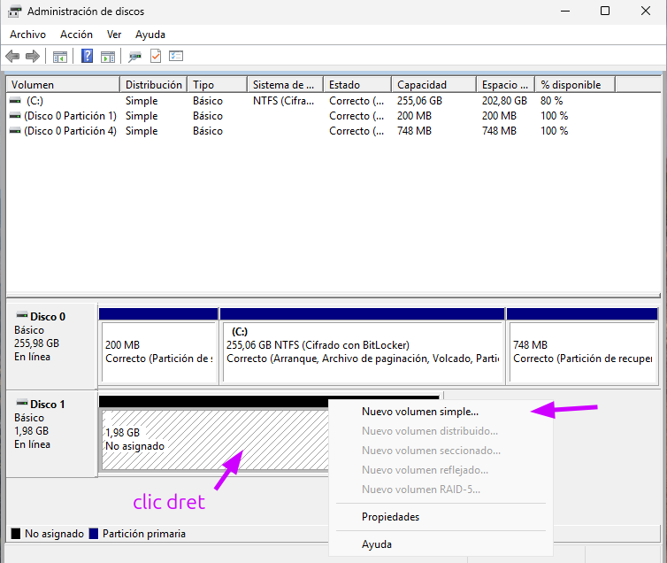                                                              |

Seguim l'assistent

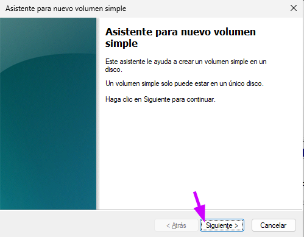

| Especifiquem la mida, la primera particio farà servir 1 GB    | Deixem la lletra per defecte assignada |
| ------------------------------------------------------------- | -------------------------------------- |
| 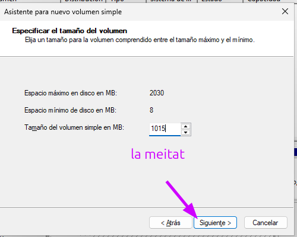                                  | 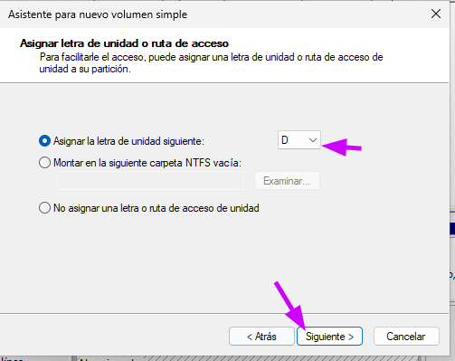           |
| Formateem amb NTFS que deixa fer quotes, amb l'etiqueta Dades | Deixem la lletra per defecte assignada |
| 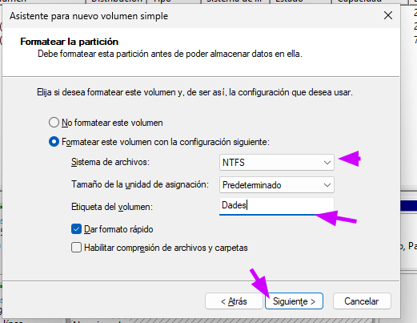                                  | 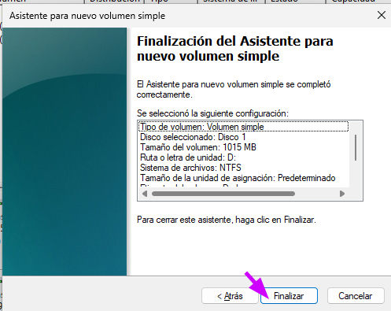           |

He realitzat el mateix amb la partició de FAT32 sobre l'espai sobrant.

|                              |                              |                              |
| ---------------------------- | ---------------------------- | ---------------------------- |
| 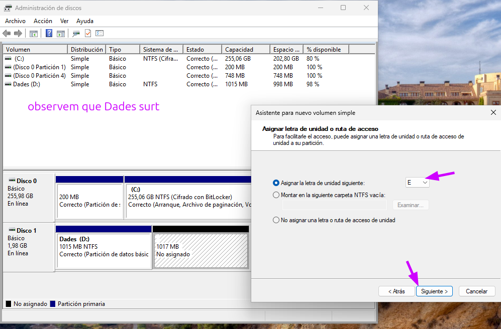 | 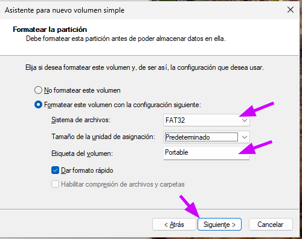 | 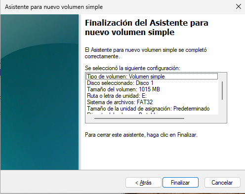 |

Observem que W11 posa el nom de la particio FAT32 en uppercase, per [l'especificació](https://www.reddit.com/r/Windows11/comments/17yy0ln/why_can_fat32_partitions_only_use_label_with/)

Comprovem que surten les dues particions

```bat
:: Per iniciar l'eina
diskpart

:: Per llista els volums i discos respectivament
LIST VOLUMES
LIST DISK

:: Per seleccionar-lo
SELECT DISK 1

:: Per llista les particions especificament dintre del disk
:: La de 15 MB no la veiem amb LIST VOLUMES
LIST PARTITIONS
```

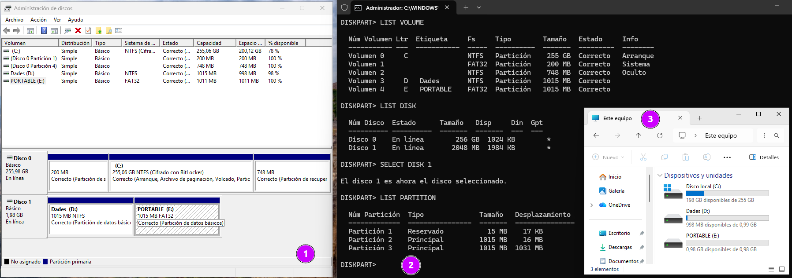

# Fase 2 - Punts de restauració

> [!NOTE]
> Pas 5. Activar quotes de disc a la partició Dades (NTFS)
> Pas 6. Establir límit de 300 MB per usuari, amb notificació d’advertència
> Pas 7. Crear dos usuaris locals: alumne1 i alumne2
> Pas 8. Afegir-los a un grup nou anomenat Limitats
> Pas 9. Provar la còpia de fitxers dins Dades per veure com actuen les quotes (superar límit)

## Activació quota

En les propietats de la partició, he activat les Quotes, en l'apartat de `Quota`

- He posat limit a 300 MB i notifica als 200 MB (advertencia), bloquejant espai del disc al superar el limit.
- Com a admins en interessa tenir-ho registre de quan ha passat un incident (event),
  per aquesta raó he activat el els dos registres de límit i advertencia.

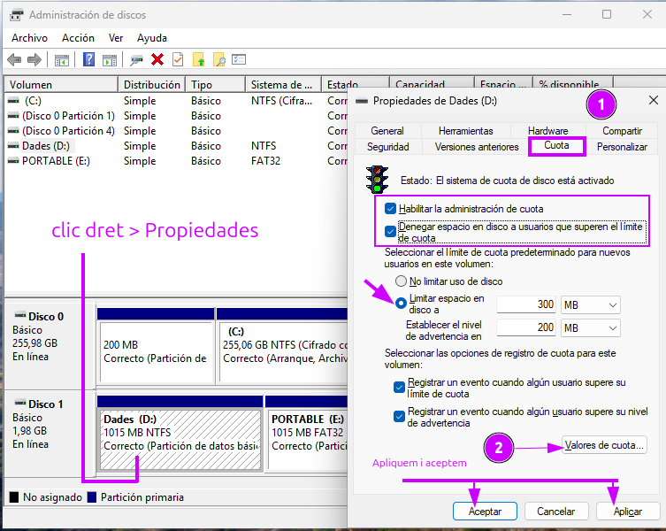

## Creació usuaris i grups

En l'administrador d'equips he creat els usuari i els he afegit als grups.

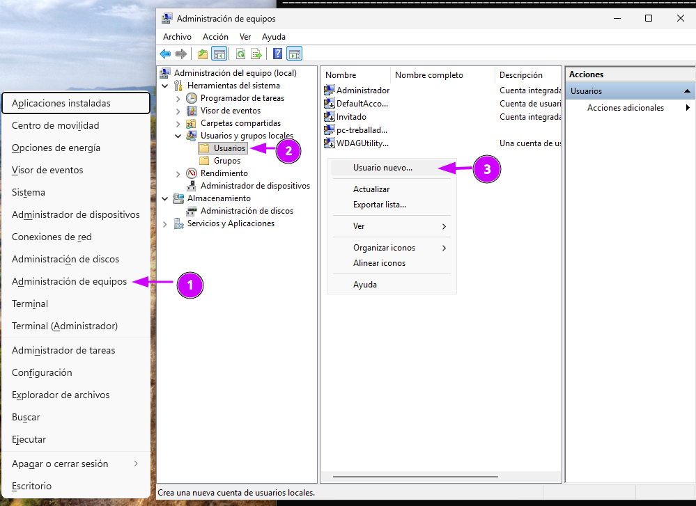

| 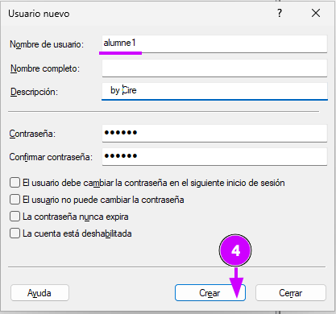                                           | 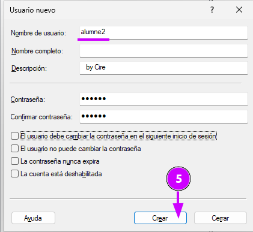 |
| ----------------------------------------------------------------------- | ----------------------------- |
| El mateix he realitzat amb el grups, però l'extra d'afegir els usuaris. |                               |
| Creació grup                                                            | Afegir integrant              |
| 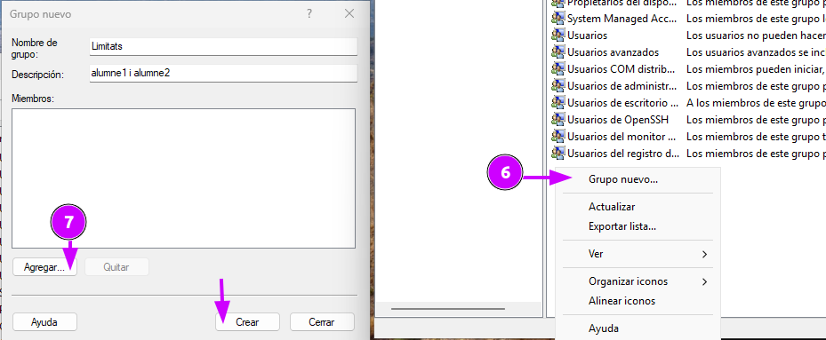                                           | 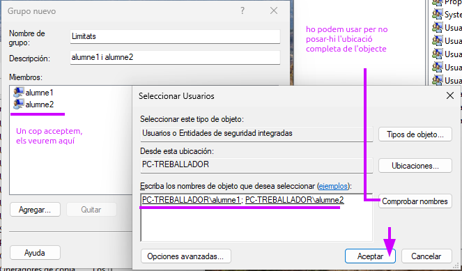 |

Comprovacions:

| Login                         | Grup                          |
| ----------------------------- | ----------------------------- |
|  | 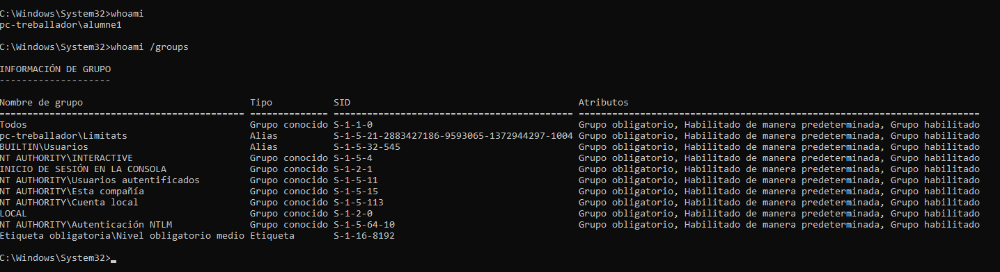 |
|  | 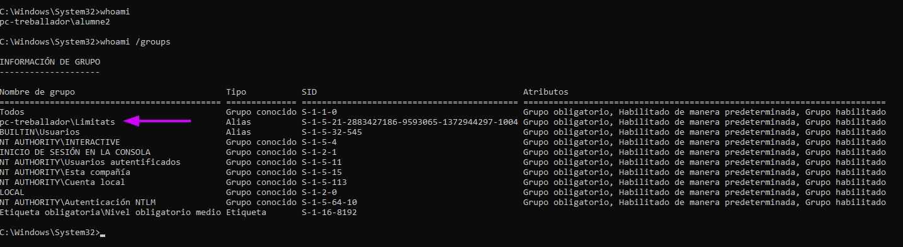 |

> [!NOTE]: també he afegit el grup al limit en l'entrada de quota de dades, encara que sigui redundant.

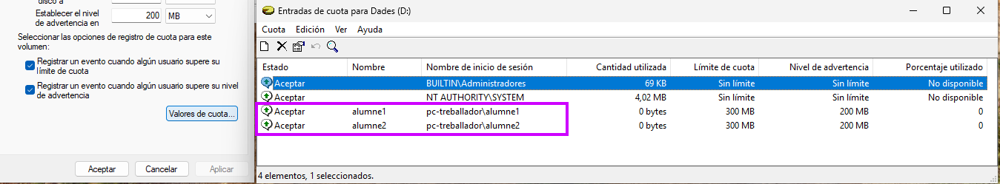

# Fase 3 - Script de còpia i automatització

> [!NOTE]
> Pas 10. Afegir tercer disc virtual, formatar-lo en NTFS com a Backups
> Pas 11. Crear carpeta CòpiesUsuaris dins Backups
> Pas 12. Crear un script .bat que copiï `C:\Users\%USERNAME%` a `E:\CòpiesUsuaris\%USERNAME%`
> Pas 13. Obre `gpedit.msc` → Configuració d'usuari → Scripts → Inici de sessió
> Pas 14. Assigna l'script perquè s’executi automàticament quan alumne1 o alumne2 inicien sessió

| Disc afegit                   | Formatat                      |
| ----------------------------- | ----------------------------- |
| 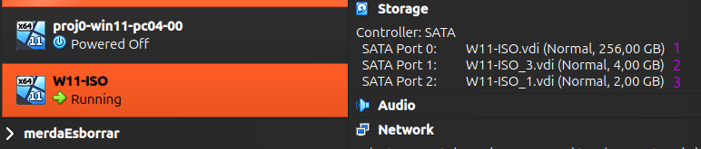 | 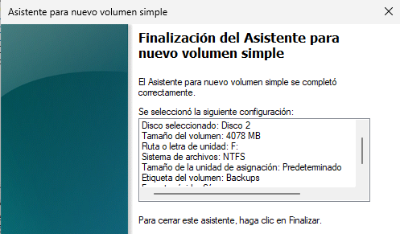 |
| Carpeta CòpiesUsuaris         |
| 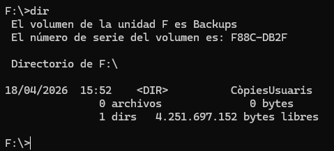 |

El script que faig servir és el següent.

> He canviat el nom traient l'accés, batch té problemes.

```bat
@echo off
xcopy "C:\Users\%USERNAME%" "E:\CòpiesUsuaris\%USERNAME%\" /E /I /Y
```

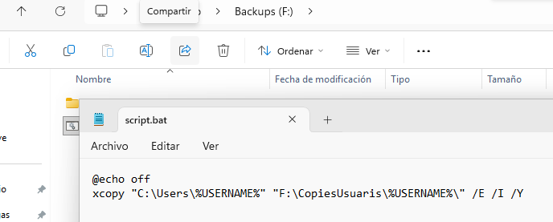

Després en la configuracio de GPO, l'hi he posat a la politica d'usuari l'alumne1

- He ubicat el script en la ruta de la GPO (`C:\Windows\System32\GroupPolicy\User\Scripts\Logon`)

|                               |                               |
| ----------------------------- | ----------------------------- |
| 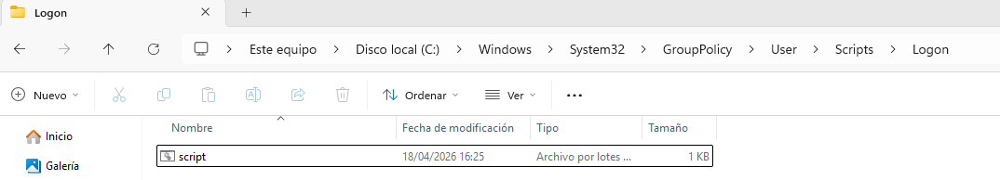 | 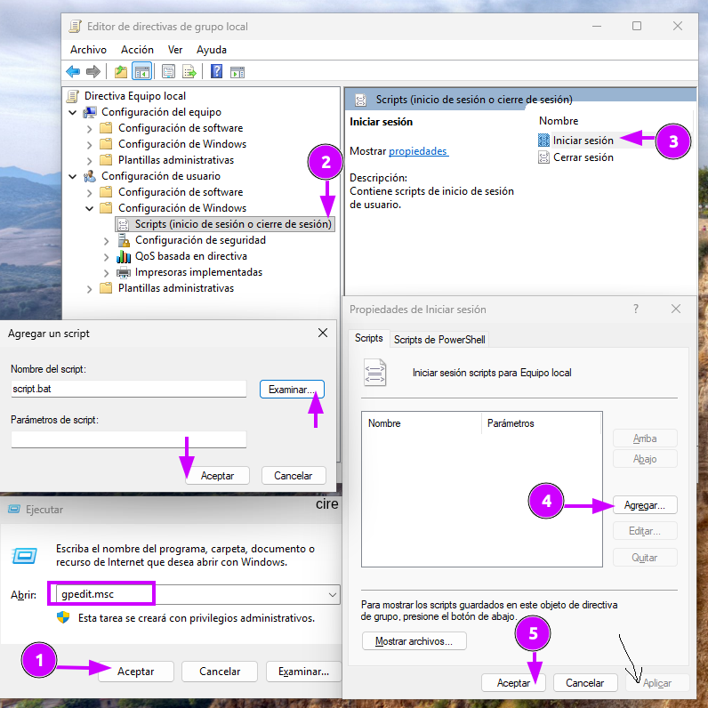 |

# Fase 4 - Verificació i documentació

## Quotes de disc

He intentat copiar l'instal·lable de GIMP (310 MB) fent ús tant de xcopy m'ha bloquejat efectivament.

- Tot i que l'advertencia de superar el 'soft limit' de 200 MB no ha aparegut
- 350 MB són 350 · 1024 · 1024 = 367001600 B

Alumne2:

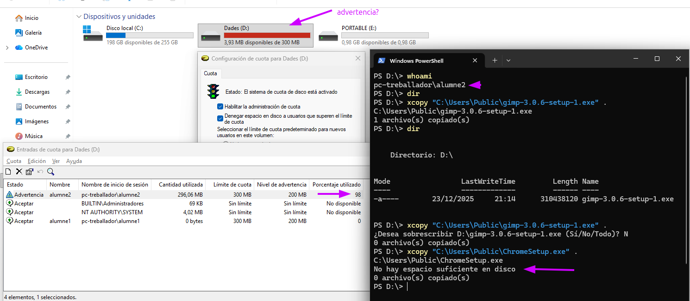

Alumne1
Amb copy ha fallat directament en copiar l'arxiu de Chrome (11 MB) mes de 25 vegades

|                               |                               |
| ----------------------------- | ----------------------------- |
| 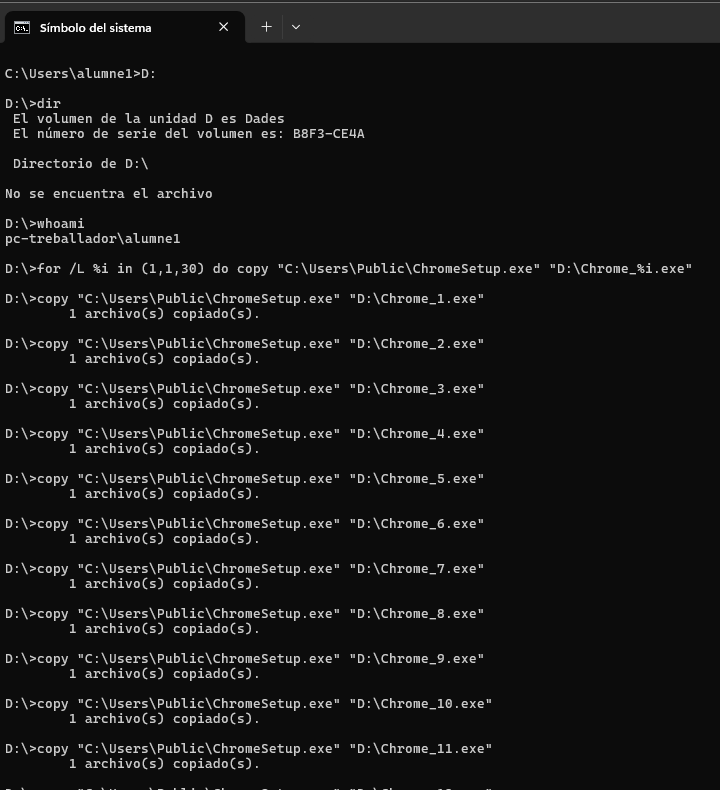 | 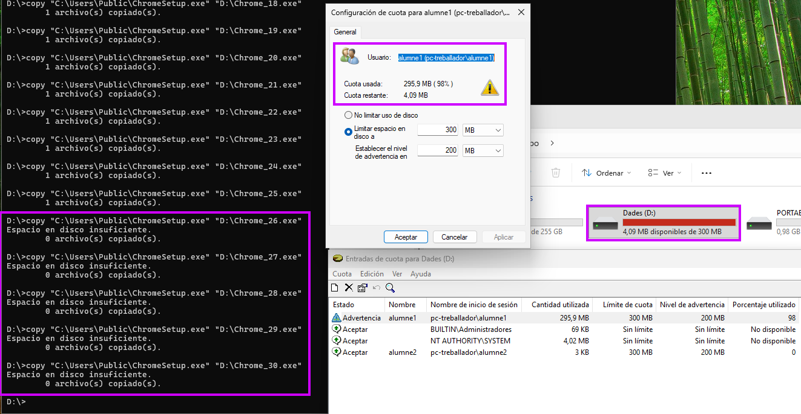 |

Tot i que si que surt en el visor d'events (Registros de Windows > Sistemas)

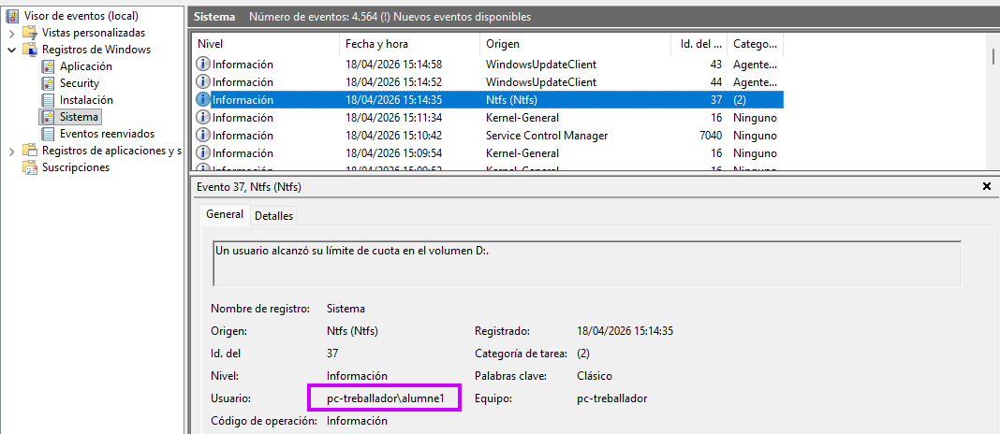

## Còpia de seguretat

Observem en iniciar como alumne1 o alumne2 que s'ha realitzar la còpia automaticament.

Podem observar que s'ha realitzat la còpia

|                               |                               |                               |
| ----------------------------- | ----------------------------- | ----------------------------- |
| 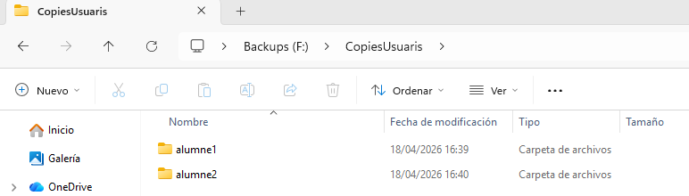 | 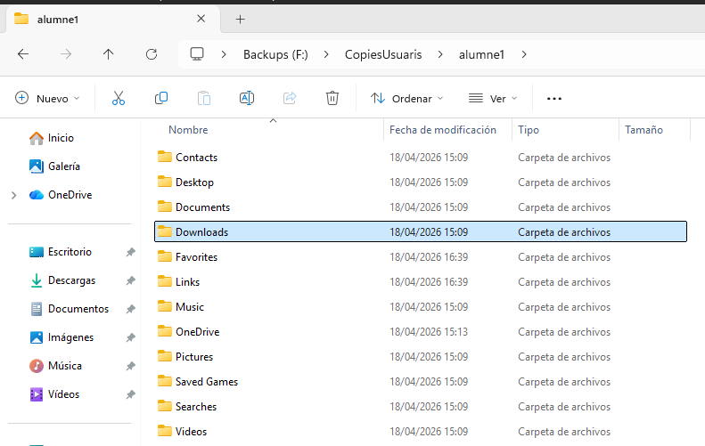 | 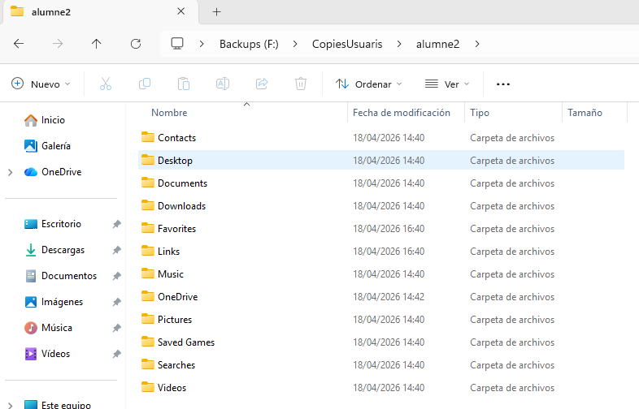 |

# Fase 5 – Gestió de processos i serveis

## Llistar processos actius

> [!NOTE]
> Pas 19. Llistar processos actius
>
> - Inicia sessió com alumne1
> - Obre la consola (cmd) com a usuari
> - Executa: tasklist
> - Copia el resultat a un fitxer: tasklist > C:\Users\%USERNAME%\processos_inici.txt
> - Observa processos típics: explorer.exe, SearchIndexer.exe, OneDrive.exe, etc

| LLista processos i copia a un fitxer | Processo típics               |
| ------------------------------------ | ----------------------------- |
| 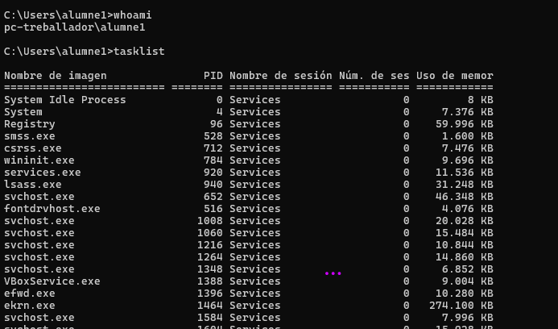        | 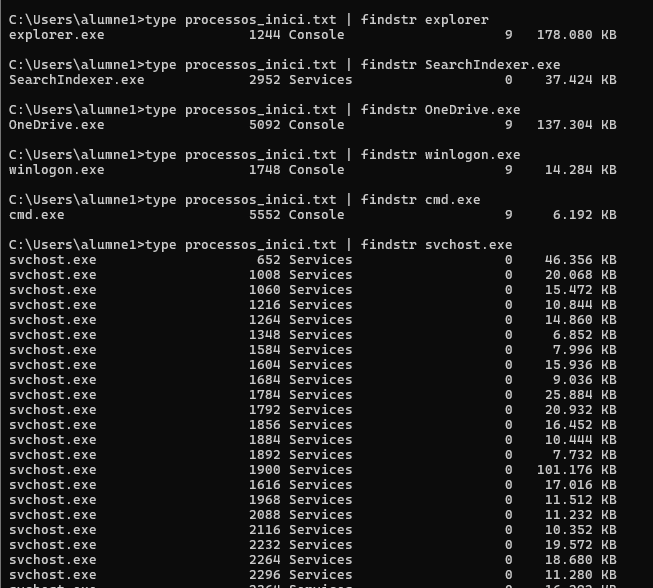 |

Els 2 processos tipics més coneguts/ rellevants són:

- `explorer.exe`: procés que controla la interfície gràfica de Windows (escriptori, barra de tasques i explorador d’arxius)
- `cmd.exe`: procés que executa l’intèrpret de comandes per interactuar amb el sistema mitjançant ordres textuals
- `svchost.exe`: procés del sistema que allotja i executa serveis de Windows basats en DLL agrupant-los per optimitzar recursos
- `SearchIndexer.exe`: servei que indexa fitxers per accelerar les cerques al sistema
- `OneDrive.exe`: client de sincronització amb el núvol de Microsoft OneDrive

> Pas 20. Identificar processos prescindibles
>
> - Busca processos no essencials per a l’usuari, com: OneDrive.exe, Teams.exe, SkypeApp.exe
> - Fes una taula amb:
> - - Nom del procés
> - - Memòria usada
> - - Justificació per eliminar-lo

> El teams no el trobo com a Teams.exe, sinó com ms-teams.exe i com que no tinc Skype, faig servir Xbox obrint-lo

> 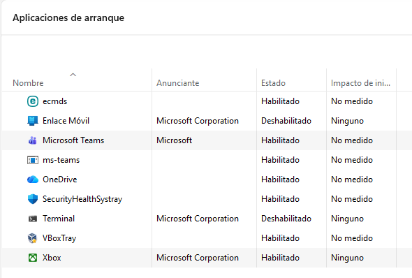

Els he buscat amb el filtre /Fi i retornat en format taula amb /Fo.

```bash
tasklist /Fo table /FI "IMAGENAME eq OneDrive.exe"
tasklist /Fo table /FI "IMAGENAME eq ms-teams.exe"
tasklist /Fo table /FI "IMAGENAME eq xbox*"
```

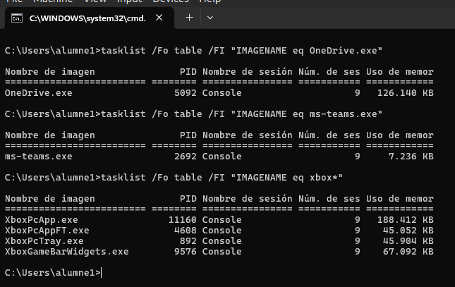

| Procés                   | Memòria usada | Justificació per eliminar                                                                                      |
| ------------------------ | ------------- | -------------------------------------------------------------------------------------------------------------- |
| `OneDrive.exe`           | `126 MB`      | Intenta sincronitzar i la maquina ni te internet, no tinc el compte enllaçat i tampoc dades a guardar al cloud |
| `ms-teams`.exe           | `7 MB`        | El puc obrir manualment, a banda que no realitzo reunion freqüents amb aquesta app                             |
| `XboxPcApp.exe`          | `188 MB`      | Aplicació de gaming: innecessària en entorn acadèmic o d'empresa, no jugo i tenen un catàleg pobre de jocs     |
| `XboxPcAppFT.exe`        | `45 MB`       | Procés associat a Xbox, no té utilitat                                                                         |
| `XboxPcTray.exe`         | `45 MB`       | Servei en segon pla: consumeix recusos de fons...                                                              |
| `XboxGameBarWidgets.exe` | `67 MB`       | Overlay de jocs: consum extra de recursos                                                                      |

L'impacte que suposaria eliminar aquells processos, segons les dades, serià:

- Alliberament aproximat: **~478 MB RAM**
- Millora en màquines virtuals amb pocs recursos
- Reducció de processos en segon pla

## Eliminar processos prescindibles

> Pas 21. Eliminar processos manualment
> Encara dins de la consola, executa: `taskkill /IM OneDrive.exe /F`
>
> - Comprova amb tasklist si ha desaparegut
> - Fes una captura abans i després

Llistar:

```bat
tasklist /Fo list /FI "IMAGENAME eq OneDrive.exe"
tasklist /Fo list /FI "IMAGENAME eq ms-teams.exe"
tasklist /Fo list /FI "IMAGENAME eq xbox*"
```

Eliminar:

```bat
taskkill /IM OneDrive.exe /IM ms-teams.exe /IM XboxPcApp.exe /IM XboxPcAppFT.exe /IM XboxPcTray.exe /IM XboxGameBarWidgets.exe /F
```

Explicació paràmetres:

- `/IM`: indica el nom del procés (Image Name)
- `/F`: força el tancament i és necessari en processos resistents o penjats (com ms-teams.exe o Xbox\*), perquè sense això poden no finalitzar.
- `/FI`: aplica un filtre (ex: nom procés)
- `/Fo` table/list: defineix format de sortida

|             Abans             |            Després            |
| :---------------------------: | :---------------------------: |
| 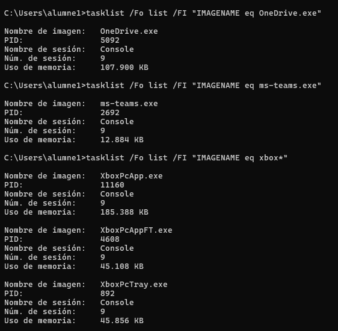 | 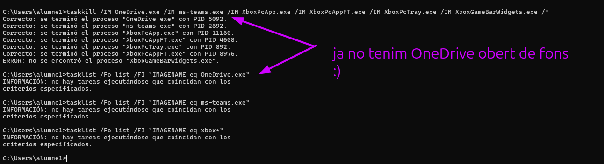 |

> Pas 22. Automatitzar-ho a l’inici de sessió
> Modifica l’script d’inici de sessió afegint:
>
> - taskkill /IM OneDrive.exe /F
> - taskkill /IM Teams.exe /F

```bat
taskkill /IM OneDrive.exe /F
taskkill /IM ms-teams.exe /F
taskkill /IM XboxPcApp.exe /F
taskkill /IM XboxPcAppFT.exe /F
taskkill /IM XboxPcTray.exe /F
taskkill /IM XboxGameBarWidgets.exe /F
```

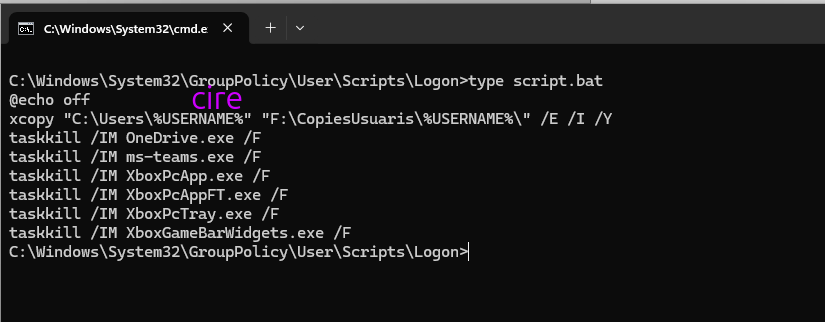

> Reengega sessió com `alumne2` i comprova que aquests processos no es llencen o es tanquen

He obert amb `alumne2` i efectivament, no estan.

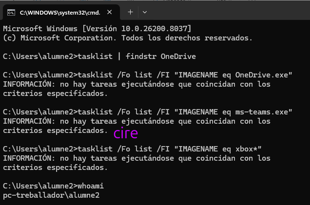

> Nota: OneDrive tot i en el paràmetre, a vegades me surt i altres no, depen que tan rapid

> Pas 23. Documentació
>
> - Afegeix fitxer de tasklist i taula justificativa a la doc amb MkDocs
> - Explica què passa si mates un procés crític com explorer.exe (prova controlada)
> - Comenta com aquesta gestió pot millorar el rendiment de màquines virtuals o amb pocs recursos

Si matem el procés explorer.exe (és critic) desapareix l'escriptori + barra tasques, sistema segueix actiu.

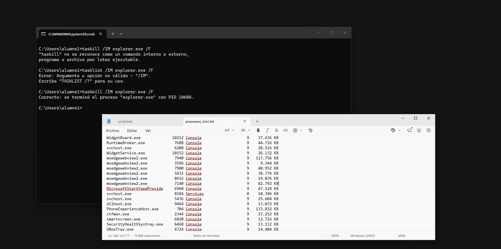

En no tenir interficie grafica a carregar no "saturem la GPU" en renderitzar gràfics

> Ahorrem en memoria de vídeo, processament i la nostra vista podria descansar de tanta saturació.
> Aixó per a un servidor en el qual estem realitzant una tasca que en aquell moment necessita un poquet més de recursos,
> podria ajudar un poquet.

En iniciar el procés novament amb `start explorer.exe` o qualsevol de l'índole, tornarà la interfície gràfica

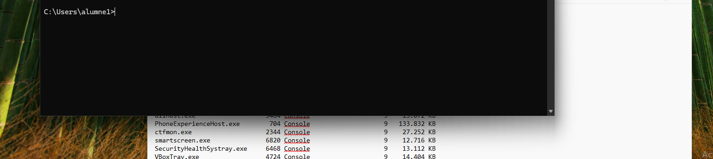

# Fase 6 – Gestió de permisos (ACLs)

> [!NOTE]
> A Windows, cada fitxer i carpeta té una llista de control d'accés (ACL, Access Control List).
> Aquesta llista defineix qui pot fer què amb aquell recurs.
> Cada entrada d'una ACL es diu ACE (Access Control Entry) i indica:
>
> - Quina identitat (usuari o grup) està afectada
> - Quins permisos té (lectura, escriptura, execució, control total, etc.)

> Volem controlar qui pot accedir i modificar la carpeta Projectes, creada dins la partició Dades.
> El grup Limitats tindrà accés total, però alumne2 tindrà només lectura, tot i formar part del grup.

> Pas 24. Crear la carpeta
> Inicia sessió com a administrador i crea la carpeta

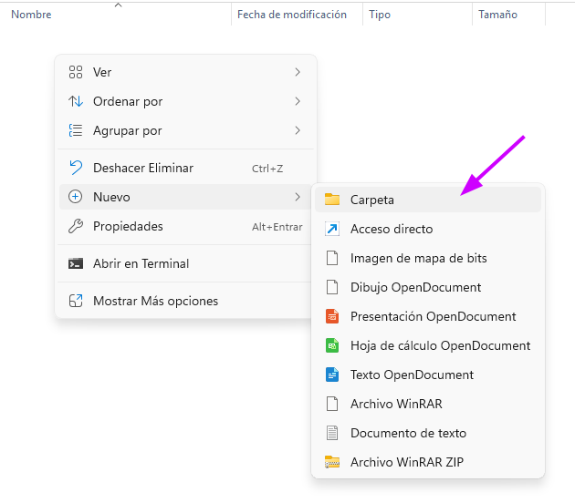
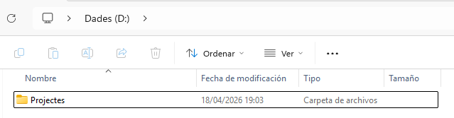

## Assignació permisos grup

> Pas 25. Assignar permisos normals al grup
>
> - 1. A les propietats de la carpeta D:\Projectes, ves a la pestanya Seguretat
> - 2. Fes clic a Avançat → Desactiva la herència i conserva els permisos existents
> - 3. Elimina Users o Everyone si hi apareixen
> - 4. Afegeix el grup Limitats i dona-li Control total
> - 5. Aplica els canvis
>      Ara qualsevol usuari del grup Limitats té accés complet

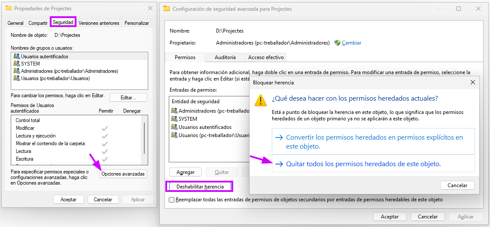
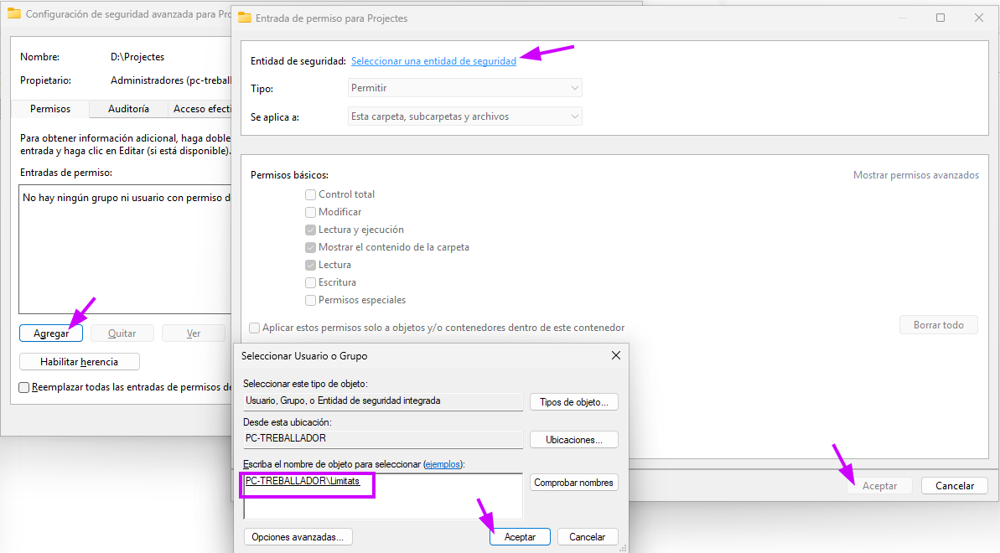

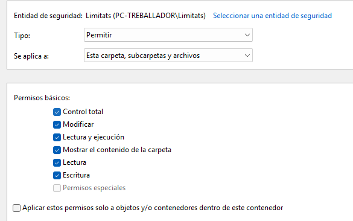
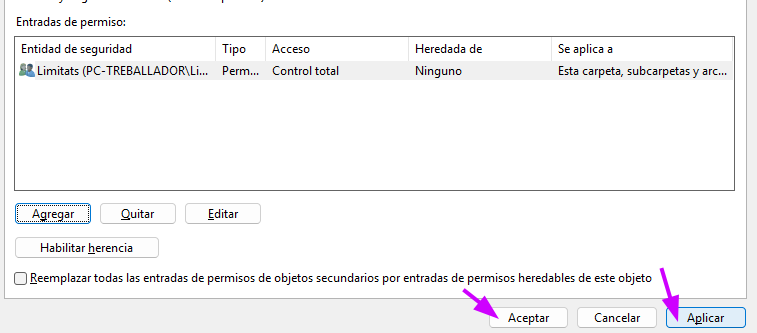

Afegeixo el grup de Limitats

Pas 26. Comprovar accés amb alumne1

1. Inicia sessió com alumne1
2. Crea un fitxer dins D:\Projectes, modifica’l i elimina’l
3. Tot hauria de funcionar (perquè té permisos heretats del grup Limitats)

Tot funciona com és veu en la imatge
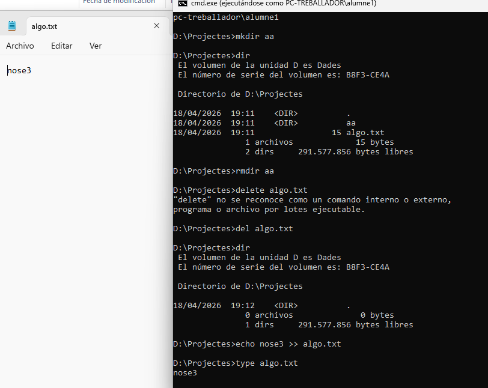

## Assignació permisos alumne2

> Nota: ni si se si
> Pas 27. Aplicar excepció per alumne2
> Torna a iniciar sessió com administrador i executa:

```bat
icacls "D:\Projectes" /grant:r "alumne2:(R)"
```

- `/grant:r`: substitueix permisos existents
- `(R)`: només lectura

Això substitueix qualsevol permís anterior d’alumne2 i li dona només lectura

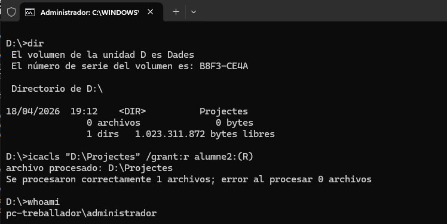

Pas 28. Comprovar l'excepció amb alumne2

1. Inicia sessió com alumne2
2. Intenta obrir un fitxer dins D:\Projectes ha de poder llegir-lo
3. Intenta editar-lo o crear-ne un de nou ha de rebre un missatge de denegació
   Efectivament, pot llegir el fitxer hola.txt que he deixat abans

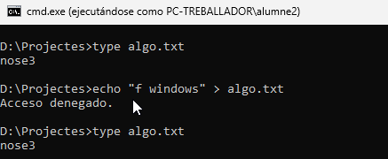

Pas 29. Consultar els permisos aplicats
Torna a la consola com a admin i escriu: `icacls "D:\Projectes"` i veuràs alguna cosa com:

> D:\Projectes --> Limitats:(OI)(CI)(F) alumne2:(R)

Això confirma que el grup té control total i alumne2 té només lectura

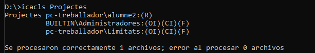
