# Índex
- [Configuració server](#configuració-server)
- [Configuració client](#configuració-client)

# Configuració server

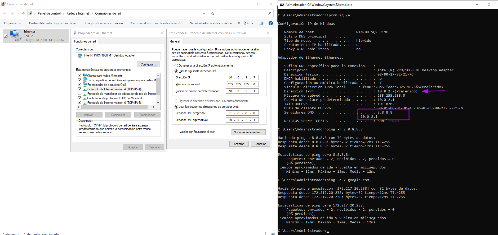

Afegit funcionalitat domini i promover (nou bosc `mcire.local`)

|                              |                              |
| ---------------------------- | ---------------------------- |
| 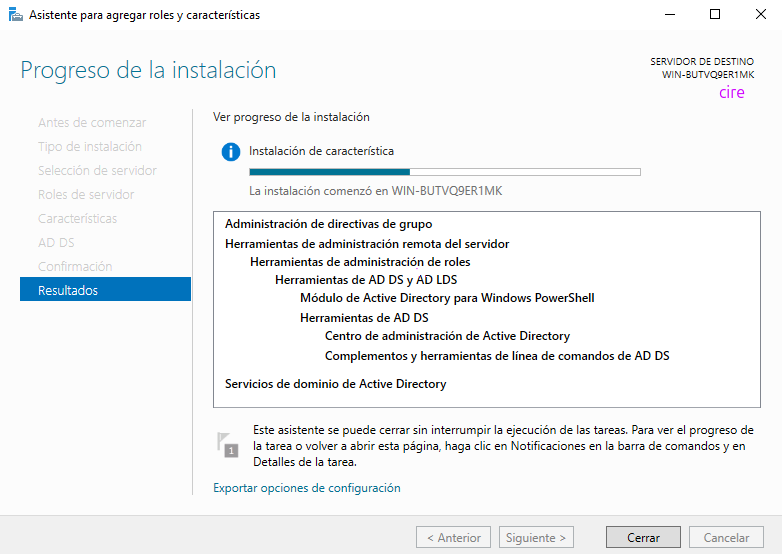 | 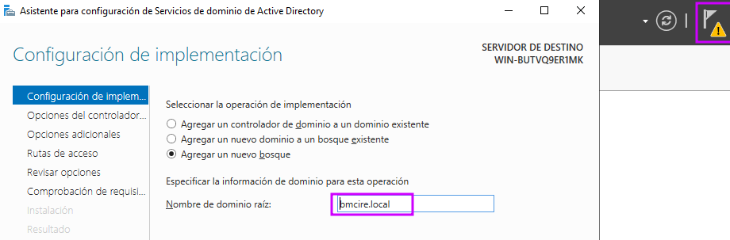 |
| 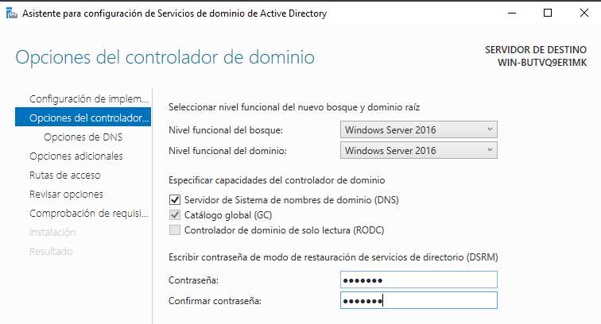 | 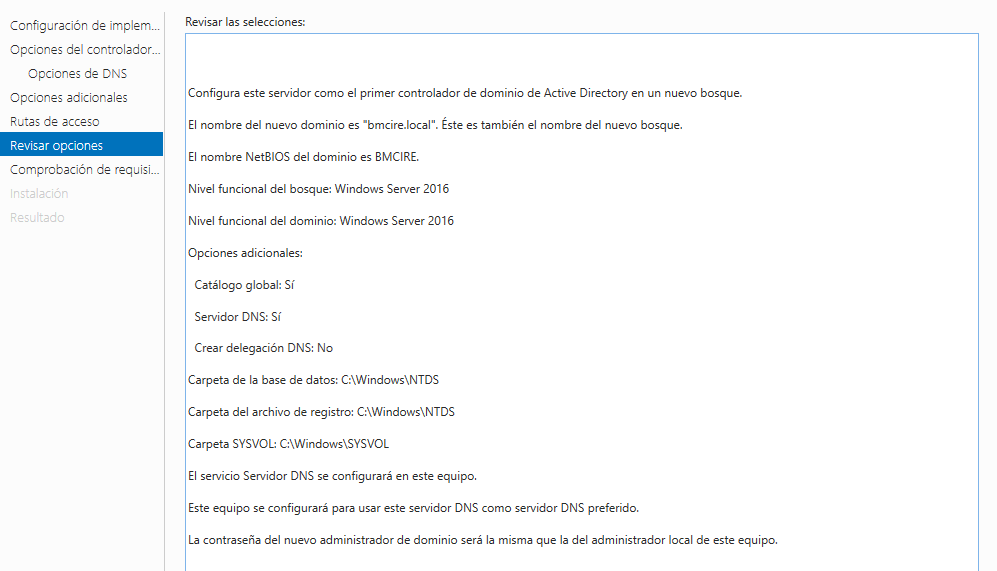 |

|                              |                               |
| ---------------------------- | ----------------------------- |
| 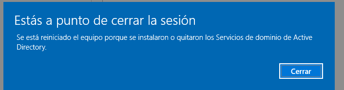 | 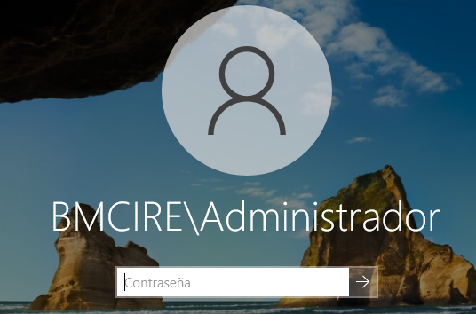 |

Crear nova **UO** `classe` con usuario `alumne`

|                              |                              |                               |
| ---------------------------- | ---------------------------- | ----------------------------- |
| 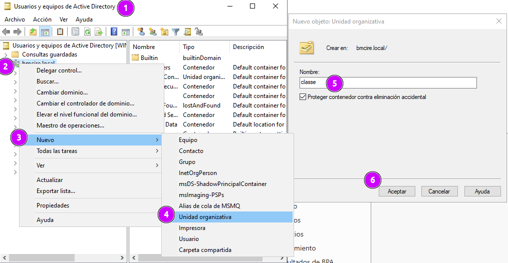 | 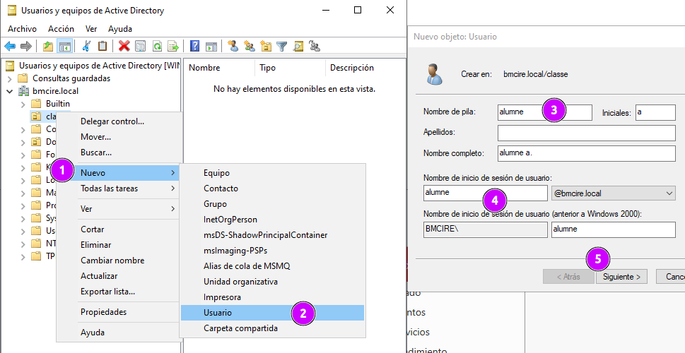 | 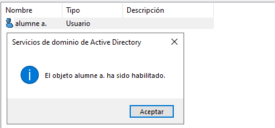 |

|                              |                               |                               |
| ---------------------------- | ----------------------------- | ----------------------------- |
| 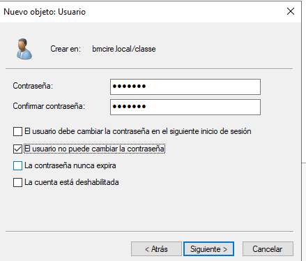 | 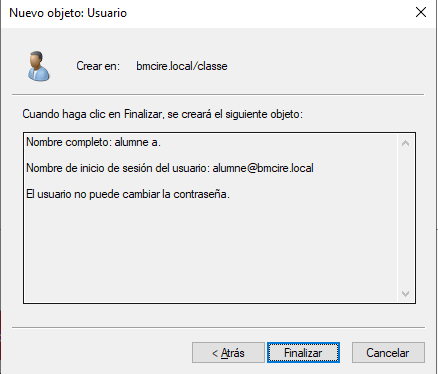 | 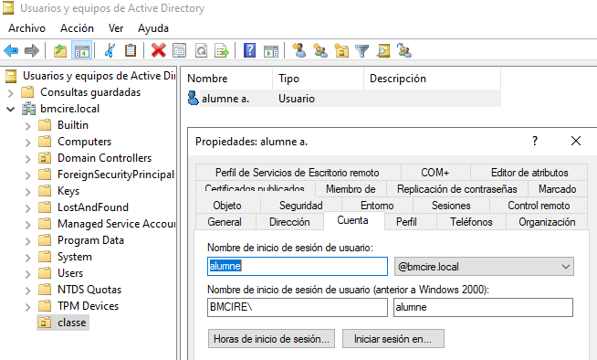 |

# Configuració client

- DNS servidor (10.0.2.7) i google (8.8.8.8)

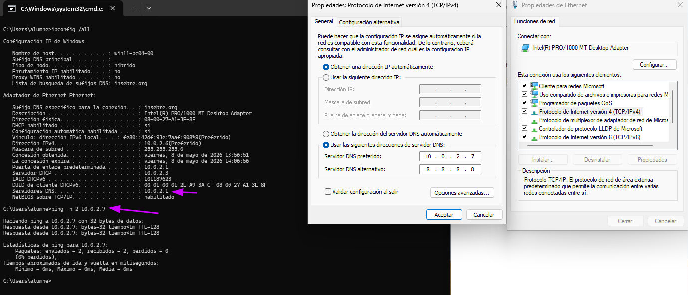

Unió al domini (el panell control _redirecciona_ a la conf en W11)

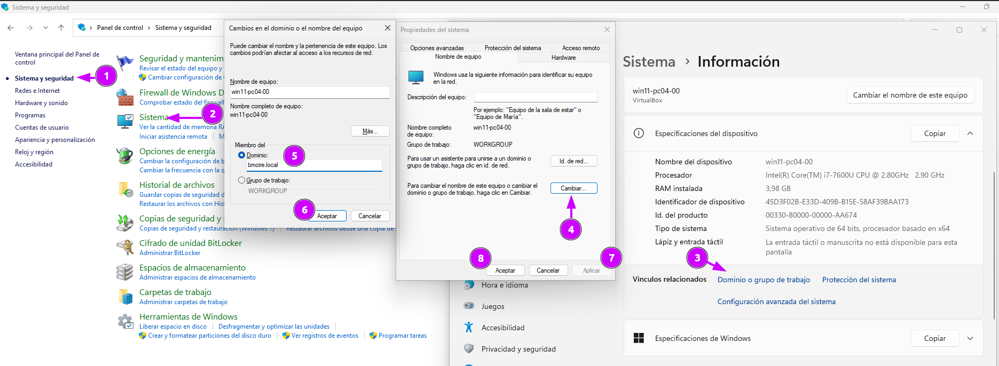

|                               |                               |
| :---------------------------: | :---------------------------: |
| 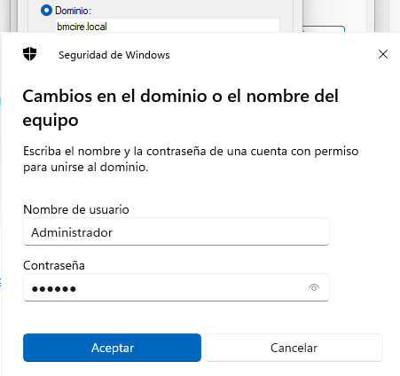 | 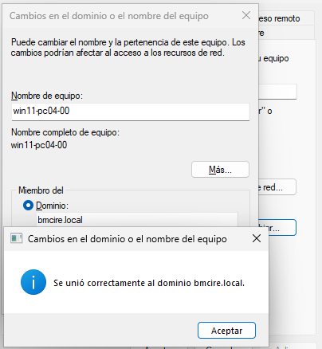 |
| 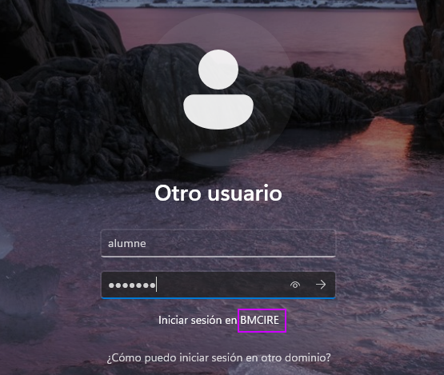 | 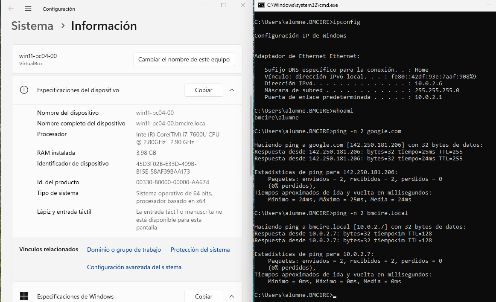 |

L'objecte esta al domini

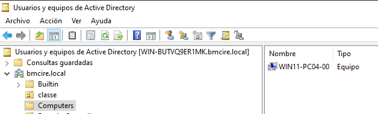