# Índex

- [Preparació i inicialització](#preparació-i-inicialització)
- [Creació RAID 5](#creació-raid-5)
- [Proves de funcionalitat](#proves-de-funcionalitat)
  - [Simulació de fallada (treure un disc)](#simulació-de-fallada-treure-un-disc)
  - [Simulació de segona fallada](#simulació-de-segona-fallada)
  - [Recuperació](#recuperació)

# Preparació i inicialització

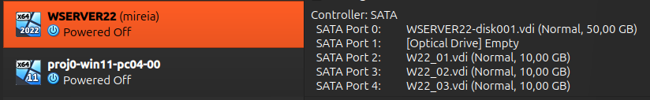
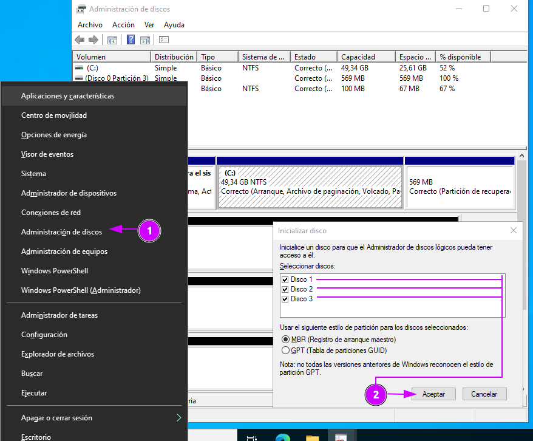

# Creació RAID 5

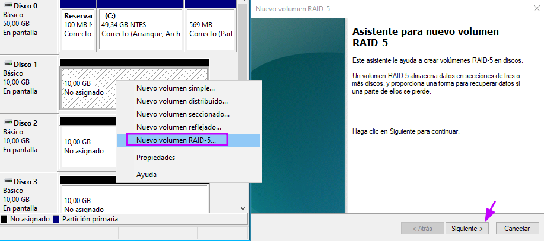

|                                |                              |
| ------------------------------ | ---------------------------- |
| 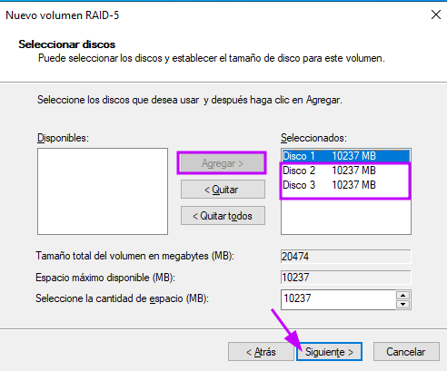 | 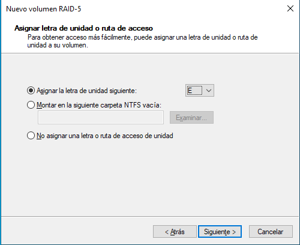 |
| 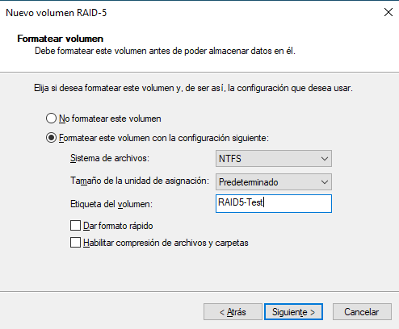   | 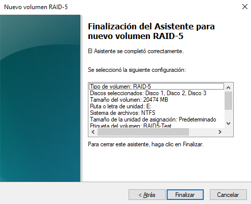 |
| 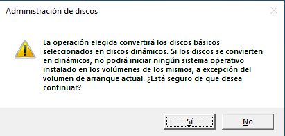   | 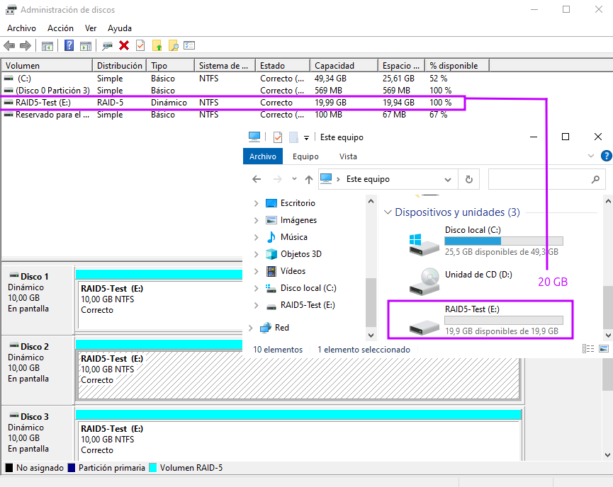 |

# Proves de funcionalitat

Són accessibles.

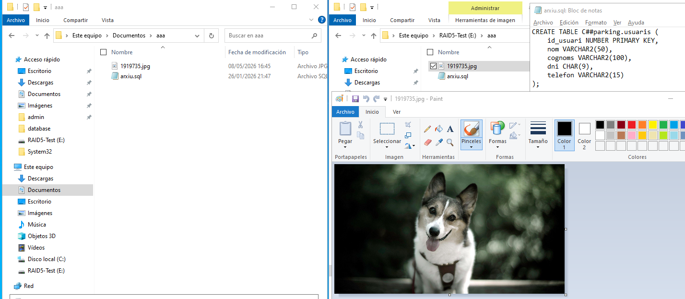

## Simulació de fallada (treure un disc)

|                               |                               |
| :---------------------------: | :---------------------------: |
| 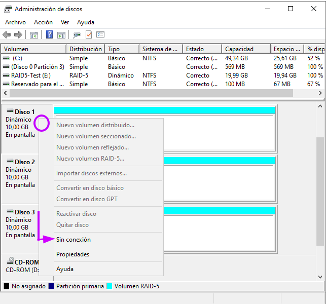 | 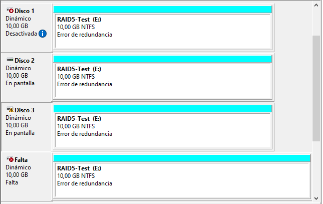 |

Tot segueix accessible

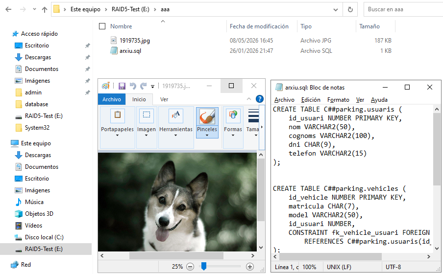

## Simulació de segona fallada

No apareix ni l'unitat

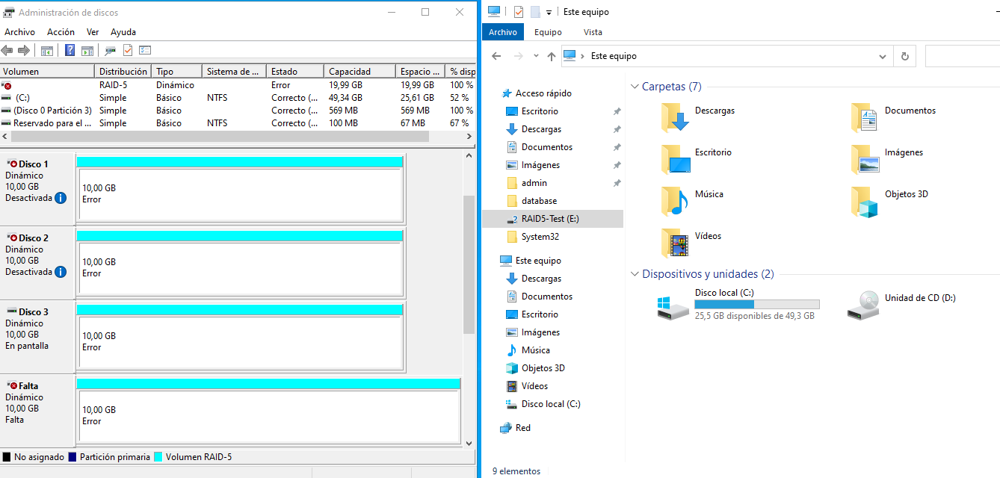

## Recuperació

Ha tornat posant el Disc 2 Online, curiosament en posar el Disc 1 Online i no el 2, no torna.

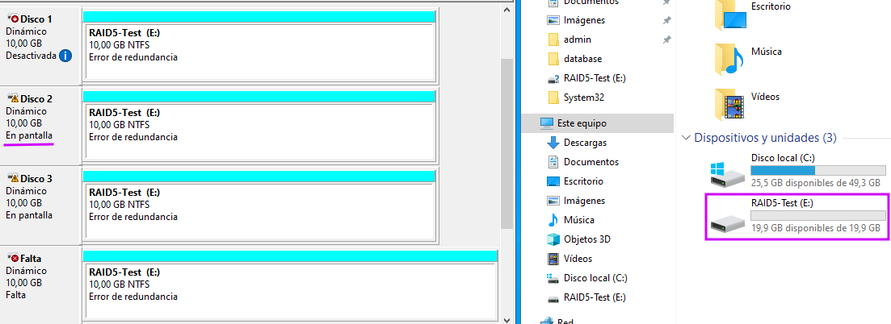
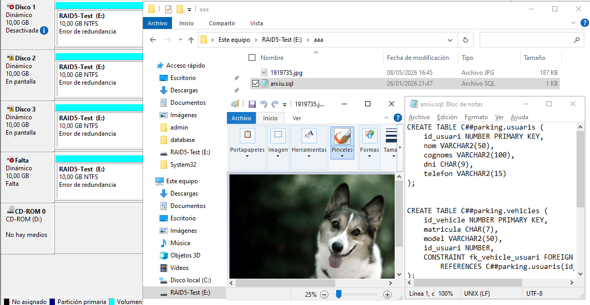
