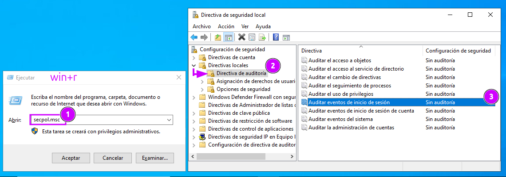
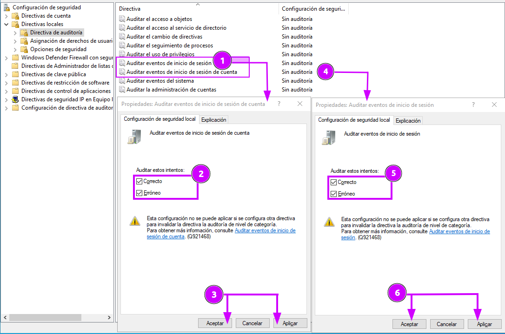
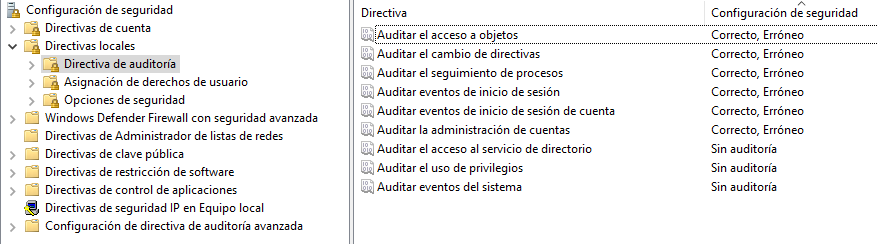
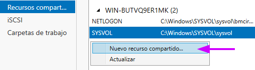
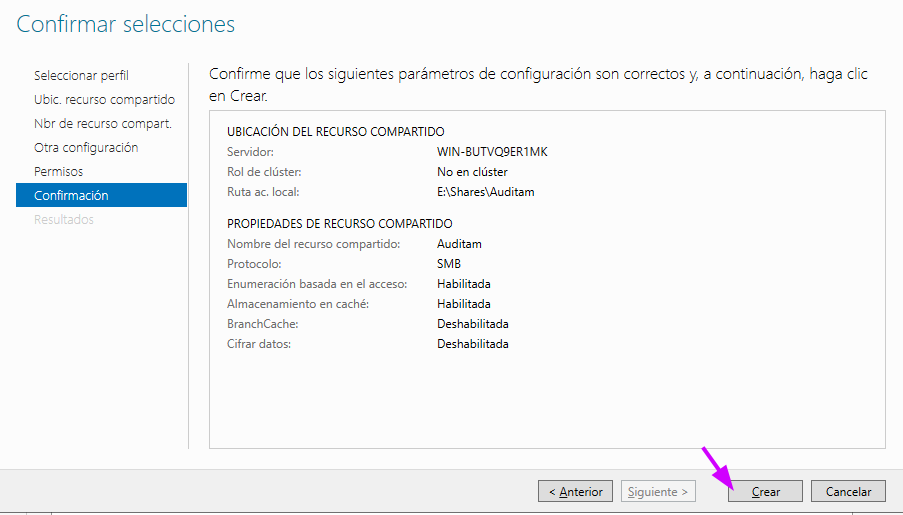
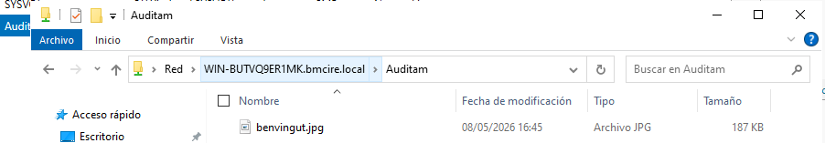
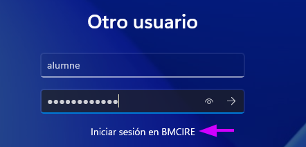
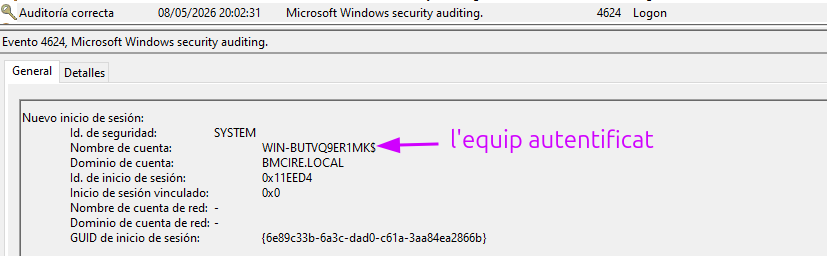
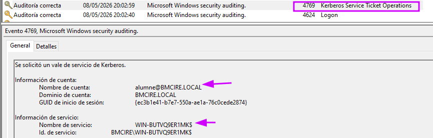
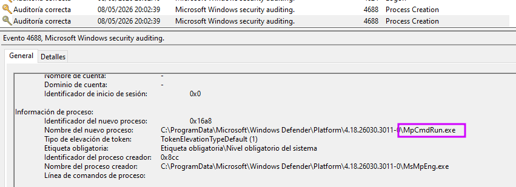

# Índex
- 1. [Configuració directives](#configuració-directives)
- 2. [Preparació entorn](#preparació-entorn)
- 3. [Comprovacions](#comprovacions)

# Configuració directives

Per registrar inici sessió i accés fitxers, accedim en `Directivas de seguridad local` > `Directivas locales` > `Directiva de auditoría`

> Tot i que és recomana fer servir `Configuración avanzada de la política de auditoría` per a servidor i no barrejar amb les configuracions locals.



Les següents directives

1. **Auditar eventos de inició de sesión**.
2. **Auditar eventos de inició de sesión de cuenta**.
- La diferencia és que la primera directiva té un abast més gran, **`qualsevol` tipus d'inici de sessió**.
- Mentres que la segona **qualsevol tipus d'inici de sessió d'objectes del sistema**



També he activat unes quantes directives básiques més,

3. **Auditar el cambio de directivas**, directiva important, si un 'usuari' aconsegueix canviar/assignar-se politiques
per eludir (o qualsevol altra raó), com a admin. és essencial tindre registre d'aixo, juntament amb les següents directives.
4. **Auditar el seguimiento de procesos**, per monitorar activació de programes, sortida de processos, duplicació de controls i accés indirecte a objectes.
5. **Auditar la administración de cuentas** , per detectar canvis en permisos, propietats... dels comptes.
6. **Auditar el acceso a objetos**, els objectes en Windows poden ser diverses coses (fitxers, carpetes,registres, etc).



> [!NOTE]
> Font per més informació: https://learn.microsoft.com/en-us/previous-versions/windows/it-pro/windows-10/security/threat-protection/auditing/basic-audit-logon-events

# Preparació entorn

He poder veure els esdeveniments, he preparat un entorn controlat. Fare servir l'usuari `alumne` (de l'anterior [sprint](./sp4.md)) per a totes les proves.


I per la directiva d'objectes, he creat un recurs de xarxa (carpeta amb fitxer) compartida amb els usuaris del domini.

- En estar al grup d'usuaris per defecte el usuari 'alumne', no hem fer fer cap canvi en permisos.





Per finalitzar, he posat una imatge de benvinguda.



# Comprovacions

> [!NOTE]
> Els codis a mirar corresponent a les politiques avançades de auditoria, tot i que s'hagin realitzat a la local
> https://learn.microsoft.com/es-es/windows-server/identity/ad-ds/plan/appendix-l--events-to-monitor

En l'usuari `alumne` unit al domini en un altre equip (màquina virtual), he realitzat el seguent:

1. Iniciat sessió al domini , per a que es generin logs d'inici sessió

|                           |                           |
| ------------------------- | ------------------------- |
|  |  |

2. Obert el quadre de diàleg d'Executar per obrir la CMD, per al seguiment processos.
3. En la CMD obert `explorer.exe` a la ruta UNC del recurs compartit amb la següent comanda:

```bash
explorer.exe \\WIN-BUTVQ9ER1MK.bmcire.local\Auditam
```


Un cop realitzat, en el visor d'esdeveniments (`eventvwr.msc`), en `Registros de Windows`, he filtrat per els ID d'esdeveniments possibles.

- [4624], 4625: Login exitos o login fallit. `inició sessión`
- 4769: Sol·licitud ticket servei, aquest és fa servir en accedir al recurs. `inició sessión de cuenta`
- [5140]: Accés a compartició xarxa
- [4688]: S'ha creat un nou procés. `seguimiento de processos`


|                           |                           |
| ------------------------- | ------------------------- |
|  |  |

S'han obert **MpCmdRun.exe** (que és el que quadre de diàleg)+ altres processos (cmd.exe, explorer...)



Per a la directiva que resta, he deshabilitat i tornat a habilitat a alumne.


I podem observar que surt el registre als events.
També aprofito per veure els registres de canvis de directives

- 4722: S'ha habilitat un compte d'usuari.... `adminitración de cuentas`, també esta 4720 (usuari creat), 4721 (usuari activat), etc
- 4719: S'han fet canvis en les directives.


